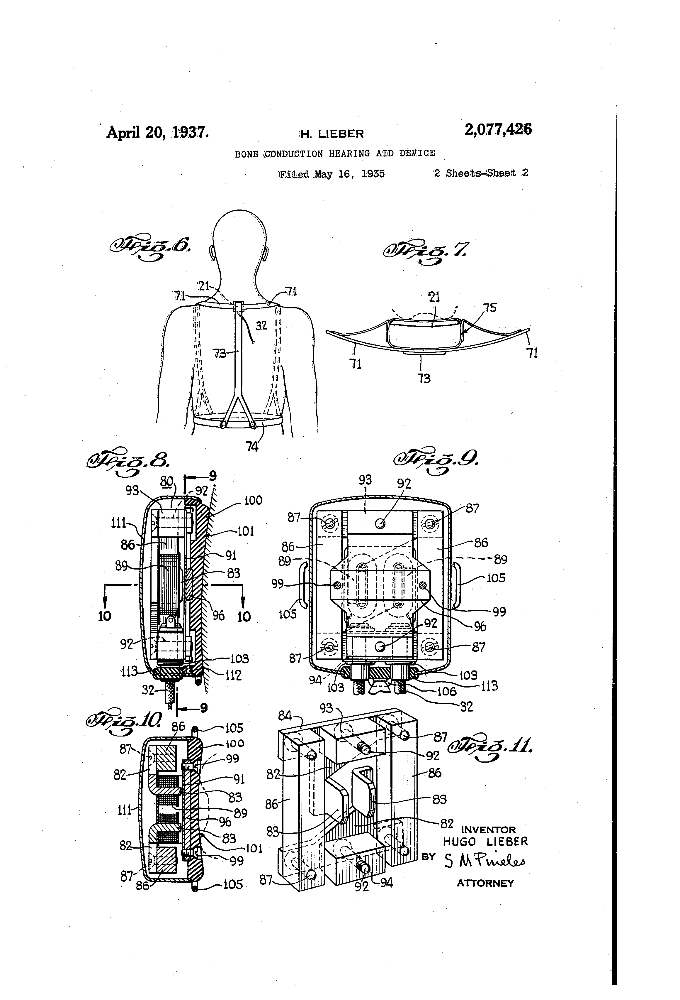

<title>development</title>

Next Steps / To Do
---
<pre>

----ili
	https://9gag.com/gag/aQeZRP7?ref=fsidebar       The future is now, old man

	handheld language translator
	http://www.tonvid.com/info.php?video_id=ISi4E0NLx7c	ili Real-time Wearable Translator without WiFi/3G/4G
	https://iamili.com/
		https://www.youtube.com/watch?v=nH6LVfQ12A8	The Story behind ili (Interview with CEO Takuro Yoshida)
			Takuro... I have a solution for 2 way speaking... Just ad 2 ili in one... The first botton for asking and the second one for answers
			I'd buy it if not for one fatal flaw: ili is a 1-way translator device... not a 2-way device.
		https://www.youtube.com/channel/UCp9pmRUsgQi4ULPdB8qrYOg	ili

	http://www.tonvid.com/search.php?q=handheld%20language%20translator&videoDefinition=any&date_filter=any&videoDuration=any&safeSearch=none&videotype=any&order=date

	http://www.tonvid.com/info.php?video_id=Ck7mUhuhHJ4	Tech Daily: Handheld translator works with over 80 languages | 1 May 2017

	logbar language translator
	ili translator

	http://www.tonvid.com/info.php?video_id=VpFhdjkfWq8	An Introduction to ili - A Wi-FI Free Translation Device

https://9gag.com/gag/aVMRzgv	 *Dad what does this tattoo mean* (Not mine) 
http://www.tonvid.com/info.php?video_id=AwItDxBlVac	Commercial for Google Home Mini

http://www.tonvid.com/info.php?video_id=FcnzA1WUI8Q	These Earbuds Give You Super Powers (Seriously)
http://www.tonvid.com/info.php?video_id=ZAHfevDUMK4	Testing earbuds that translate in real-time

-write Bopomofo tree layout avec 37 characters
        https://en.wikipedia.org/wiki/Bopomofo
                21 - Consonants
                17 - Rhymes and medials

                https://zh.wikipedia.org/wiki/%E6%B3%A8%E9%9F%B3%E7%AC%A6%E8%99%9F

        https://en.wikipedia.org/wiki/Pinyin_table
        https://en.wikipedia.org/wiki/Zhuyin_table
        https://en.wikipedia.org/wiki/Chinese_input_methods_for_computers
        https://en.wikipedia.org/wiki/Sogou_Pinyin
        https://en.wikipedia.org/wiki/Google_Pinyin
        https://en.wikipedia.org/wiki/Smart_Common_Input_Method
        https://en.wikipedia.org/wiki/Pinyin
                https://zh.wikipedia.org/wiki/%E6%B1%89%E8%AF%AD%E6%8B%BC%E9%9F%B3
        https://en.wikipedia.org/wiki/Wade%E2%80%93Giles_table
        https://en.wikipedia.org/wiki/Palladius_table
        https://en.wikipedia.org/wiki/Cyrillization_of_Chinese

-meeting location marker incorrect
        http://www.openstreetmap.org/?mlat=43.83339&mlon=-79.30638#map=19/43.83339/-79.30638
        geo:43.83339,-79.30638?z=19
        http://www.openstreetmap.org/#map=19/43.83339/-79.30638         //no marker

        --old
        http://www.openstreetmap.org/?mlat=43.8330&mlon=-79.3059
        geo:43.8330,-79.3059

        --new
        http://www.openstreetmap.org/?mlat=43.8333&mlon=-79.3063        //marker, but at city scale. acceptable
        geo:43.8333,-79.3063

        -install android studio
                -on 40GB sata, ei-goh's computer
                        -overwrite archlinux /dev/sda3

                -debian 8 jessie i686
                        https://en.wikipedia.org/wiki/Debian_version_history#Debian_8_.28Jessie.29

                -on 20GB ssd acer
                -on 250GB ssd samsung

                -try android sdk tools

                https://developer.android.com/studio/releases/sdk-tools.html
                https://developer.android.com/studio/index.html#downloads
                        Tested on Ubuntu® 14.04 LTS, Trusty Tahr (64-bit distribution capable of running 32-bit applications)
                https://developer.android.com/studio/run/emulator.html#Requirements
                https://developer.android.com/studio/install.html
                        sudo apt-get install libc6:i386 libncurses5:i386 libstdc++6:i386 lib32z1 libbz2-1.0:i386
                        https://twitter.com/AndroidDev
                        https://plus.google.com/+AndroidDevelopers
                        https://www.youtube.com/user/androiddevelopers
                https://developer.android.com/studio/releases/index.html

                https://www.google.ca/search?dcr=0&source=hp&q=android+studio+WARN+dea.updater.sdkcomponentsource+s.repotrogressindicatoradapter&oq=android+studio+WARN+dea.updater.sdkcomponentsource+s.repotrogressindicatoradapter&gs_l=psy-ab.3...2063.28176.0.28417.85.78.1.0.0.0.394.10836.0j37j18j3.58.0....0...1.1.64.psy-ab..26.22.4546...0j0i131k1j0i22i30k1j0i22i10i30k1j33i160k1.0.1_svpxOaZYc
                https://askubuntu.com/questions/882474/android-studio-ide-and-tools-do-not-launch-after-install
                        -does not work in dwm.  Must use ubuntu default

	-solder toekeyboard pad to microphone input
		-run audacity

	-android studio
		https://developer.android.com/studio/index.html#downloads
		https://developer.android.com/studio/releases/sdk-tools.html

$./studio.sh 
Looking in classpath from com.intellij.util.lang.UrlClassLoader@2077d4de for /com/sun/jna/linux-x86-64/libjnidispatch.so
Found library resource at jar:file:/home/yorlov/Android/android-studio/lib/jna.jar!/com/sun/jna/linux-x86-64/libjnidispatch.so
Trying /home/yorlov/.AndroidStudio2.3/system/tmp/jna6496359881471757954.tmp
Found jnidispatch at /home/yorlov/.AndroidStudio2.3/system/tmp/jna6496359881471757954.tmp
[  45481]   WARN - dea.updater.SdkComponentSource - java.io.FileNotFoundException: /tmp/StudioDownloader1sys-img2-1.xml (No such file or directory) 
[  45924]   WARN - dea.updater.SdkComponentSource - java.io.FileNotFoundException: /tmp/StudioDownloadersys-img2-1.xml (No such file or directory) 
[  46391]   WARN - dea.updater.SdkComponentSource - java.io.FileNotFoundException: /tmp/StudioDownloadersys-img2-1.xml (No such file or directory) 
[  48510]   WARN - dea.updater.SdkComponentSource - java.io.FileNotFoundException: /tmp/StudioDownloaderaddon2-1.xml (No such file or directory) 

-install android-x86 i686 on 4GB usb stick
-install ubuntu 16.04.3 LTS on SATA drive (40Gb where archlinux is)
	https://www.ubuntu.com/download/desktop
	Ubuntu 16.04.3 LTS

----board.net crash
	http://board.net/p/toekeyboard
	--log
	-2017
	sep 16 	-17:00	broken
		-19:00	works

-install android studio on 32-bit machine (outside)
	-ask on #ubuntu channel, if anyone has same problem of freezing

	~/Android/android-studio/bin$./studio.sh 
		Looking in classpath from com.intellij.util.lang.UrlClassLoader@2077d4de for /com/sun/jna/linux-x86-64/libjnidispatch.so
		Found library resource at jar:file:/Android/android-studio/lib/jna.jar!/com/sun/jna/linux-x86-64/libjnidispatch.so
		Trying /.AndroidStudio2.3/system/tmp/jna6021911500112156448.tmp
		Found jnidispatch at /.AndroidStudio2.3/system/tmp/jna6021911500112156448.tmp
		[  46420]   WARN - dea.updater.SdkComponentSource - java.io.FileNotFoundException: /tmp/StudioDownloadersys-img2-1.xml (No such file or directory) 
		^C[  87355]   WARN - pl.local.NativeFileWatcherImpl - Watcher terminated with exit code 130 

----android studio java
	https://developer.android.com/studio/intro/index.html?utm_source=android-studio

	https://developer.android.com/sdk/index.html
	https://developer.android.com/studio/install.html
		sudo apt-get install libc6:i386 libncurses5:i386 libstdc++6:i386 lib32z1 libbz2-1.0:i386

	----oracle jdk
	----oracle java
	https://askubuntu.com/questions/634082/how-to-install-android-studio-on-ubuntu
		Installing Java
		sudo add-apt-repository ppa:webupd8team/java
		sudo apt-get update
		sudo apt-get install oracle-java8-installer
		After that
		sudo apt-get install oracle-java8-set-default

	
		//or

		sudo apt install ubuntu-make
		sudo umake android --accept-license

	http://www.webupd8.org/2014/03/how-to-install-oracle-java-8-in-debian.html
		# echo "deb http://ppa.launchpad.net/webupd8team/java/ubuntu xenial main" | tee /etc/apt/sources.list.d/webupd8team-java.list
		# echo "deb-src http://ppa.launchpad.net/webupd8team/java/ubuntu xenial main" | tee -a /etc/apt/sources.list.d/webupd8team-java.list
		# apt-key adv --keyserver hkp://keyserver.ubuntu.com:80 --recv-keys EEA14886
		# apt-get update
		# apt-get install oracle-java8-installer

	http://www.webupd8.org/2012/09/install-oracle-java-8-in-ubuntu-via-ppa.html
		sudo add-apt-repository ppa:webupd8team/java
		sudo apt-get update
		sudo apt-get install oracle-java8-installer

	--log
		/etc/apt# add-apt-repository ppa:webupd8team/java
			 Oracle Java (JDK) Installer (automatically downloads and installs Oracle JDK7 / JDK8 / JDK9). There are no actual Java files in this PPA.

			Important -> Why Oracle Java 7 And 6 Installers No Longer Work: http://www.webupd8.org/2017/06/why-oracle-java-7-and-6-installers-no.html

			Ubuntu 16.10 Yakkety Yak is no longer supported by Canonical (and thus, Launchpad and this PPA). The PPA supports Ubuntu 17.10, 17.04, 16.04, 14.04 and 12.04.

			More info (and Ubuntu installation instructions):
			- for Oracle Java 7: http://www.webupd8.org/2012/01/install-oracle-java-jdk-7-in-ubuntu-via.html
			- for Oracle Java 8: http://www.webupd8.org/2012/09/install-oracle-java-8-in-ubuntu-via-ppa.html

			Debian installation instructions:
			- Oracle Java 7: http://www.webupd8.org/2012/06/how-to-install-oracle-java-7-in-debian.html
			- Oracle Java 8: http://www.webupd8.org/2014/03/how-to-install-oracle-java-8-in-debian.html

			Oracle Java 9 (for both Ubuntu and Debian): http://www.webupd8.org/2015/02/install-oracle-java-9-in-ubuntu-linux.html

			For JDK9, the PPA uses standard builds from: http://jdk.java.net/9/ (and not the Jigsaw builds!).

			Important!!! For now, you should continue to use Java 8 because Oracle Java 9 is available as an early access release! You should only use Oracle Java 9 if you explicitly need it, because it may contain bugs and it might not include the latest security patches! Also, some Java options were removed in JDK9, so you may encounter issues with various Java apps. More information and installation instructions (Ubuntu / Linux Mint / Debian): http://www.webupd8.org/2015/02/install-oracle-java-9-in-ubuntu-linux.html
			 More info: https://launchpad.net/~webupd8team/+archive/ubuntu/java
			Press [ENTER] to continue or ctrl-c to cancel adding it

-if < iframe > is causing a problem, refresh screen by reloading webpage in browser.  pressing 'Enter' in url bar.
	Ctrl-r does not refresh page properly

-get xoscope to work, measure voltage
	-solder probe to 3.5mm audio jack / cable

-get linux demo / alsa hacking to work
	-espeak / apertium translation
-get linux application to work
	-python
	-hdajackretask

-get docker instance with android build tools to work

-get android application to compile 	dotdash (apk)
-get 'android update-project' to work
	-debian android build tools
	-docker
	-vmware/virtualbox/qemu
	-try installing android studio on linux mint

-----audio app
	HTC:  Android 2.2

	https://f-droid.org/packages/net.bitplane.android.microphone/		1.5
		microphone
		bitplane.net
		https://github.com/bitplane/Microphone
		bitplane.net/projects/android		//defunct
	https://f-droid.org/packages/net.iowaline.dotdash/			1.6
		DotDash Keyboard
		Morse code keyboard
	https://f-droid.org/packages/fr.herverenault.directdictaphone/		2.1
		Direct Dictaphone
		Record short audio notes

	https://f-droid.org/packages/com.github.axet.audiorecorder/		2.3
		Audio Recorder
		Record audio files
		"There is a problem parsing the package"
	https://f-droid.org/packages/org.billthefarmer.scope/			4.0
	https://f-droid.org/packages/com.mantz_it.rfanalyzer/			4.0
	https://f-droid.org/packages/eu.mrogalski.saidit/			4.0
		Echo
		Record audio in the backgroud
	https://f-droid.org/packages/com.danielkim.soundrecorder/		4.1

----gta-robotics / 3dbott / pickering ideas

	----transitor
	----mosfet
	-use a transitor / MOSFET
		-available transistors
			modem card (small):	
				S9014 C 331
				KSP 42 606
				KSP 92 606
			modem card (with removed transformer): 
				KSP 13 -047
			car stereo:
				A1150 O I J
				A1048 Y I J
				C2459 Y I E
				M5236L 160I
				C2458 LL IJ
				D1468 S SD
				280 A92
				K435 C I K T
				V99 1 K

				

				

	-opamp

	-build the oscilliscope / multimeter from alsa

	-measure voltage / current out at speakers

-infra-red from one shoe to the other.  bluetooth chip to phone.
-infra-red from both feet upto phone. with infra-red receiver attached to micro usb
	http://www.alibaba.com/trade/search?fsb=y&IndexArea=product_en&CatId=&SearchText=infrared+receiver+microusb

----android todo

-figure out how to re-compile f-droid programs, create apk

-figure out how to write android ndk c programs, access alsa driver
	~$wajig search android ndk
	google-android-ndk-installer - Google Android Native Development Kit (NDK) Installer
		Length: 755551010 (721M) [application/zip]
		Saving to: ‘android-ndk-r12b-linux-x86_64.zip’

~$wajig search scope
bitmeter - diagnosis tool for JACK audio software
cscope - interactively examine a C program source
diffoscope - in-depth comparison of files, archives, and directories
kscope - source browsing and editing environment
ll-scope - an oscilloscope DSSI plugin
seascope - source code navigation tool
trydiffoscope - in-depth comparison of files, archives, etc. (try.diffoscope.org client)
xoscope - digital oscilloscope

----toekeyboard gaming
	-make pokemon / bug rapping game
		-if can detect face, superimpose mouth onto bug
		-ranking of who has the sickest raps / rarest bugs&animals
		-neural network / ai rapping bot
		-grab wikipedia article of which bug/animal you have.  confirmed or deconfirmed by users.  basically taking video
			-the rarer the bugs, the more points you get
		-have live rap battles agains other people

	-have dance battles with other dance students
		-who can finish the most dance steps

-get android toekeyboard demo to work	

-start seeding toekeyboard on glt

-make binary trees des autres langues

-hack android alsa
	https://gitlab.com/axet/android-audio-library
	https://gitlab.com/axet/android-torrent-client

-do live streaming (ogg) of meetings (1 hr)
	https://9gag.com/gag/a6VNxDL?ref=fsidebar	Add yours
		Open Broadcaster - Video recording and live streaming

	https://en.wikipedia.org/wiki/Ogg
	https://en.wikipedia.org/wiki/Icecast

	oggfwd - basic icecast source client for audio and video streaming
	oggvideotools - toolbox for manipulating and creating Ogg video files
	oggz-tools - utilities for mangling Ogg streams
	nanoblogger - Small weblog engine for the command line
		http://nanoblogger.sourceforge.net/docs/nanoblogger.html
		http://nanoblogger.sourceforge.net/

	https://en.wikipedia.org/wiki/RadioTux

-make windows .exe / .msi
	-see how transmission / synergy does it
		-transmission
			https://github.com/transmission
			https://github.com/transmission/transmission
			https://github.com/transmission/transmission/issues
			https://github.com/transmission/transmission-releases
			https://github.com/transmission/transmission.github.io

			https://transmissionbt.com/resources/
				https://i-miss-erin.blogspot.ca/2010/09/use-transmission-in-android.html
					https://code.google.com/archive/p/transdroid
						https://github.com/erickok/transdroid
						http://www.transdroid.org/
							http://www.transdroid.org/download/using-transmission-on-ubuntu/
						https://play.google.com/store/apps/details?id=org.transdroid.lite
				https://code.google.com/archive/p/itransmission/
					github.com/ccp0101/iTransmission		//2011
				https://forum.transmissionbt.com/	
					https://forum.transmissionbt.com/viewtopic.php?f=16&t=18087
				https://build.transmissionbt.com/

		-synergy
			https://github.com/symless/synergy
			https://github.com/symless/synergy/releases
			https://github.com/symless/synergy-android-cyanogen
				We use the uinput module for user space input driver, so you must have
				a modded Android with access to /dev/uinput (Like Cyanogen). That means
				your android must have /dev/uinput module and this file can be RW by app.
			https://symless.com/synergy

	https://en.wikipedia.org/wiki/Special:Search?search=windows+on+linux&go=Go&searchToken=2z4r93bmzatkdvkl4uta78rz3
	https://en.wikipedia.org/wiki/Mono_(software)
		https://en.wikipedia.org/wiki/Xamarin
		https://en.wikipedia.org/wiki/Ximian
	https://en.wikipedia.org/wiki/MonoDevelop
	https://www.linuxquestions.org/questions/linux-desktop-74/how-to-create-windows-executable-from-linux-481159/

	https://en.wikipedia.org/wiki/Windows_Subsystem_for_Linux
	https://en.wikipedia.org/wiki/Cooperative_Linux
	https://en.wikipedia.org/wiki/Cygwin
	https://en.wikipedia.org/wiki/Wine_(software)
	https://en.wikipedia.org/wiki/FreeBSD#OS_compatibility_layers

	https://en.wikipedia.org/wiki/Executable_space_protection

	https://en.wikipedia.org/wiki/Windows_10_Mobile
	https://en.wikipedia.org/wiki/Windows_Phone
	https://en.wikipedia.org/wiki/Microsoft_Surface
		https://en.wikipedia.org/wiki/Surface_computer
		https://en.wikipedia.org/wiki/Surface_3

	https://en.wikipedia.org/wiki/Linux_adoption
	https://en.wikipedia.org/wiki/Criticism_of_Linux
		https://en.wikipedia.org/wiki/Criticism_of_desktop_Linux
		https://en.wikipedia.org/wiki/Criticism_of_Microsoft_Windows
		https://en.wikipedia.org/wiki/The_Unix-Haters_Handbook

-make blackberry OS app
	-compile bb OS / playbook application, on linux
	https://developer.blackberry.com/native/download/
	-cherche ----blackberry os
	https://github.com/search?utf8=%E2%9C%93&q=blackberry+playbook&type=Repositories

-setup:
	-need to register account
	https://riot.im/app/#/room/#toekeyboard:matrix.org

	http://www.reddit.com/r/toekeyboard
	https://www.twitter.com/toekeyboard
	https://www.facebook.com/toekeyboard
	https://www.instagram.com/toekeyboard
	https://www.snapchat.com/toekeyboard
	https://www.pinterest.com/toekeyboard

	https://botbot.me/freenode/toekeyboard/		//need to submit for review
		https://botbot.me/request/
	https://f-droid.org/packages/com.github.toekeyboard.toekeyboard/	//need to submit for review
		https://f-droid.org/contribute/
			https://f-droid.org/wiki/page/Inclusion_Policy
			https://gitlab.com/fdroid/rfp/issues
			https://f-droid.org/docs/

	https://toekeyboard.wordpress.com/
	https://medium.com/toekeyboard
		https://medium.com/@femion/
		https://en.wikipedia.org/wiki/Medium_(website)
			https://en.wikipedia.org/wiki/Evan_Williams_(Internet_entrepreneur)

	-source code accounts
		sourceforge, launchpad, bitbucket
		github (cancelled?), gitlab (no mailinator allowed)

-make info gif
	https://9gag.com/gag/a6VqpL8	 Science b*tch 

	-start logging toekeyboard irc
		-post up on website

-promotion
	-for everyone ordered, will also give one to blind person  (CNIB-Canada, NIB-USA)

-make product page

-start a wearable computing magazine?

-dotdash f-droid keyboard improvements
	-instead of 'L'/'R', have the next letters show up in its place

	----quadro-copter
	battery in quadro-copter
		DS 902351
		3.7Vdc	800mAh
		2.96Wh	160910
		Made in China

		Tigerpow
		Rechargeable
		Li-Ion Battery
		1ICP9/24/56

-recruit people to join me

	-what is this?
		-partnership
		-project
		-business / startup
		-company
			-promotions company
			-advertising
		-side hustle
		

	-what this is not?
		-MLM / multi-level marketing scheme
		-pyramid
		-ponzi scheme

	FAQ
		-Is this a religion? Like Scientology / spreading the gospel?
		-What's the difference between spreading an idea, and spreading a religion?

	-faire pdf / phamplet, de ce que je faits
		-become a salesman / seller toekeyboard
			-talking to dance studios
			-product representative

		-you keep 100% of sales
			-no commision to upper tiers (not a MLM / pyramid / ponzi scheme)

		-you're competing against the open source part

		-looking for a side hustle?
		-become a partner today!

-have a bittorrent seedbox  (P3, i686), quiet

-faire personalized advertisement quand donne les toekeyboards sample kits a les gens.

	-look for male-to-male 3.5mm connector
		-wire suppliers
		-dollar store

	-uninstalled Google Apps:
		AnySoftKeyboard
		CN Thai Keyboard
		Vietnamese IME

	-external / outer protective layer
		-heat shrink wrap 
		-vinyl (iron pressed)

	-print out 
		-4 charts
			-english mmemonic tree
			-A-Z sequential
			-tap code
			-scroll
		-Uses section
	-short circuit 9V  (wrap with electrical tape)
	-seed static file on bittorrent

	-lost tabs (power outtage)
		Flite  - festival light
			f-droid
			gitlab
		espeak

	-move power cable to APC
	-install android-x86 on 250GB
		-move powersupply / graphic card to quad-core

	-hook-up op-amp
		toekeyboard/toekeyboard.github.io/images/prototype/documentation/op_amp/TA75558P.pdf
		https://www.digchip.com/datasheets/parts/datasheet/487/TA75558P.php
		https://duckduckgo.com/?q=ta+75558p+op+amp&t=ffab&ia=web

----3.5mm audio jack
	https://en.wikipedia.org/wiki/Phone_connector_%28audio%29
	http://www.tonvid.com/search.php?order=relevance&safeSearch=none&videoDefinition=any&date_filter=any&videoDuration=any&videotype=any&q=how+are+3.5mm+audio+cables+made&channelTitle=darren+wilson&pageToken=CAoQAA
	how are 3.5mm audio cables made
	https://www.youtube.com/watch?v=O4ZbwhmAQfA How to Make a 3.5mm Audio Connector - Basic Audio Technical Training 
	https://duckduckgo.com/?q=how+to+make+3.5mm+audio+connector&t=ffab&ia=videos
	https://www.techwalla.com/articles/how-to-make-a-35mm-audio-cable
	https://duckduckgo.com/?q=manufacture+own+3.5mm+audio+jack&t=ffab&ia=web
	https://github.com/search?utf8=%E2%9C%93&q=3.5mm+audio+jack&type=

	-start seeding toekeyboard torrent

	-print out davigrini script (hindi).  rencontre beaucoup de indians

	-relaxus / dr. school	(in pharmacy.  $7 - $20)

	-toekeyboard light demo malfonctionne

	-installing apps from computer
		-run 'python_server'   python_server
		-download from browser on phone		http://192.168.1.59:8000/app.apk

	-accessing downloads
		Broswer -> 'MENU' -> ... More -> Downloads

		F-droid		'There is a problem parsing the package'
		dotdash keyboard
			https://f-droid.org/repo/net.iowaline.dotdash_17.apk
				tinyurl.com/dodapk
		AnySoftKeyboard 
			https://f-droid.org/packages/com.menny.android.anysoftkeyboard/
			https://f-droid.org/repo/com.menny.android.anysoftkeyboard_2658.apk
				http://tinyurl.com/askfdsa

			Language&Input  settingsa

		flite
			https://f-droid.org/packages/edu.cmu.cs.speech.tts.flite/
			https://f-droid.org/repo/edu.cmu.cs.speech.tts.flite_4.apk
				http://tinyurl.com/flitefdsa

	-installed apps on Froyo (2.2)
		Googles:  opens, but no connection  (scans image, but stops after that)
			https://play.google.com/store/apps/details?id=com.google.android.apps.unveil
				Updated
				28 May 2014
				Requires Android
				2.2 and up
		Square Register:  need to register
		Mitzuli  (translator)
			https://play.google.com/store/apps/details?id=com.mitzuli
				Updated
				7 April 2016
				Requires Android
				2.2 and up
		Mobile Accessibility
			27.18MB
			https://play.google.com/store/apps/details?id=es.codefactory.android.app.ma.vocalizerenudemo
				Updated
				19 September 2016
				Current Version
				2.123

	https://play.google.com/store/search?q=morse%20code%20keyboard&c=apps
		https://play.google.com/store/apps/details?id=net.iowaline.dotdash
			Actualizado	12 de diciembre de 2015
			Descargas	10.000 - 50.000
			Requiere Android	1.6 y versiones superiores 

			https://github.com/agwells/dotdash-keyboard-android
				https://f-droid.org/packages/net.iowaline.dotdash/
					https://www.youtube.com/watch?v=y5g5OHfjRWA		 DotDash Keyboard 
				https://github.com/agwells/dotdash-keyboard-android/issues

		https://play.google.com/store/apps/details?id=com.arsiwala.shamoil.morsekeyboard

		https://play.google.com/store/apps/details?id=com.ddsoftware.cw.morsecodekeyer.free

	--typidy keyboard
		https://play.google.com/store/apps/details?id=com.thumodynamic.typidy_trial
			oct 28, 2016	500-1000
			Requiere Android	4.0 y versiones superiores
		https://play.google.com/store/apps/details?id=com.thumodynamic.typidy
			oct 28, 2016	10-50
			Requiere Android	4.0 y versiones superiores

	----miracast android
		-essayer mobile de pere avec miracast		
			-cherche '----miracast android'

		-essayer mobile de pere avec miracast
			https://play.google.com/store/apps/details?id=com.mattgmg.miracastwidget
			https://play.google.com/store/search?q=miracast&c=apps

		https://f-droid.org/packages/com.mattgmg.miracastwidget/
			https://github.com/mattgmg1990/miracast-widget
				https://github.com/mattgmg1990/miracast-widget/issues
			https://play.google.com/store/apps/details?id=com.mattgmg.miracastwidget

	----fdroid
	----f-droid
		https://f-droid.org/
			download on froyo (android 2.2).	"There is a problem parsing the package"
				~/Downloads$python_server
				FDroid.apk

			https://f-droid.org/about/
				https://botbot.me/
					https://botbot.me/freenode/fdroid/

					https://botbot.me/request/
						https://github.com/botbotme

			https://f-droid.org/contribute/

	-goto pacific mall
		-ask about chinese keyboard at mobile stores.  demo toekeyboard
		-take pictures of floorplan layout

	-go demo to #2 cable specialist
		-demo python program

-copy offline osm markham tile pics
-download youtube vides, donc can view offline
	-need html offline video player / mpv player in browser?

----bluez
----bluetooth
	# wajig search bluez
	bluez - Bluetooth tools and daemons
	bluez-cups - Bluetooth printer driver for CUPS
	bluez-dbg - Bluetooth tools and daemons (with debugging symbols)
	bluez-hcidump - Analyses Bluetooth HCI packets
	bluez-obexd - bluez obex daemon
	bluez-test-scripts - test scripts of bluez
	bluez-test-tools - test tools of bluez
	libkf5bluezqt-data - data files for bluez-qt
	libkf5bluezqt-dev - development files for bluez-qt
	libkf5bluezqt6 - Qt wrapper for bluez
	qml-module-org-kde-bluezqt - QML wrapper for bluez
	bluez-tools - Set of tools to manage Bluetooth devices for linux
	python-bluez - Python wrappers around BlueZ for rapid bluetooth development
	bluez-firmware - Firmware for Bluetooth devices

	lshw (1)             - list hardware

	# apropos bluetooth
	# apropos bluetooth
	bluetoothctl (1)     - bluetooth control tool
	bluetoothd (8)       - Bluetooth daemon
	bt-adapter (1)       - a bluetooth adapter manager
	bt-agent (1)         - a bluetooth agent
	bt-device (1)        - a bluetooth device manager
	bt-network (1)       - a bluetooth network manager
	bt-obex (1)          - a bluetooth OBEX client/server
	btmon (1)            - Bluetooth monitor
	ciptool (1)          - Bluetooth Common ISDN Access Profile (CIP)
	gatttool (1)         - tool for Bluetooth Low Energy device
	hciconfig (1)        - configure Bluetooth devices
	hcitool (1)          - configure Bluetooth connections
	hid2hci (1)          - Bluetooth HID to HCI mode switching utility
	mpris-proxy (1)      - Bluetooth mpris-proxy

	# lsusb
	Bus 003 Device 117: ID 0a5c:2045 Broadcom Corp. Bluetooth Controller

	# hciconfig scan
	hci0:	Type: Primary  Bus: USB
		BD Address: 06:D4:2F:28:8A:9E  ACL MTU: 1017:8  SCO MTU: 64:0
		DOWN
		RX bytes:473 acl:0 sco:0 events:18 errors:0
		TX bytes:69 acl:0 sco:0 commands:18 errors:0

	https://www.reddit.com/r/toekeyboard
		https://www.reddit.com/subreddits/search?q=toekeyboard

	-add powerpoint presentation to toekeyboard	(graphviz)
				start
			/ 		 \
		backward one slie	forward one slide
		/				\
	backward 5 slides			forward 5 slides

	-arbeit aus toekeyboard
		-goto wire suppliers, on morningside rd.

		-splice video (to demo what's happening)  (00.mp4 & 01.mp4)

		-develop pour android-x86
			Android Runtime

			-install android-x86 on usbkey
				# dd if=/dev/zero of=/dev/sdc bs=512M
				Downloads/android-x86_64-7.1-rc1.iso
					 785M Jul 22 19:44 android-x86_64-7.1-rc1.iso

		-get demo to fonction sur mobile de pere
			-cherche ----LG V10

		-upgrade ubuntu kernel to lastest, re-install android studio sdk
			-expand hdd from 40GB to 80GB
		-get morse-to-text-to-speech demo to work on debian linux
			-so can demo at ham radio clubs
		-work on toekeyboard debian linux demo		(delete/space/enter)
			-morse code (toekeyboard) -> text -> speech (espeak) demo in debian linux
		-bouger toekeyboard.github.io -> tinyurl.com/toekeyboard.  avoir glt postings dans bittorent, de source code
		-have espeak demo to work, alors peut donner des presentations / indroduction
		-faire application de dance, pour montrer a les institutions de dance

		-get demo to work in debian linux, then android-x86
		-avoir android-sdk fonction
			android-sdk - Software development kit for Android platform

		-setup toekeyboard annual conference / AGM 
	

	-toekeyboard order form
		-make board.net/p/toekeyboard-orderform
		-put up actual orders, donations, priority

	----dancing / playing music video
		-using gps / pass a threshold
		-just make ddr
		-use orientation sensors, so you have to spin

		-speed up / slow down music

		-typing training / like mavis bacon

		-ddr / morse code training

		-speed typing with your toes / in sync with music / lyrics

-new print runs / advertising
	#toekeyboard
	tinyurl.com/toekeyboard0

	-print new
		tinyurl.com/toekeyboard -> bitly.com/wxyz -> tinyurl.com/toekeyboard-YYYYMMDD

	-start seeding
		(toekeyboard.github.io) -> bitly.com/xyz -> tinyurl.com/toekeyboard -> bitly.com/wxyz -> tinyurl.com/toekeyboard-YYYYMMDD
		(toekeyboard.github.io) -> bitly.com/xyz -> tinyurl.com/toekeyboard0 -> bitly.com/wxyz -> i.imgur.com
		(toekeyboard.github.io) -> bitly.com/xyz -> tinyurl.com/toekeyboard-YYYYMMDD
			(0,1,2...)

	-tinyurl.com/toekeyboard -> i.imgur.com/gifv	
		toekeyboard_full.gif

	-statistics
		goo.gl	(all time)
			http://goo.gl/VZGG0+
		bitly.com	(only last 10 days)
		ow.ly

-download wikipedia article for morse code table, donc peut voir offline

-get all apertium langues installed
	http://wiki.apertium.org/wiki/List_of_language_pairs
		trunk, staging, nursery, incubator
	-get polish (pl) / romanian (ro) to work
		$apertium -l | grep ro
		ro-es

-use d3.js, to graph how many people i have given it to, compared to time
	-graph how many bittorrent downloads

	-cherche
		----android sdk
		----android ndk
		----android runtime
		----android app development

		----remixos
		----android-x86

	-make manufacturer directory
		canadian / chinese

	----order form
	-faire 'order form'
		-organization
		-location
		-link to their glt profile
		-# of sample business cards
		-# of complete toekeyboards

		order form
			address & location
			quantity
			priority
			-request date
		pending & waitlist
		Fulfilled
			-delivery date
			quantity delivered

		-have javascript, sortable tables

		
		

<!--	
	-trouver pourquoi <iframe> ne fonction pas
	 <iframe src="hello.txt" style="border:1; width:100%; height:450px;"></iframe>
-->
	

	-put habla / espeak in trans/ directory
	-resolder second toekeyboard

	
	--done / re-do
		-etre certain toekeyboard demo fonction
		-put toekeyboard.github.io/index.html on acer / bb playbook
			/media/usb/downloads/toekeyboard_html		//when mounted in debian
			file:///sdcard/download/toekeyboard_html/index.html

			-reduce image sizes	(2MB -> 30k)

		-download board.net/p/txt
		-copy over this planner file

		-move toekeyboard/ssh$ outside of directory
			-before going to next bbq line-ups
		-!move ssh/ out of toekeyboard

	-download offline OSM maps
		-add partners to location.  
			wire supplier / financial brokerage firm / treefrog
			-105gibson

	-avoir offline ydl123 fonction
		-perisian / farsi videos  (entertainment / news)

	-faire plus de toekeyboard demo kits  (pour donner a les bbq rencontre)

	-print out toekeyboard meeting times			//avec garmen lee, 	world financial group
		-if he starts asking personal / history questions
		-we're talking about the future, he's talking about the past
		-doing it on his turf, invited to his house.  so need to follow his rules
		-dont leave till he kicks me out

-velcro straps toekeyboard to knees
-make second toekeyboard with ethernet cables
-make html tables, assign material acquisition to who

https://en.wikipedia.org/wiki/Chief_visionary_officer

----franchise toekeyboard
	-franchise out toekeyboard distributors

----ani
https://en.wikipedia.org/wiki/Group_identifier
https://en.wikipedia.org/wiki/Two-way_radio
https://en.wikipedia.org/wiki/Squelch
https://en.wikipedia.org/wiki/Selective_calling
https://en.wikipedia.org/wiki/Automatic_number_identification
	https://en.wikipedia.org/wiki/Automatic_number_announcement_circuit
	https://en.wikipedia.org/wiki/Dialed_Number_Identification_Service
	https://en.wikipedia.org/wiki/Direct_inward_dial

	----toekeyboard hackathon competition
		https://en.wikipedia.org/wiki/Boston_Beer_Company#LongShot_American_Homebrew_Competition
	
	----toekeyboard market
		https://www.therecord.com/news-story/6081559-thalmic-launches-app-market-for-myo-armband/			Nov 05, 2015
			https://market.myo.com/

	-have employees with "Caught you using toekeyboard". business card.  golden ticket
		00:38:00	20170317_hibt_kscott-0f8abfb0-66da-46f1-9b10-11349fc1ecbd.mp3?orgId=1&d=2663&p=510313&story=520531137&t=podcast&e=520531137&siteplayer=true&dl=1
		https://en.wikipedia.org/wiki/Kendra_Scott
			 March 20, 2017
			Kendra Scott: Kendra Scott

		-get a free wearable bone conduction hearing system
		-goto specific store, anytime

	-post back up on snapd markham / eventbrite

	-develop for Replicant / lineageOS 	(Android fork)
		-instead for iOS / Android

	-make line sheet / order form.  how many toekeyboards do you want
		https://en.wikipedia.org/wiki/Line_sheet

		-go get resources, and i will make it for you
			-clear tape
			-chinese string
			-aluminum foil
			-plastic

			-ethernet cable
			-3.5mm audio jack

		-then move into RTL contract manufacturing
		-build tools myself

	----airturn
		http://www.tonvid.com/info.php?video_id=80OVgx5Q7T4	Hands Free Page Turns for iPad Musicians with the AirTurn BT-105 Bluetooth Page Turner
		http://www.tonvid.com/info.php?video_id=QHTqilI_uzw	AirTurn and Virtual Sheet Music Viewer Application for iPad, iPhone and iPod Touch
		http://www.tonvid.com/info.php?video_id=swCpq88H608	New Airturn PED Review with Onsong
		airturn
		ipad sheet-music foot switch

		https://www.wired.com/2010/07/ipad-sheet-music-foot-switch-is-a-real-page-turner/
		https://duckduckgo.com/?q=ipad+music+foot+switch&t=ffab&ia=products

	----sponsorship toekeyboard
	----advertising toekeyboard
	----promotion toekeyboard
	----schlepper toekeyboard
		paper handout, with tinyurl.com/toekeyboard -> bit.ly/goo.gl (for traffic metrics) -> imgur.com (gif with instructions) -> tinyurl.com/toekeyboard-yyyy-mm-dd -> bittorrent

		-get companies to purchase the wire
		-i do the manufacturing / fabrication
		-give away toekeyboards away for free at events, where there's line-ups
			-drive traffic to a (url shortener), bit.ly.  keep track of how much traffic driven to website. how many cpc (cost per click)

			----register websites
				toekeyboard.com
					~$whois toekeyboard.com
						No match for domain "TOEKEYBOARD.COM".
				gettoekeyboard.com
				https://www.facebook.com/toekeyboard
				https://www.twitter.com/toekeyboard
				https://www.instagram.com/toekeyboard
				https://www.youtube.com/toekeyboard

		-find a sponsor to purchase 
			-3.5mm TRS audio jack from sayal	(bulk)
				<a href="http://sayal.com/zinc/zinc_SEARCH.asp?txtSEARCH=3.5+stereo" target="_blank">3.5 stereo (audio jack / 3.5mm stereo connector)</a>
				<a href="http://sayal.com/zinc/zinc_SEARCH.asp?txtSEARCH=3.5mm" target="_blank">3.5mm (audio jack / 3.5mm stereo connector)</a>

			-ethernet cable, aluminum
	

	----variety village
		3701 Danforth Ave, Scarborough

		mike honey, Parks Canada
			-out patient recovery / re-habilitation
			-"occupational therapy?"
			-started by lake ontario swimmer?  marion bell

		http://www.varietyvillage.ca/
			Variety Village is a family-friendly fitness, sports and life skills facility in Toronto.

			http://www.varietyvillage.ca/join/membership-options/
				Variety Village is the only facility that offers membership to people with and without disabilities and promotes inclusion through integrated programs and services. 

			http://www.varietyvillage.ca/about-us/
				3701 Danforth Ave, Scarborough

			http://www.varietyvillage.ca/history/

		https://duckduckgo.com/?q=variety+village+scarborough&t=ffab&ia=places

		https://twitter.com/varietyvillage
		https://www.facebook.com/VarietyVillageToronto
			https://www.facebook.com/pg/VarietyVillageToronto/about/?ref=page_internal
				3701 Danforth Ave., Toronto
		https://www.youtube.com/channel/UC7wCSW4Yg2kN77vd2EAt0uw/videos
		https://www.instagram.com/variety_village/

	----105 Gibson Centre
		105 Gibson Dr, Markham
		www.105gibson.com
		Thrift Store
		Food bank
		twitter.com/105gibson
		instagram.com/105gibson
		facebook.com/105gibson

	----st john's ambulance	youth squad
		Crosby Heights Public School
		190 Neal Dr, Richmond Hill	  (NW 	Major Mackenzie & Bayview)
		Ellen 416-738-5753
		meets:  Thurs 7:30-9pm  (not in summer).  sep-jun?

	----phrases
	----sentences
	----ctr-l R phrases
	----history search des phrases
		-demo'ing
		-want Ctr-R / History of top sentences
			-donc peut repetter les phrases les plus frequent

		-transition de imprimer aveces les orteils -> puis imprimer sur le clavier avec les droits -> puis parlant

	-DIAS - discreet information acquisition system

	----meme toekeyboard
	----shitpost toekeyboard
		-test with another shitpost	board.net/p/meme
			-like 
				https://www.reddit.com/r/Physics/comments/40zhxn/is_this_100_accurate_about_spacetime/
				http://imgur.com/ruejpSZ		An Explanation of Spacetime
					http://imgur.com/gallery/ruejpSZ
			-see who will post on it

		tinyurl.com/toekeyboard 
			-imgur.com/6JkJcqA 		(gif/meme, with tinyurl.com/toekeyboard-yyyymmdd instructions)
				http://imgur.com/gallery/6JkJcqA	Kid gives Megatron Optimus Prime's Head on a Stick
					http://imgur.com/6JkJcqA
				http://imgur.com/gallery/lrGbr		The same image of Robbie Rotten, but every day I randomly remove another pixel added to the amount I removed previously. Day Number Fifty-Two.
			-board.net/p/toekeyboard	(open discussion)
		

	----counterfeit
	----copy cats
	----quality fade
			world/internet/npr.org/2017/07/06$mpv *hibttr*
			Playing: 20170623_hibt_hibttrx.mp3?orgId=1
			20:00 mins

		https://en.wikipedia.org/wiki/Total_quality_management
		https://en.wikipedia.org/wiki/Fade_margin
		https://en.wikipedia.org/wiki/Special:Search?search=quality+fade&go=Go&searchToken=3zpmnnrxd4b7tuj4n70evrsfa

		https://en.wikipedia.org/w/index.php?title=Special:Search&search=counterfeiters&fulltext=1&profile=default&searchToken=aqdufqcnnonxkwybm7pg5oczx
		https://en.wikipedia.org/wiki/Counterfeit
		https://en.wikipedia.org/wiki/Counterfeit_consumer_goods

	-make short gif, video of toekeyboard / clairvoyant
		-upload to vid.me

	----demo toekeyboard
		-easy demo, using mouse
			-then wired mouse, solder new pieces
			-then bluetooth mouse, with TRS - 3.5mm toekeyboard
			-then hack alsa audio driver, to input directly to laptop TRS 3.5mm audio jack, with toekeyboard

		-make linux demo.  tap in with toe, display avec grand lettres sur l'ecran.  text-to-speech
		-make powerpoint presentation, website at bottom
		-music control
			-fast-forward, rewind, next track of music
		-put down computer, control from a distance  (like a puppet-master)
			-have scripts to do introduction
			-play videos
			-long extension wires, 3.5mm, male-female. bring them all, so can sitdown
				-put laptop on chair in front of the room
				-play "Sympathy for the devil" as intro
					http://www.tonvid.com/search.php?q=sympathy%20for%20the%20devil&videoDefinition=any&date_filter=any&videoDuration=any&safeSearch=none&videotype=any&order=viewCount
						http://www.tonvid.com/info.php?video_id=ZRXGsPBUV5g	The Rolling Stones - Sympathy For The Devil (Live) - OFFICIAL
		-file system navigation
		-local search.  text-to-speech of wikipedia
			-reading "Demo" / "Accessibiility"
		-translation demo
			-apertium -> espeak-mbrola
			-italian, spanish

		

		----meetings
			-hamradio club.   text to morse code
			-airport club. text to NATO codes?
			-car clubs, rapping to music.  start / stop music
			-accessibility meetings.  text to speech
			
	-voice recognition
		-tap code
		-cw / morse code
		----codes
			-dit, dah (traversing morse code tree)
			-put space, delete, enter in morse code tree?  (unused spot)
				-dum (space)
				-der (delete)
		

	-change website to welcome page, with bittorrent download

	-avoir crontab fonction, post chaque jour
		http://tinyurl.com/toekeyboard-yyyymmdd

		preview.tinyurl.com/toekeyboard
		preview.tinyurl.com/toekeyboard-yyyy
		preview.tinyurl.com/toekeyboard-yyyymm
		preview.tinyurl.com/toekeyboard-yyyymmdd

	----wikipedia toekeyboard
		-write wikipedia article
		-do in lesser/smaller/unpopular languages, so not banned
		https://en.wikipedia.org/wiki/Toe_keyboard
		https://fr.wikipedia.org/wiki/Clavier_d'orteil
		https://de.wikipedia.org/wiki/Zehe_tastatur
		
		

	-make only toekeyboard webpage
		toekeyboard.github.io
		toekeyboard.github.io/baseball

		-everything else downloadable from bittorrent

	-create baseball inserts
		tinyurl.com/toebaseball
			-re-direct to 
				toekeyboard.github.io/baseball

		http://preview.tinyurl.com/toebaseball
		http://preview.tinyurl.com/baseballtoe

			----android bittorrent
			http://www.utorrent.com/intl/en/downloads/
			https://play.google.com/store/apps/details?id=com.utorrent.client
			https://play.google.com/store/apps/details?id=com.bittorrent.client
		
	

	-create toekeyboard ppt
		-website at bottom
		-embed gifs, video clips

		https://unix.stackexchange.com/questions/131702/is-there-any-cli-terminal-slideshow-app
			tpp - text presentation program
				/usr/share/doc/tpp/examples$
				https://github.com/cbbrowne/tpp

			mdp - command-line based Markdown presentation tool
				https://github.com/visit1985/mdp
				https://raw.githubusercontent.com/visit1985/mdp/master/sample.md

	-register
		https://twitter.com/toekeyboard

	----minutes
		/github.com/etherpad-lite/bin$run.sh
			http://localhost:9001/p/2017-06-20

	-solder toekeyboard
		-repair toekeyboard demo (audio jack, TRS, functional/wearable)
		-make soldered taped fabrication demo  (to show layout)

		-take picture, and put it on top of main page

	-print / design 1" inlet, printed out page	
		toekeyboard.github.io		
		tinyurl.com/toekeyboard

	---start meetings
		-copper wire consortium
		-fabrication / contract manufacturing / micro manufacturing
		-accessibility meeting

	-goto every highschool / middle school / baseball field
		-wire attach it to fences  (Sep-Jun)
		-will spread by word of mouth

		-littering on school property?
		-is it illegal to advertise on school property
			https://duckduckgo.com/?q=advertising+at+schools&t=ffab&ia=web
				http://www.commercialfreechildhood.org/issue/advertising-schools
				https://en.wikipedia.org/wiki/Advertisements_in_schools
				http://www.ibiblio.org/commercialfree/commercialism.html

	-re-intall android studio on ubuntu
		----android studio		
		-try re-installing android studio
			-update debian, ubuntu,
			-install linux mint, android-x86

				http://distrowatch.com/
				https://en.wikipedia.org/wiki/Android-x86
					https://en.wikipedia.org/wiki/BlueStacks
					https://en.wikipedia.org/wiki/American_Megatrends#DUOS-M
				https://en.wikipedia.org/wiki/Remix_OS				//closed source
				https://en.wikipedia.org/wiki/Android_%28operating_system%29#Open-source_community

			https://duckduckgo.com/?q=android+studio+successfully+installs+on+linux&t=ffab&ia=web
				https://itsfoss.com/install-android-studio-ubuntu-linux/
				https://www.linuxhelp.com/how-to-install-android-studio-in-ubuntu/
				https://stackoverflow.com/questions/28314139/how-to-install-android-studio-in-ubuntu
				https://wiki.ubuntu.com/ubuntu-make

	-start seeding toekeyboard sur bittorrent / glt
		-crontab, to autopost daily
		-get ready for Jun 13,2017 - mededge
		-redirect toekeyboard.github.io/index.html 
			http://tinyurl.com/toekeyboard-20170617		//working magnet link
			http://tinyurl.com/toekeyboard		//test out, see if will get blocked
				http://sprunge.us/cOHd

	-translate pages in G8 lanugages
		arabic, chinese, english, french, russian, spanish
		https://en.wikipedia.org/wiki/Official_languages_of_the_United_Nations
		

	-get toekeyboard to work in python
		-delete, space, enter
		-espeak

	----contract manufacturing
		https://en.wikipedia.org/wiki/Contract_manufacturer
		https://en.wikipedia.org/wiki/Electronics_manufacturing_services
		https://duckduckgo.com/?q=wiki+electronic+contract+manufacturing&t=ffab&ia=web

	-music application
		-foot pedal
			-audio synthesizer / terminatorx / auto-tunes
				terminatorx - realtime audio synthesizer
			-turn on / off audio synthesizer / drum beats

		-dj / scratch the song, while performing a rap / buskering

		
			

	-get emulation on android sdk to work
		-then install on daddy's mobile
		-ou mettre sur ei-goh's mobile
		-ou mettre lineageos sur ei-goh's mobile

	-put on demo kits
		http://tinyurl.com/toekeyboard	
		-> redirects to instructions on pastebin
		tinyurl.com/toekeyboard-YYYYmmdd
		tinyurl.com/toekeyboard-20170604	(June 04, 2017)

		paste at bottom

	-empty out github.com/toekeyboard
		-redirect to board.net/p/toekeyboard
	-empty out board.net/p/toekeyboard
		-only have link to bittorrent magnet link

	-make complete demo kits  (with wire & phone app)

	----electronic contract manufacturing services
	----electronic manufacturing services
	----electronic design services
		Creation Technologies
			110 Clegg Rd, Markham
			creationtech.com
		Span Manufacturing Inc.
			125 Gibson Dr, Markham
			spanmfg.com
		Radiant Technologies Inc
			7755 Warden Ave #8 Suite 8, Markham
			151 Bentley St, Markham
			radianttechnologies.ca
		Circuit-Tech Inc.
			399 Denison St, Markham
			275 Steelcase Rd E, Markham
			circuittech.com

	----wire gauge
	----fil d'electricite
	----wire morningside
		-8 foot+, 30 gauge.  avec deux 3.5mm TRS audio jack connector.  cut dans le milieu, pour 4 foot+ wire et connector.
			Cable specialist
				2 Royal Crest, Markham
			Industrial Electric Wire & Cable Company
				 10 Melford Dr, Scarborough
			House Of Electrical Supplies 
				880 Milner Ave, Scarborough
				 houseofelectrical.com
			Wiremagic
				5310 Finch Ave E #39, Scarborough
				wiremagic.ca	
			S&S Electronics
				2200 Markham Rd #5, Scarborough
				s-selectronics.com
			Independent Electric Supply Inc
				48 Milner Ave, Scarborough
				iesupply.ca
			Robertson Electric Wholesale
				140 Milner Ave, Scarborough
				robertson-electric.com

		-braded, 26 gauge
		-thread in a U-shape
		-si utilise fil d'electricite 30 gauge, solid core?
			-thread through aluminum
			https://duckduckgo.com/?q=earbuds+wire+guage&t=ffab&ia=web
			https://en.wikipedia.org/wiki/American_wire_gauge
			https://en.wikipedia.org/wiki/Wire_gauge
				Wire gauge comparison chart			https://upload.wikimedia.org/wikipedia/commons/2/28/Gauge_Chart.pdf
			https://en.wikipedia.org/wiki/Standard_wire_gauge
			https://en.wikipedia.org/wiki/Speaker_wire
			https://en.wikipedia.org/wiki/Gauge
			https://en.wikibooks.org/wiki/Engineering_Tables/Standard_Wire_Gauge
			https://xtronics.com/wiki/Wire-Gauge_Ampacity.html
			https://www.reddit.com/r/headphones/comments/3o5139/14_or_16_guage_wire_too_thick_for_a_diy_headphone/
			http://www.answers.com/Q/What_wire_gauge_used_for_headphones
			https://electronics.stackexchange.com/questions/144922/why-are-headphone-wires-so-thin

	-post toekeyboard with picture on imgur, and links to magnet links
		https://www.reddit.com/r/headphones/
			https://www.reddit.com/r/headphones/comments/6evl75/my_cheap_headphone_standhanger_solution/

	----toe baseball
		-leave on players bench  before games, in fields (lawnmowers will cut them up).  if tying it to fence.  (one of the players will find it)
			-leaving it on each teams' bench, is like you forgot it.  not noticeable
		-find league schedules
		-video tape games, and put online too
		-players can just have their bluetooth headsets on, talking
			-call and answer it
		-goto little leagues, and convice them

		-get toekeyboard working in linux, through audio jack
			-translation: 		apertium
			-gnugo

		-repair toekeyboard		(make new one, solder together)
		-get full toekeyboard to work under linux
			-get linux-alsa to work

	----dancing toekeyboard
	----toekeyboard dancing
	----dance dance revolution
	----ddr for the mobile phone

		-use mobile phone gyroscope to gauge orientation of individual

		https://en.wikipedia.org/wiki/List_of_dances
			international ballroom: waltz, foxtrot, quickstep, viennesse waltz
			international latin: cha cha, rumba, tango, jive
			salsa, merengue
			hip hop
			swing, lindy hop	https://en.wikipedia.org/wiki/Lindy_Hop
			ballet
			tap dancing

		https://duckduckgo.com/?q=waltz+step+patterns&t=ffab&iax=1&ia=images
		https://duckduckgo.com/?q=tango+step+patterns&t=ffab&iax=1&ia=images
		https://duckduckgo.com/?q=ballet+step+patterns&t=ffab&iar=images&iax=1&ia=images

		https://duckduckgo.com/?q=ballet+step+patterns&t=ffab&iar=images&iax=1&ia=images&iai=http%3A%2F%2Fwww.stepsontoes.com%2Fwp-content%2Fuploads%2FDanceSteps.jpg

		-get toekeyboard working on lineageos

			----lineageos
			https://en.wikipedia.org/wiki/LineageOS
			https://www.lineageos.org/
			https://github.com/lineageos

			https://www.facebook.com/lineageandroid
			https://www.twitter.com/lineageandroid
			https://www.lineageos.org/feed.xml
			https://plus.google.com/113897076738126120764

			https://en.wikipedia.org/wiki/Rooting_%28Android_OS%29

			https://en.wikipedia.org/wiki/Comparison_of_mobile_operating_systems
				https://en.wikipedia.org/wiki/Tizen
				https://en.wikipedia.org/wiki/Sailfish_OS
					https://en.wikipedia.org/wiki/Mer_%28software_distribution%29
				https://en.wikipedia.org/wiki/Ubuntu_Touch
				https://en.wikipedia.org/wiki/WebOS

			https://en.wikipedia.org/wiki/List_of_custom_Android_firmware
			https://en.wikipedia.org/wiki/List_of_free_and_open-source_Android_applications

		----app for phone
			-media player control where you tilt your phone
			tilt phone 
				right - play
				left - stop
				forward - next track
				towards you - previous track

		-get delete, spacebar, enter working on python
		-make toekeyboard for ei-goh

		-get linux-alsa tutorial working

		-make promotional / instructional video
		-make promotional / instructional video for toekeyboard, glt123, ydl123

		----braille
			-refreshable braille display
				https://en.wikipedia.org/wiki/Refreshable_braille_display
					https://en.wikipedia.org/wiki/Assistive_Technology_Service_Provider_Interface
						https://wiki.gnome.org/Accessibility

						https://en.wikipedia.org/wiki/Linux_Desktop_Testing_Project
						https://en.wikipedia.org/wiki/Accessibility_Toolkit

					https://en.wikipedia.org/wiki/Tactile_%28device%29
					https://en.wikipedia.org/wiki/Braille_e-book

					https://www.youtube.com/watch?v=olm3BwNbMq4	 Full page braille display, BEST RESOLUTION braille display in the world, 12,000 pixels 
					https://www.youtube.com/watch?v=QHKZ56FLcq0	Multi-Line Refreshable Braille Display: Working & Construction 

			https://en.wikipedia.org/wiki/English_Braille

			https://en.wikipedia.org/wiki/Deafblindness

			humanware.com
				victorreader stratus

				http://www.humanware.com/en-canada/contact/canada_contact
					Canadian Sales Offices
					Ontario and Manitoba
					3660 Midland Avenue, Suite 340, Scarborough		(Midland & McNicoll)

		----song
		----morse code tree song
			-make morse code song
				-so can remember the order of the binary tree

			-like:
				alphabet song
				happy birthday
				o'canada
				god save the queen
					https://en.wikipedia.org/wiki/God_Save_the_Queen
				matilda
					https://en.wikipedia.org/wiki/Matilda_%28song%29
						https://en.wikipedia.org/wiki/Calypso_music

		----goto 		
		----visit
			-universities / colleges
				-staple toekeyboard samples up on bulletin boards

			CNIB
				cherche ----cnib
			The War Amps
				waramps.ca
				6043 Yonge St, North York
				War Amputations Key Tag Service
				1 Maybrook Dr, Toronto		(6km	mcnicoll / Middlefield)

			humanware.com
				victorreader stratus
				
				http://www.humanware.com/en-canada/contact/canada_contact
					Canadian Sales Offices
					Ontario and Manitoba
					3660 Midland Avenue, Suite 340, Scarborough		(Midland & McNicoll)

			College of Audiologists and Speech-Language Pathologists of Ontario
				3080 Yonge Street, Toronto		(20km.	at lawrence)
				Room: Suite 5055	Meissner Fishbein Room, Suite 5055, CASLPO 
				http://www.renewal.caslpo.com/events/upcoming-events
				http://www.renewal.caslpo.com/who-we-are/council/meetings
				cherche ----caslpo

		-toekeyboard.github.io		improvements
			-put up picture of mall, move shopping section upto calendar section
				-add mall table area images
			-reduce image sizes, so loads faster
				-reduce images to 100K... so page loads faster

			-putint google analytics?
				better than "Graphs -> Traffic"

		-get spacebar, delete, enter a fonctioner

		----toekeyboard demo'ing
			-wear toekeyboard
			-have computer on me (with bluetooth mouse), do demo when desired

			-working on an open source project
			-"the pen is mighty"			
				"the pen is power"
				"the pen is mightier then the sword"
				"21st century pen"
		

		-improve toekeyboard cheat sheet
			-print out morse code mnemonic, with sentences / poems

		----apertium android
			https://play.google.com/store/apps/details?id=org.apertium.android
			http://wiki.apertium.org/wiki/Apertium_Android
			http://wiki.apertium.org/wiki/Mitzuli
			https://play.google.com/store/apps/details?id=com.mitzuli
			http://www.mitzuli.com/en/
			https://duckduckgo.com/?q=apertium+android+apk&t=ffab&ia=web

		-goto pacific mall, take pic of floorplan
			-start handing out toekeyboard samples
				-after have android app working

		-make triple layered pads, for me

		-make toekeyboard with earbuds / audio jack / TRS connector, for ei-goh

		-make instructional gif
			https://9gag.com/gag/aDWZrVB	You wanna play golf but you only got football skills, and here is FOOTGOLF

		images/toekeyboard_black.png		//works, has image
			https://github.com/toekeyboard/toekeyboard.github.io/blob/master/images/toekeyboard_black.png		//does not work, no image
			https://github.com/toekeyboard/toekeyboard.github.io/blob/master/images/toekeyboard_black.png?raw=true		//works, display image
			https://raw.githubusercontent.com/toekeyboard/toekeyboard.github.io/master/images/toekeyboard_black.png		//works, display image

		-take pics of making toekeyboard.  v4

		-put toekeyboard demo kits in stores
			Mybat Valor Communication Inc.	(Wireless Accessories)
				82 Gibson Dr, Markham
				43.823568,-79.328657

			-makerwiz
			-carobotics
			-sayal

		-make meeting minutes
			-redundant, since dated in  board.net/p/toekeyboard
			-expand to this, if more data
				https://board.net/p/toekeyboard-20170418

		https://api.github.com/
		https://api.github.com/repos/toekeyboard/toekeyboard
		https://api.github.com/repos/toekeyboard/toekeyboard-fabrication
		https://api.github.com/repos/toekeyboard/toekeyboard.github.io

		-dj'ing with the toes.
			-drum beats

		-have L/R scroll, to select letter.
			R - forward
			L - backwards
			1 tap - 1 letter
			1.5 sec hold skip by 3 letters
			2 sec hold skip by 6 letters

		-add to locations.kml
			src/github.com/mapping/geojson/togeojson/index.html

			https://github.com/mapbox/togeojson
				https://mapbox.github.io/togeojson/
			https://github.com/mapbox/tokml
				https://mapbox.github.io/tokml/

			https://github.com/dmrsouza/json2kml

		https://en.wikipedia.org/wiki/File_descriptor

		https://www.thestar.com/news/world/2017/04/01/truck-driver-that-hit-bus-killing-13-was-texting-while-driving-says-witness.html

		----hardware improvements
			-twist wires at the junction, so contact pads, doesnt fall off
			-move circle down to middle
			-make circle bigger

		-get space, backspace, enter to work

		-attach new toekeyboard to ear buds

		-setup both laptops
			-bring both laptops  (vga / hdmi)
			-does not work on debian

		-get apertium, surfraw searches, espeak to work

		----alsa
		----pyaudio
		----portaudio
			~$wajig search pyaudio
			python-pyaudio - Python bindings for PortAudio v19
			python-pyaudio-doc - Documentation for Python bindings for PortAudio v19
			python3-pyaudio - Python3 bindings for PortAudio v19

			~$wajig search portaudio
			libportaudio2 - Portable audio I/O - shared library
			portaudio19-dev - Portable audio I/O - development files
			portaudio19-doc - Portable audio I/O - documentation
			libportaudiocpp0 - Portable audio I/O C++ bindings - shared library
			libportaudio-ocaml - OCaml bindings for the portaudio library
			liquidsoap-plugin-portaudio - audio streaming language -- Portaudio plugin
			libportaudio-ocaml-dev - OCaml bindings for the portaudio library

			https://people.csail.mit.edu/hubert/pyaudio/
			http://stackoverflow.com/questions/35344649/reading-input-sound-signal-using-python
			pyaudio retask audio jack
			http://stackoverflow.com/questions/4672457/pyaudio-trying-to-use-jack
			http://stackoverflow.com/questions/28999267/open-audio-with-callback-using-alsa#29151230
			https://duckduckgo.com/?q=access+alsa+audio+driver+from+python&t=canonical&ia=qa

		-regardez a key_up
			-look at key_up, to end first tap / keystroke
		-commence a logging backspace
			http://www.alterawiki.com/wiki/Timing_Constraints
			https://en.wikipedia.org/wiki/Jitter

		-draw pictures, to put on website
			usage with person

		-build toekeyboard / earbuds for die-goh

		-improve toekeyboard cheatsheet
			-hollow out feet (moin ink)
			-tree with clear left and right, with arrows
			-les poems arbre
			-p.2   full morse breakdown des tous lettres   (comme morse code)

			-avoir clipboard & pen

		-write debian linux demo
			-from scratch
				-rewrite from scratch
			-works in ubuntu

			-make python work, with wireless mouse

			--evdev
				libevdev-dev - wrapper library for evdev devices - development files
				libevdev-tools - wrapper library for evdev devices - tools
				libevdev2 - wrapper library for evdev devices

				pip install evdev

			-run github morsecode demos

		-get glt123 packaging to work
			-add to path
			~$.bashrc
				export PATH=$PATH:./

		-get file.kml mapping to work
		-set locations
			http://toekeyboard.github.io/toekeyboard/locations/index.html		(montre kml locations)
			-mettre locations sur website

		

		-!get food/ to work

		-setup snapd / eventbrite meetings
			-giving away free toekeyboards		april 3

		----error
			-buffer temps entre les lettres, quand imprimer
				-pareto principal	80:20
					-si faire plus de 20% errors, relentir le buffer temps
		----uses
			-dance, typing out poetry / songs while dancing
			

		----bluetooth
			bluez - Bluetooth tools and daemons
			bluez-tools - Set of tools to manage Bluetooth devices for linux

			hcitool scan
			bt-device -l
			bluetooth-wizard

			http://unix.stackexchange.com/questions/96693/connect-to-a-bluetooth-device-via-terminal#101422
			http://www.heatxsink.com/entry/how-to-pair-a-bluetooth-device-from-command-line-on-linux
			https://wiki.archlinux.org/index.php/Bluetooth

			-bluetooth headset
				jabra n356 z302		12/10		dec 2010?		mini usb connector
	

		----ubuntu
			https://bbs.archlinux.org/viewtopic.php?id=155759
				$hcitool dev
					Devices:
						hci0	68:94:23:87:A5:3A
					hcitool scan
				$lsusb
					Bus 001 Device 004: ID 1bcf:2c32 Sunplus Innovation Technology Inc. 
					Bus 001 Device 003: ID 0489:e04e Foxconn / Hon Hai 
				$rfkill list
					0: hci0: Bluetooth
						Soft blocked: no
						Hard blocked: no
					3: acer-bluetooth: Bluetooth
						Soft blocked: no
						Hard blocked: no
				$sudo lsmod | grep blue
					bluetooth             552960  32 btrtl,btintel,bnep,btbcm,rfcomm,ath3k,btusb
				$systemctl enable bluetooth.service
					$systemctl start bluetooth.service

			http://unix.stackexchange.com/questions/96693/connect-to-a-bluetooth-device-via-terminal
				$hciconfig scan
					hci0:	Type: Primary  Bus: USB
						BD Address: 68:94:23:87:A5:3A  ACL MTU: 1022:8  SCO MTU: 183:5
						UP RUNNING 
						RX bytes:1341 acl:0 sco:0 events:93 errors:0
						TX bytes:3634 acl:0 sco:0 commands:83 errors:0
				$bt-device -l
					No devices found

		-setup eventbrite, toekeyboard meeting

		--wi-di  (wireless display)
		--wifi display
		--widi
		--miracast
			-use xiaomi?	for testing / demo'ing.  can it do wi-di / miracast

			-voir si le mobile a wi-di
			https://play.google.com/store/apps/collection/search_results_cluster_apps?clp=ggEHCgV3aS1kaQ%3D%3D:S:ANO1ljLbIAk

			--uses
				-chefs - pulling up recipes 	(fast forward in videos, rewind in videos)
				-painters / artists - navigate the web while painting	(wi-di wireless display)

		-make laptop demo with 3.5mm audio jack
			-get hdajackretask to work
			-make aperitum / freedict / dictd / espeak demo

		-resolder audio jack. too flimsy
			-couper autre headphone wires, avec solid audio jack
		-make toekeyboard with regular pieces (earbud, lighter, tape), make sur it works
			-!solder wires for toekeyboard and earbuds, and y-connector / TRRS connector
				-so can make demo in waterloo
				-not needed, bluetooth headset?

		-write android studio 'hello world', on ubuntu. upload to htc mobile froyo 2.2
			-doesnt work anymore on ubuntu?

		http://www.android-x86.org/download
			https://es.osdn.net/projects/android-x86/downloads/65890/android-x86_64-6.0-r1.iso/

			http://distrowatch.com/table.php?distribution=androidx86

		-find morse code example projects
			github.com/morse

			https://github.com/search?o=desc&q=morse&s=updated&type=Repositories&utf8=%E2%9C%93
			https://github.com/search?o=desc&q=morse+code&s=updated&type=Repositories&utf8=%E2%9C%93

		-faire seperate videos.html link

		-setup jenkens, CI - continual integration

		----Applications
			hands free note taking
				-text-to-speech
			translation

			-with bluetooth headset (for hearing)
				https://en.wikipedia.org/wiki/Headset_%28audio%29#Bluetooth
					https://en.wikipedia.org/wiki/List_of_Bluetooth_profiles#Advanced_Audio_Distribution_Profile_.28A2DP.29
					https://en.wikipedia.org/wiki/Apple_earbuds#Apple_AirPods

		-cherche
			----toe123 meetings
			----toekeyboard meetings

		-take pictures of every step, when cutting earbuds, and making toekeyboard
			-follow steps, et prends les photo de exactement comment c'est fabriquer

			http://www.kobakant.at/DIY/?p=5210	Light Touch Pressure Sensor
				-textile button
					http://www.kobakant.at/DIY/
						http://www.kobakant.at/DIY/?p=6378	Textile Sensor Demo Station
						http://www.kobakant.at/DIY/?p=6184	ohmGlove
						http://www.kobakant.at/DIY/?p=6218	Tilt Sensor Demo
						http://www.kobakant.at/DIY/?p=6239	Elastic Button Fabric
						http://www.kobakant.at/DIY/?p=6063	Sensing with Textiles
						http://www.kobakant.at/DIY/?p=5915	Flip-Dot Swatch Example
						http://www.kobakant.at/DIY/?p=5647	Engineers for Social Impact workshop at Mumbai : e-Diwali
						http://www.kobakant.at/DIY/?p=5415	Soft Sensors for Soft Bodies II
						http://www.kobakant.at/DIY/?p=5509	Woven Speaker
						http://www.kobakant.at/DIY/?p=5210	Light Touch Pressure Sensor
						http://www.kobakant.at/DIY/?p=6396	Soft Interactive Technology 1 at KHB
					

		-make gnugo / chess / translation demo
			-si mobile n'est pas assez fort, seulement ssh a un ordinateur portable avec linux, et faire les computations sur ca
			-wifi connect.  besoid hostAP sur laptop, peut fonctioner comme hot spot

		-print out toekeyboard insert card
			ubuntu		toekeyboard/all_8.306.pdf

			-design toekeyboard insert card
				-minimum ink

			github.com/toekeyboard/toekeyboard.github.io/images/typing/insert_card$

			WxH
			(8.5 /3) x (11 /5)
			2.833 x 2.2
			2.833 x 2.194

			(8.5 /3) x (11 /6)
			2.833 x 1.833
			2.833 x 2.194

			-gimp
				https://docs.gimp.org/en/gimp-tool-free-select.html

		----cutting aluminum sheets (18")
			-couper, donc pas plus longue de blade du coupeur
			-couper (7/8)"  (face plus de coups, donc moin de couper par main)
			-couper 2 strips
			-couper access, donc ca alligne avec 16
			-couper (7/8)"

		----cutting ethernet wire  (~82")
			-headpohone / earphones / earbuds mod

			-make wires 1ft / 
			27.333"	82.0/3
			20.5"	82.0/4
			16.4"	82.0/5
			13.666"	82.0/6			*use.	13"5/8'  (13.625")
			12" - minimum for me.
			11.714"	82.0/7	too small

			--reality
			1"1/4"
			1.25/6 = 0.208"

			-make more toekeyboards demo kits
				-20 ethernet cables	(6ft10" = 82")
				-1 cable:  (8 wires x 6 partitions) / (2 wires x 2 pads) = 12 toekeyboard kits
				-20 cables x 12 toekeyboard demo kits = 240 toekeyboard demo kits

		----img src alternative link
			-changer img src to alternative link
			-img src alternative link

			http://stackoverflow.com/questions/980855/inputting-a-default-image-in-case-the-src-attribute-of-an-html-img-is-not-vali
<!--
				  <object data="http://stackoverflow.com/does-not-exist.png" type="image/png">
				    
				  </object>
-->
			http://stackoverflow.com/questions/10772346/display-alternate-image
<!--
				<object data="foobar.png" width=200 height=200>
				  
				</object>

				

-->
			http://stackoverflow.com/questions/3984287/how-to-show-alternate-image-if-source-image-is-not-found-onerror-working-in-ie#9891041
<!--
				
				

-->
			http://stackoverflow.com/questions/8980563/showing-alternative-image-if-img-src-is-not-working-properly

		----usb amplifier speaker
		----amplifier speaker
		----collar speaker
			-piezo-electric speaker with a shirt clip
				-usb powered, for audio amplifier
					https://www.lelong.com.my/golf-2-1-lightning-micro-usb-mini-fan-android-iphone-iphonecase-176357951-2017-04-Sale-P.htm
				-cherche		----amplifier
							----set-up transformer
							----voltage amplifier

			https://www.youtube.com/watch?v=_o47RzCIQ8A	Talking Dog 1- New Collar
			https://patents.google.com/?q=collar&q=speaker
				https://patents.google.com/patent/US7035422B1/en?q=collar&q=speaker
				https://patents.google.com/patent/US5212734A/en?q=collar&q=speaker
				https://patents.google.com/patent/US5331119A/en?q=collar&q=speaker
				https://patents.google.com/patent/US5563951A/en?q=collar&q=speaker
				https://patents.google.com/patent/US20140070957A1/en?q=collar&q=speaker

			https://www.youtube.com/watch?v=_o47RzCIQ8A	 Talking Dog 1- New Collar 
			https://duckduckgo.com/?q=wiki+collar+speaker&t=ffab&ia=web	

			http://www.dx.com/p/kp100-collar-bar-type-mini-bluetooth-v3-0-voice-prompt-stereo-speaker-black-226774
			

		-setup reddit page
			https://www.reddit.com/toekeyboard

		-publish on reddit
			https://www.reddit.com/search
			https://www.reddit.com/subreddits

			https://www.reddit.com/subreddits/search?q=github

			https://www.reddit.com/r/github/
				https://www.reddit.com/r/github/comments/5y8gv4/need_help_with_idea_of_gitserver/

			https://www.reddit.com/r/coolgithubprojects/

			https://www.reddit.com/r/mildlyinfuriating/
			https://www.reddit.com/r/CrappyDesign/

		-fini python program premierement.  montre peut imprimer

		-get android studio / oracle jdk to work
			-load 'hello world'
			-install ubuntu

		-look at xoscope, see how they do it
			debian/xoscope/xoscope-2.2

		-hdajackretask
			debian/alsa-tools-gui/alsa-tools-1.1.0/hdajackretask$

		-github.com search 'morse'

		-make more toekeyboard demo kits
		-get a roll of plastic bags, from a grocery store

		-goto sayal / creatronics, find cost
			-bring laptop, with stock

			-3.5mm audio connector		http://sayal.com/zinc/zinc_SEARCH.asp?txtSEARCH=3.5mm
			-ethernet cable
				-canadacomputers / ncix

		-setup eventbrite / snapd "wearble computing - Toe keyboard" meetings
			-change date time, does not overlap with wireless community network?  leave the same

		-design toekeyboard demo kit info paper, into pdf.
			-print with printer

		-make more demo kits
		-write python mouse program

		-make video how toekeyboard works
			-clip video de clairvoyant et reveal
			-split screen, of typing and video

			-faire les 'how-to' videos
				-pour fabriquer

		-draw CAD designs of toe keyboard
			freecad, blender, solid works
			cherche ----freecad
				----qcad     	
				----librecad
				----openscad
		--done
			-put freecad jpg up

			-put up chess / go boards
			-put alpha go on website
				-download alphago promotional video
				Google DeepMind - Ground-breaking AlphaGo masters the game of Go-SUbqykXVx0A

			-make demonstratable mockup product

		----viral video
			-make how to video
				http://9gag.com/gag/aYxozAV	Lego Tape. Turns anything into a lego-friendly surface 

			-make viral postings		9gag.com / imgur.com / funnyjunk.com / 
				-make frontpage post on imgur
					http://imgur.com/gallery/eAGgy	This f**ing guy

				http://9gag.com/gag/avG7EXZ	I would drive this truck into my mouth

				-make reddit, imgur, 9gag viral image for
					-easy way to remember morse code

				https://reddit.com/user/morsecodedichotomics
				http://imgur.com/user/morsecodedichotomicsearch
					http://imgur.com/user/morsecodedichotomicsearch/submitted

		-break down clairvoyant with commentary
			swing
				ropes:  antennas
				bench: laptop and wifi router
					-translate morsecode-to-text, then text-to-speech
			mouth of girl:  sound bite bone conduction wireless receiver
			shoes of guy:  toe keyboard, transmitter in his clothes

		-package projects with glt123
			events.ics

		-essayer referencing url pars relative path
			/blob/master/images.jpg
			-dont toekeyboard.github.io, fonction offline
			-peut voir les images offline

		-download alphago videos to laptop / bb playbook

		-garder des wires longue.
			-porter le sur les orteiles quand je departs

		-get more plastic bags from supermarket
			-chinese super market on kennedy / 407.  clear

		-escribo wikipedia article
			-https://en.wikipedia.org/wiki/Toe_Keyboard
			-https://fr.wikipedia.org/wiki/Toe_Keyboard
				 (smaller langages).wikipedia.org
				pas bon monitoree

		-make more toekeybard demo kits

		-write python mouse demo
		-write c hdajackretask/ audio jack demo
			-github.com	search morse code, for demos
			-write espeak text-to-speech demo
			-ecire dictd / apertium translation demo
			-ecrire soundclip / clipy / audio record demo

		-setup 	eventbrite / snapd meetings
			-just faire, toe keyboard
			'----wearable computing'
			-en espanol.  todos lengua
			https://es.wikipedia.org/wiki/Computadora_corporal
				https://en.wikipedia.org/wiki/Wearable_computer

			-comme
				https://www.eventbrite.ca/e/wireless-community-network-tickets-31221111184?aff=es2

		-reduce image thumbnail sizes, so webpage loads faster.... 200kb max?
			-click on will goto full size

		-keep track of serial number, of demo kits
			-which ones are going where

		----manufacturing
			-pars robotics
			-looking for a hole puncher for plastic bags
				-

		----tot bags
			-package in tot bags for hackathons, in conferences

		----marketing video
		----promotion video
			-splice clairvoyant AGT performance, & REVEAL videos ensemble
				-30s clip
				-1min clip
				-3min clip

			ffmpeg cut clairvoyant video
				put on blackberry
			-put clairvoyant video up on site
			-picture of product in ziploc sac
			
			-put in rotten robbie
				-best of robbie rotten
					http://www.tonvid.com/info.php?video_id=4BIpDIelf8s	Lazy Town: Best of Robbie Rotten

			----distribution
				-like 
					aircanada, free headsets
					cineplex, free 3d glasses

				-stadiums
					-pour la prochaine fois, viens a le stadium, porter le toekeyboard
					-live tweet during a stadium game.  while eating a hotdog
					-partner with twitter / kik

				-original reason for me, was to cheat at chess.  write notes during committee meetings
			

		----android
			/usr/lib/android-sdk/platforms/android-23$
			/var/cache/google-android-platform-23-installer

			----android-x86
				-install on android-x86

				https://en.wikipedia.org/wiki/Android-x86
					http://www.android-x86.org/
				https://en.wikipedia.org/wiki/Remix_OS

				http://distrowatch.com/table.php?distribution=androidx86

		

			----htc aria
				htc aria a6380
				https://en.wikipedia.org/wiki/HTC_Aria

				www.htc.com/aria
				https://en.wikipedia.org/wiki/Android_Froyo

				Settings-> About phone
					Phone identity:  HTC Aria A6380
					Software Information:  
						Android version: 
							2.2
						Baseband version: 
							47.54.35.20U_7.13.35.13
						Kernel version:
							2.6.32.21-g9c9b792
							htc-kernel@and18-2 #1
							Wed Oct 27 21:11:23 CST 2010
						Build number:
							2.37.707.5 CL279279 release-keys
						Software number:
							2.37.707.5
						Browser version:
							WebKit 3.1

				SD & phone storage -> Factory data reset

				https://duckduckgo.com/?q=htc+aria+a6380&t=ffab&ia=web
				http://www.gsmarena.com/htc_aria-3392.php
					http://www.gsmarena.com/htc_aria-review-506.php

				https://duckduckgo.com/?q=reflash+htc+aria+a6380&t=ffab&ia=web
				https://forum.xda-developers.com/showthread.php?t=719622
				https://theunlockr.com/2010/08/02/how-to-root-the-htc-aria-unrevoked-method/

				http://www.phonescoop.com/phones/phone.php?p=2804

			http://www.hard-reset.com/htc-aria-hard-reset.html
			https://www.youtube.com/watch?v=fh8wFrgm-K0	 HARD RESET your HTC ARIA (RESTORE to FACTORY condition) 
			https://duckduckgo.com/?q=htc+aria+factory+default&t=ffab&ia=videos

			https://en.wikipedia.org/wiki/Android_%28operating_system%29#Open-source_community

			https://en.wikipedia.org/wiki/LineageOS
			https://github.com/lineageos
			http://lineageos.org/
			http://lineageos.org/community/
			https://www.reddit.com/r/LineageOS/
			http://wiki.lineageos.org/
			https://github.com/LineageOS/lineage_wiki

			https://en.wikipedia.org/wiki/Android_%28operating_system%29
			https://en.wikipedia.org/wiki/Android_Froyo

			https://en.wikipedia.org/wiki/Android_version_history
			https://en.wikipedia.org/wiki/Android_version_history#Hardware_requirements

			~$wajig search android
				android-sdk - Software development kit for Android platform
				android-sdk-build-tools - Tools for building Android applications
				android-sdk-build-tools-common - Tools for building Android applications - Common files
				android-sdk-common - Common files of Android SDK base toolset
				android-sdk-platform-tools - Tools for interacting with an Android platform
				android-sdk-platform-tools-common - Tools for interacting with an Android platform - Common files

				google-android-platform-8-installer - Google's Android SDK Platform 8 Installer
					E: Unable to locate package android-sdk-platform-8
				
					android-sdk-platform-8

					/var/cache/google-android-platform-8-installer
						-rw-r--r-- 1 nobody nogroup 74652366 May 24  2016 android-2.2_r03.zip
						-rw-r--r-- 1 root   root          61 Mar  6 13:08 android-2.2_r03.zip.sha1
						-rw-r--r-- 1 root   root        1433 Mar  6 13:08 Makefile

				google-android-platform-23-installer - Google's Android SDK Platform 23 Installer
					Setting up google-android-platform-23-installer (23+r03) ...
					make: Entering directory '/var/cache/google-android-platform-23-installer'
					cd /var/cache/google-android-platform-23-installer && unzip -ou platform-23_r03.zip
					Archive:  platform-23_r03.zip
					install -d -m0755 /usr/share/doc/google-android-platform-23
					find /usr/share/doc/google-android-platform-23 | sort >> /var/lib/dpkg/info/google-android-platform-23-installer.list
					chmod -R a+rX /var/cache/google-android-platform-23-installer/android-6.0/
					chmod -R go-w /var/cache/google-android-platform-23-installer/android-6.0/
					install -d -m0755 /usr/lib/android-sdk/platforms/
					/usr/lib/android-sdk/platforms/android-23 already exists.
					Makefile:10: recipe for target 'install' failed
					make: *** [install] Error 1
					make: Leaving directory '/var/cache/google-android-platform-23-installer'
					dpkg: error processing package google-android-platform-23-installer (--configure):
					 subprocess installed post-installation script returned error exit status 2
					Errors were encountered while processing:
					 google-android-platform-23-installer
					E: Sub-process /usr/bin/dpkg returned an error code (1)

				android-sdk-platform-23 - Android SDK Platform for API Level 23 (6.0 Marshmallow)
					/usr/lib/android-sdk/platforms/android-23

					/var/cache/google-android-platform-23-installer# ls -l
						drwxr-xr-x 6 root   root        4096 Mar 22  2016 android-6.0
						-rw-r--r-- 1 root   root        1433 Mar  6 16:41 Makefile
						-rw-r--r-- 1 nobody nogroup 70433421 Apr  1  2016 platform-23_r03.zip
						-rw-r--r-- 1 root   root          61 Mar  6 16:41 platform-23_r03.zip.sha1

				google-android-build-tools-installer - Google build tools for Android (aapt, aidl, dexdump, dx)
					The following packages will be REMOVED:
					  aapt android-sdk android-sdk-build-tools libzopfli1 zipalign
					The following NEW packages will be installed:
					  google-android-build-tools-installer:i386

			android/android-studio/bin$./studio.sh
				android$
					-449372867 Mar  6 13:33 android-studio-ide-162.3764568-linux.zip

				$wajig search jdk
					openjdk-8-jdk - OpenJDK Development Kit (JDK)
					default-jdk - Standard Java or Java compatible Development Kit

					$JDK_HOME=/usr/lib/jvm/java-8-openjdk-amd64
					$JDK_HOME=/usr/lib/jvm/java-1.8.0-openjdk-amd64/

			http://www.oracle.com/technetwork/java/javase/downloads/jdk8-downloads-2133151.html
			https://duckduckgo.com/?q=oracle+java+sdk&ia=web

			http://stackoverflow.com/questions/35555319/installing-android-studio-in-ubuntu-unable-to-run-mksdcard-sdk-tool
				lib32stdc++6 - GNU Standard C++ Library v3 (32 bit Version)
				apt-get install lib32z1 lib32ncurses5 lib32bz2-1.0 lib32stdc++6

			http://stackoverflow.com/questions/28847151/unable-to-install-android-studio-in-ubuntu
			https://devdheer.wordpress.com/2015/11/07/installing-android-studio-on-linux-64-bit-system-needs-linux-32-bit-libraries/
			http://stackoverflow.com/questions/42404980/unable-to-create-android-virtual-device-in-android-studio-2-2-in-ubuntu
			https://www.google.ca/?gfe_rd=cr&ei=fjnAWKOSDOzL8Aef3regBg&gws_rd=ssl#q=WARN+-+dea.updater.SdkComponentSource+-+java.io.FileNotFoundExceptfile+or+directory)ion:+%2Ftmp%2FStudioDownloaderaddon2-1.xml+(No+such&*
			http://askubuntu.com/questions/639260/run-android-studio-after-installation-and-other-programs
			http://askubuntu.com/questions/683618/android-studio-does-not-launch-in-ubuntu-14-04

			.android/repositories.cfg could not be loaded
				http://stackoverflow.com/questions/38448482/installing-android-studio-in-ubuntu-14-04-64-bit-android-repositories-cfg-could

			https://developer.android.com/studio/install.html
			https://developer.android.com/studio/intro/index.html
			https://developer.android.com/training/basics/firstapp/index.html
			https://developer.android.com/studio/index.html
			https://duckduckgo.com/?q=android+sdk+on+android&ia=web

			http://www.linuxtopia.org/online_books/android/devguide/guide/developing/other-ide.html
			http://www.linuxtopia.org/online_books/android/devguide/guide/tutorials/hello-world.html
			https://duckduckgo.com/?q=android+linux+hello+world&ia=qa

			https://developer.android.com/studio/publish/preparing.html
			https://developer.android.com/distribute/tools/open-distribution.html

			https://play.google.com/store/apps/details?id=org.apertium.android

			https://www.youtube.com/watch?v=y_vAFd7Uk5U	Linux Tip | How to Customize Your BASH Environment
			http://www.tonvid.com/info.php?video_id=QCIGCrwaP0k	HTC ARIA A6366 INTRUDER UNLOCKED
			http://www.tonvid.com/info.php?video_id=jLSUoaqWO2I	Forgot Password HTC Aria How To Hard Reset
			htc aria a6380 unlock password
			http://www.tonvid.com/info.php?video_id=JWGhi1J0gpQ	How To Unlock Android Pattern Or Password, No Software No Root Needed
			how to flash a password android phone
			http://www.tonvid.com/info.php?video_id=XcDX_Gm7bjg	 How To Flash On Android / What Is Flash - Complete Guide On Flashing Android
			how to reflash an android phone
			http://www.tonvid.com/info.php?video_id=_bEMSRWupZc	Looking at Android_x86 Linux Distro
			http://www.tonvid.com/info.php?video_id=ftHII66vJL8	Android-x86-6.0-rc1 on PC
			http://www.tonvid.com/info.php?video_id=okF_50H-6c8	Android x86 Nougat 7.0 | Android 7 on PC

			https://en.wikipedia.org/wiki/Android_version_history#Hardware_requirements
			https://en.wikipedia.org/wiki/Android_%28operating_system%29#Hardware
			https://en.wikipedia.org/wiki/Android_version_history#Android_2.2_Froyo_.28API_8.29
			https://en.wikipedia.org/wiki/Android_version_history

			https://duckduckgo.com/?q=android+retask+audio&t=ffab&ia=web
			http://source.android.com/devices/audio/index.html

			https://duckduckgo.com/?q=android+enter+incorect+password+multiple+times&t=ffab&ia=web
			http://www.askmefast.com/How_to_unlock_phone_if_wrong_password_entered_too_many_times-qna2232863.html
			http://androidforums.com/threads/what-happens-if-you-enter-wrong-pin-too-many-times.522179/
			http://androidandme.com/2014/03/news/htc-one-m8-performs-factory-reset-if-you-get-the-password-wrong-10-times/
			http://smallbusiness.chron.com/happens-enter-wrong-password-iphone-many-times-69874.html
			http://androidforums.com/threads/phone-will-automatically-reset-to-factory-if-incorrect-pin-enter-10-times.863223/

			https://duckduckgo.com/?q=android-sdk-platform-23&t=ffab&ia=web
			https://developer.android.com/studio/releases/sdk-tools.html
			http://stackoverflow.com/questions/7708847/which-android-api-to-use
			https://duckduckgo.com/?q=android-sdk-platform-8&t=ffab&ia=web

			https://en.wikipedia.org/wiki/HTC_Aria
			https://en.wikipedia.org/wiki/CyanogenMod

			https://developer.android.com/ndk/index.html
			https://developer.android.com/ndk/guides/index.html
				http://docs.oracle.com/javase/7/docs/technotes/guides/jni/spec/jniTOC.html
			https://developer.android.com/ndk/downloads/index.html
				https://dl.google.com/android/repository/android-ndk-r14-linux-x86_64.zip

			https://developer.android.com/index.html
			https://duckduckgo.com/?q=develop+android+on+android&t=ffab&ia=web
			https://www.udacity.com/course/new-android-fundamentals--ud851
			https://www.udacity.com/course/android-development-for-beginners--ud837
			https://duckduckgo.com/?q=debian+linux+install+android&t=ffab&ia=web
			https://developer.android.com/guide/topics/manifest/uses-sdk-element.html#ApiLevels
			https://developer.android.com/about/versions/android-2.2.html
			https://developer.android.com/studio/intro/index.html
			http://source.android.com/compatibility/overview.html
			https://developer.android.com/guide/practices/compatibility.html
			http://stackoverflow.com/questions/7708847/which-android-api-to-use
			https://duckduckgo.com/?q=android-sdk-platform-8&t=ffab&ia=web
			https://search.debian.org/cgi-bin/omega?DB=es&P=android-sdk-platform-8
			https://developer.android.com/studio/install.html
			https://developer.android.com/training/basics/firstapp/index.html
			https://www.google.ca/?gfe_rd=cr&ei=8aW9WJGDMsnT8gedpoW4Bg&gws_rd=ssl#q=android+hello+world&*
			http://stackoverflow.com/questions/14389326/cant-build-hello-world-kernel-module-on-android-jellybean
			https://prezi.com/iqp7kai8rq0q/build-a-hello-world-android-app-on-linux/
			https://trivedihardik.wordpress.com/2011/06/16/hello-world-example-using-ndk-in-android/
			https://duckduckgo.com/?q=android+linux+hello+world&t=ffab&ia=qa

			http://square.github.io/okhttp/#download
			http://square.github.io/okhttp/
			https://github.com/square/okhttp
			https://github.com/Trinea/android-open-project
			https://github.com/codepath/android_guides
			https://github.com/wasabeef/awesome-android-ui
			https://github.com/googlesamples/android-architecture
			https://github.com/search?o=desc&p=2&q=android&ref=searchresults&s=stars&type=Repositories&utf8=%E2%9C%93
			https://github.com/iBotPeaches/Apktool
			https://github.com/kivy/python-for-android
			http://opengapps.org/
			https://github.com/opengapps/opengapps
			https://github.com/search?o=desc&p=2&q=android+apk&s=stars&type=Repositories&utf8=%E2%9C%93
			https://github.com/search?o=desc&q=android+apk&s=stars&type=Repositories&utf8=%E2%9C%93
			https://github.com/search?o=desc&q=android&ref=searchresults&s=updated&type=Repositories&utf8=%E2%9C%93

			https://developer.android.com/distribute/tools/open-distribution.html
			https://duckduckgo.com/?q=can+i+distribute+android+apk+on+my+own&t=ffab&ia=web
			https://developer.xamarin.com/guides/android/deployment,_testing,_and_metrics/publishing_an_application/part_3_-_publishing_an_application_on_google_play/
			https://support.google.com/googleplay/android-developer/answer/113469?hl=en
			https://www.google.ca/?gfe_rd=cr&ei=uM69WKHdHoXCqAWHuKHYCA&gws_rd=ssl#q=how+to+publish+to+google+play+store&*
			https://www.quora.com/How-can-I-publish-an-Android-app-free-in-the-Google-Play-store?share=1
			https://developer.android.com/distribute/googleplay/start.html
			http://scarletcox.com/2014/01/17/publish-google-play/
			https://duckduckgo.com/?q=how+to+publish+on+google+play+store&t=ffab&ia=web
			http://www.techradar.com/news/phone-and-communications/mobile-phones/70-best-free-android-apps-2013-687252
			https://duckduckgo.com/?q=coolest+free+android+apps&t=ffab&ia=web
			http://stackoverflow.com/questions/4654878/how-to-play-youtube-video-in-my-android-application
			https://www.androidpit.com/how-to-play-youtube-videos-in-the-background
			https://duckduckgo.com/?q=android+youtube+player&t=ffab&ia=videos

			https://play.google.com/store/apps/details?id=com.googlecode.eyesfree.espeak
			https://play.google.com/store/apps/details?id=com.redzoc.ramees.tts.espeak
			https://play.google.com/store/apps/details?id=com.reddit.frontpage
			https://play.google.com/store/apps/collection/search_results_cluster_apps?clp=ggEICgZyZWRkaXQ%3D:S:ANO1ljL4qEo
			https://play.google.com/store/search?q=espeak&c=apps

			https://en.wikipedia.org/wiki/HTML5test
			https://en.wikipedia.org/wiki/Dolphin_Browser
			https://duckduckgo.com/?q=wiki+dolphin+browser&t=ffab&ia=web

			https://play.google.com/store/apps/details?id=org.apertium.android
			https://play.google.com/store/search?q=apertium

			https://duckduckgo.com/?q=android+hello+world&t=ffab&ia=web
			https://source.android.com/devices/audio/
			https://www.google.ca/?gfe_rd=cr&ei=6nS9WOH1IdLT8gfkir_QAw&gws_rd=ssl#q=android+retask+audio&*
			https://duckduckgo.com/?q=android+retask+audio&t=ffab&ia=web

			https://github.com/googlesamples/android-architecture
			https://github.com/googlesamples
			https://github.com/googlesamples/google-services
			https://github.com/search?utf8=%E2%9C%93&q=google+android+samples
			https://developer.android.com/studio/index.html
			http://techblogon.com/install-eclipse-android-sdk-adt-pluin/
			https://duckduckgo.com/?q=eclipse+android+sdk&ia=web
			http://www.makeuseof.com/tag/build-android-app-programming-languages/
			https://www.androidpit.com/best-android-apps#personalizing
			http://www.pcmag.com/article2/0,2817,2393097,00.asp#video
			https://duckduckgo.com/?q=favorite+android+apps&ia=web
			https://duckduckgo.com/?q=audio+jack+on+htc+aria&ia=web
			http://askubuntu.com/questions/643756/openjdk-vs-oracle-jdk-for-android-studio#643761
			http://askubuntu.com/questions/467870/how-to-set-the-jdk-for-android-studio
			https://duckduckgo.com/?q=android+studio+openjdk&ia=qa
			http://envyandroid.com/android-studio-does-not-start/
			http://stackoverflow.com/questions/16580657/android-studio-does-not-run#16580845
			https://duckduckgo.com/?q=android+studio+does+not+start&ia=qa
			http://www.javaworld.com/article/3095406/android/android-studio-for-beginners-part-1-installation-and-setup.html
			https://duckduckgo.com/?q=android+studio&ia=web
			https://github.com/maldroid/adb_cheatsheet/blob/master/cheatsheet.pdf
			https://github.com/maldroid/adb_cheatsheet
			https://duckduckgo.com/?q=adb+android+cheatsheet&ia=software
			https://play.google.com/store/search?q=accessibility&c=apps
			http://www.androidcentral.com/android-201-10-basic-terminal-commands-you-should-know
			https://www.google.ca/?gfe_rd=cr&ei=5AG-WPHFEJPM8Afsmam4Cw&gws_rd=ssl#q=android+from+command+line&*
			https://developer.android.com/studio/intro/index.html
			https://developer.android.com/studio/index.html#linux-bundle
			https://developer.android.com/studio/index.html
			https://duckduckgo.com/?q=android+studio+linux&ia=web
			https://developer.android.com/design/index.html
			https://developer.android.com/index.html
			http://docs.oracle.com/javase/7/docs/technotes/guides/jni/spec/jniTOC.html
			http://www.oracle.com/technetwork/java/javase/downloads/index.html
			https://developer.android.com/studio/intro/update.html#sdk-manager
			https://developer.android.com/ndk/guides/index.html
			https://duckduckgo.com/?q=oracle+jdk&ia=web
			https://android-developers.googleblog.com/2015/06/an-update-on-eclipse-android-developer.html
			https://developer.android.com/studio/tools/sdk/eclipse-adt.html
			https://developer.android.com/studio/intro/index.html
			https://duckduckgo.com/?q=android+eclipse+adt&ia=web
			http://www.tonvid.com/info.php?video_id=DfSL4KK4nzk	How to Install the Android SDK and Eclipse
			eclipse android sdk

			----ubuntu touch
			----ubuntu phone
				https://en.wikipedia.org/wiki/Ubuntu_Touch

			----xiaomi
			----miui
				https://en.wikipedia.org/wiki/Google_Play
				https://en.wikipedia.org/wiki/Android_software_development#SDK
				https://en.wikipedia.org/wiki/Android_Studio
					https://en.wikipedia.org/wiki/IntelliJ_IDEA
					https://en.wikipedia.org/wiki/JetBrains
						https://en.wikipedia.org/wiki/InfoWorld
						https://en.wikipedia.org/wiki/Kotlin_%28programming_language%29
				https://en.wikipedia.org/wiki/Android_application_package
					https://en.wikipedia.org/wiki/JAR_%28file_format%29
				https://en.wikipedia.org/wiki/Manifest_file
				https://en.wikipedia.org/wiki/Sideloading
				https://en.wikipedia.org/wiki/Android_software_development#Android_Debug_Bridge

				https://en.wikipedia.org/wiki/Xiaomi#Mobile_phones
				https://en.wikipedia.org/wiki/MIUI
				https://en.wikipedia.org/wiki/Google_China#Google_vs._China
					https://en.wikipedia.org/wiki/Operation_Aurora
					https://en.wikipedia.org/wiki/PLA_Unit_61398
						https://en.wikipedia.org/wiki/Advanced_persistent_threat

				https://github.com/MiCode/mi2_kernel/commits/master
				https://github.com/MiCode

		----fields
		----industries	
		----applications
		----toe123 applications
		----toe123 uses
		----toe123 real-world epplications
			--top:
				-translator -  dictionary lookup, machine translation
				-chefs - pulling up recipes 	(fast forward in videos, rewind in videos)
				-musicians - page turning of electronic music sheets on tablets
					piano player - play along with video.  practicing
					buskers / open mic - playing with music in your head
				-painters / artists - navigate the web while painting	(wi-di wireless display)

			-industries with dirty hands, loud work environment.   factory workers
			-environment:  ne peut pas parler, ne peut pas perdre concentration, ne peut pas utiliser les mains

			--workplaces
				-factory workers, loud environment.  wearing work gloves.
				-gardeners, outdoors.  wearing work gloves
				-construction workers.  wearing work gloves
				-surgeon.  wearing gloves.  messy operating theatre
				-military. holding weapon.  radio silence
				-law enforcement
					-holding weapon
				-on stage:	 musical performers, actors, broadway, live performances, rappers, comedians
				-virtual reality

			-translators.  dictionary search / phrase translation
				http://www.tonvid.com/info.php?video_id=m8xSZ9Fr4c0	What Putin thinks about gays - BBC NEWS

			-camera opperator during tv recordings.   on set personnel
			-on screen anchor, news

			Typing
			Emailing
			Social Media
			Search Engines / Web Search / Personal Search

			Games:
				-chess/go game cheating
				Chess
				Go
				Checkers
				Poker
				Casino games (Roulette, Blackjack)   (Probability and chance)

			-typing
			-ubersetzung / apertium / diccionario
			-music	

			translation
				-picking words
			personal search
				-accessing information
			note taking
			games
				-chess / go

			----fields
				aerospace
					-astronauts (typing in EVA)
					-pilots (hands are on the control)
				musical
					-musical instruments
					-musicians
					-controlling (like effect pedals)
					-singing (choosing music)
				medical 
					-surgeons 

			----accessibility
				my left foot (movie, no hands)	daniel day lewis
				liz:  thalidomide friend's fiance.

				----thalidomide
				----phocomelia
					https://en.wikipedia.org/wiki/Thalidomide
						https://en.wikipedia.org/wiki/Phocomelia
						https://en.wikipedia.org/wiki/Roberts_syndrome
						https://en.wikipedia.org/wiki/Development_of_analogs_of_thalidomide

					http://www.huffingtonpost.com/eileen-cronin/thalidomide_b_5669839.html

				http://www.uhn.ca/KNC/PatientsFamilies/Clinics_Tests/Movement_Disorders
					Toronto Western Hospital
					The Edmond J. Safra Program in Parkinson's Disease and the Morton and Gloria Shulman Movement Disorders Centre are on​​
					McLaughlin Pavilion - 7th Floor​
					Hours & Contact                                                                            
					Monday – Friday
					9:00am – 4:00pm

					https://en.wikipedia.org/wiki/Movement_disorders

		-make more demo kits
			-give demo kits out to hamradio
		-write python demo for keys
			-look at github.com, search 'morse'
		-write c hdajackretask program
			-working dictd / apertium  / espeak demo

		-create http://www.reddit.com/r/toekeyboard

		-write DIY page avec bill of materials  (house hold items), pics
			DIY - toekeyboard

			-make howto.html, for v2/ pictures
				-bill of materials
				-tools required

		-solder toykeyboard

		-make more demo kits
			23 cables x 2 (cut in half) x 2 (kits per cable) = 92 kits
		-write up kickstarter support page

		https://twitter.com/search?f=tweets&q=toekeyboard&src=typd
		https://duckduckgo.com/?q=%23toekeyboard&t=ffab&ia=web

		--solder
			-solder	/ desolder audio jacks
				-get wifi mouse program to work / type
					-write hdajackretask linux program
			-make TRRS connector
				-desolder female TRS jack from laptop
				-soldered to toekeyboard & female TRS jack
			-get bluetooth mouse demo working
			-solder toekeyboard back together
			-make more toekeyboard demo kits

		--toekeyboard-fabrication
			-sortir les images de github.com/toekeyboard/toekeyboard/
			-package avec date; du -sh
			
			-briser dans deux partie.  400MB to 200MB
				https://git-lfs.github.com/
					https://github.com/git-lfs/git-lfs

			----dropbox

				https://www.dropbox.com/install
					cd ~ && wget -O - "https://www.dropbox.com/download?plat=lnx.x86_64" | tar xzf -
						Saving to: ‘STDOUT’
						-then pipe to stdout

				wajig install dropbox
					dropbox start -i

				192.168.1.63
					~/.dropbox-dist/dropboxd
					~/Dropbox
						file:///Dropbox/
					~/dropbox/headless$

				----dropbox commandline
				----dropbox terminal
				----dropbox shell
				https://duckduckgo.com/?q=using+dropbox+from+commandline&t=ffab&ia=web
					http://www.dropboxwiki.com/tips-and-tricks/using-the-official-dropbox-command-line-interface-cli

				-deactivated after 90 days no use
				

				-signup for account
				https://en.wikipedia.org/wiki/Dropbox_%28service%29
					https://en.wikipedia.org/wiki/GNOME_Filesa
						https://en.wikipedia.org/wiki/Nemo_%28file_manager%29

					~$wajig search nautilus
					nautilus - file manager and graphical shell for GNOME
					autilus-dropbox - Dropbox integration for Nautilus
					dropbox - cloud synchronization engine - CLI and Nautilus extension
					caja - file manager for the MATE desktop

					----mc
					----midnight commander
					----midnightcommander
						https://en.wikipedia.org/wiki/Midnight_Commander
							https://github.com/MidnightCommander/mc
							http://midnight-commander.org/
						Ncurses or S-Lang

						https://en.wikipedia.org/wiki/Miguel_de_Icaza
							https://en.wikipedia.org/wiki/Xamarin
								https://www.xamarin.com/

			-recherchez ----toekeyboard manufacturing
				   ----toekeyboard fabrication

		-trabajo on toekeyboard, pret pour jan 01,2017 demo
			dec 25,2017
			-morse code hidden in border of window
				-colored blinking window
			-wear shorts underneath, so can take off pants

			--demo
			-'turing test'
			-type in to talk with 'chat bot'?
			-then just talk without writing anything

		----receiving messages
			1) vibrates phone in morse code
			2) text-to-speech in phone, sends it to bluetooth headset
				-)with TRRS adapter, sends it to ear buds

		----toe123 advertising
		----toe123 marketing

			-leave around sport fields.
				-baseball diamonds
				-soccer posts

		----toe123 manufacturing
		----toe123 manufacturing
		----toekeyboard manufacturing
		----toekeyboard fabrication
			https://en.wikipedia.org/wiki/Contract_manufacturer

			https://en.wikipedia.org/wiki/Original_design_manufacturer
				https://en.wikipedia.org/wiki/BlackBerry_PlayBook
					https://en.wikipedia.org/wiki/Quanta_Computer

			-upload 300MB to github

			github.com/toekeyboard/manufacturing-fabrication
			
			https://git-lfs.github.com/
				https://github.com/git-lfs/git-lfs
				https://github.com/git-lfs/git-lfs/wiki/Tutorial
				https://www.youtube.com/watch?v=_11d1ZsEZ8g	Git LFS 1.0 

			----bill of materials
			----Materials required
				https://en.wikipedia.org/wiki/Bill_of_materials
				-Wire (for leg connections): 
					4ft / 122cm (longeur moyenne des jambres)		
					-source:  ethernet wire / computer stores
				-Aluminum foil (for contact pads): 
					-1.5 square in / 4 square cm
				-Plastic (for insulator between contact pads):
					-1.5 square in / 4 square cm
				-Tape (binding of contact pads)
				-Audio phone connector / Audio jack (connection to cellphone):
					-3.5mm audio jack (Tip-Ring-Sleeve, TRS connector)
						https://en.wikipedia.org/wiki/Phone_connector_(audio)
					-source:  headphones / earbuds

			----Tools required
				-soldering iron (to solder audio phone connector to wire)
				-wire stripper
				-scissors / exacto knife

http://www.tomshardware.com/news/multitoe-floor-shoes-multitouch,10178.html
	https://www.youtube.com/watch?v=spiKgkW1UmI	Multitoe interaction: bringing multi-touch to interactive floors 
	https://www.youtube.com/watch?v=4hGNFL0ySsU	Interactive Floor 
	https://www.youtube.com/watch?v=qawhLXnnlQY	OmniTouch: Wearable Multitouch Interaction Everywhere WWW.GOODNEWS.WS 

https://www.youtube.com/user/TheCreatorsProject/videos?flow=grid&sort=p&view=0
https://www.youtube.com/user/TheCreatorsProject/videos
	https://www.youtube.com/watch?v=eyx0SwNlpPw	Make It Wearable | Episode 4: Becoming Superhuman 
	https://www.youtube.com/watch?v=aohHf34yD_0	Make It Wearable | A Screenless Future 

https://www.youtube.com/watch?v=vbNHCn2gHQ4	Top 5 Future Technology Inventions | 2019 - 2050 
https://www.youtube.com/watch?v=oxYhGVHihnA	 10 upcoming Google Projects ! 

https://technabob.com/blog/2011/09/27/cobblestone-keyboard/

----piezo-electric hearing system
        -rc cars rechargable batteries
        https://www.youtube.com/watch?v=spiKgkW1UmI-to make piezo-electric, operational amplifier hearing system
                Creative speakers:  18V
                -hook up in series, 18V?        two 9V batteries?
                -hide piezo-electric speaker under back of tie, clip on back of shirt

https://en.wikipedia.org/wiki/Piezoelectricity
https://en.wikipedia.org/wiki/Tweeter
https://en.wikipedia.org/wiki/Keyboard_amplifier
https://en.wikipedia.org/wiki/Moving_iron_speaker
https://en.wikipedia.org/wiki/Instrument_amplifier

https://en.wikipedia.org/wiki/Delay_line_memory
https://en.wikipedia.org/wiki/Vandal-resistant_switch

----bluetooth le toekeyboard
----bluetooth smart toekeyboard
	http://www.alibaba.com/trade/search?fsb=y&IndexArea=product_en&CatId=&SearchText=bluetooth+le+transmitter
	https://en.wikipedia.org/wiki/IBeacon
	https://en.wikipedia.org/wiki/Bluetooth_Low_Energy
				Classic Bluetooth technology 	Bluetooth Smart technology
		Active slaves 	7				Not defined; implementation dependent
	http://www.microchip.com/wwwproducts/en/RN4020
	https://duckduckgo.com/?q=bluetooth+le+transmitter+chip&t=canonical&ia=web
	https://www.adafruit.com/search?q=bluetooth%20le%20transmitter
	https://www.alibaba.com/showroom/bluetooth-transmitter-chip.html
	https://www.alibaba.com/showroom/bluetooth.html
	https://www.adafruit.com/search?q=bluetooth

https://www.quora.com/How-can-I-connect-multiple-bluetooth-devices-to-a-single-bluetooth-device?share=1
https://stackoverflow.com/questions/17274506/how-many-devices-we-can-pair-via-bluetooth-to-iphone
https://stackoverflow.com/questions/17274506/how-many-devices-we-can-pair-via-bluetooth-to-iphone#17282862
	As it stands in iOS 6.1.4, the current limit for Bluetooth Low Energy devices is 10 simultaneous CONNECTIONS

https://duckduckgo.com/?q=toekeyboard&t=ffab&ia=web
https://play.google.com/store/apps/details?id=com.google.android.inputmethod.latin
https://www.youtube.com/watch?v=WTyU55c-hOc	 type in keyboard by toes 

----happy spy socks
----spy socks
	https://duckduckgo.com/?q=conductive+threading+toronto&t=ffab&ia=web
		http://conductivethread.ca/

		https://www.creatroninc.com/product/conductive-thread-60ft/

		http://www.canadarobotix.com/lilypad-microcontroller/lilypad-conductive-thread-bobbin-30ft
			http://www.canadarobotix.com/contact-us
				Canada Robotix
				800 Denison St., Unit 8-10
				Markham

		http://forums.redflagdeals.com/conductive-thread-1285515/

		http://toronto.livejournal.com/9792842.html
		https://tinkering.exploratorium.edu/sewn-circuits

	http://www.instructables.com/id/Conductive-Velcro-Toggle-Switch/
	https://www.alibaba.com/showroom/conductive-velcro-strap.html

        http://perfect.org/
                https://github.com/PerfectlySoft/Perfect
                https://twitter.com/perfectlysoft

                https://www.treefrog.ca/
                        567 Davis Drive, Unit 1, Newmarket
                                44.061033, -79.454877
                        https://www.treefrog.ca/sean-stephens

		jun 06, 2017
			opn.ninja
			#PitchItYork, york downs country club

----hackers keyboard
https://github.com/klausw/hackerskeyboard/releases/tag/1.39.1
https://play.google.com/store/apps/details?id=org.pocketworkstation.pckeyboard
https://github.com/klausw/hackerskeyboard
/dotdash-keyboard-android/src/org/pocketworkstation/pckeyboard$
https://f-droid.org/packages/org.pocketworkstation.pckeyboard/
https://f-droid.org/wiki/page/org.pocketworkstation.pckeyboard
https://f-droid.org/repo/org.pocketworkstation.pckeyboard_1039003.apk

https://en.wikipedia.org/wiki/Android_software_development
	https://en.wikipedia.org/wiki/Android_software_development#Android_Open_Accessory_Development_Kit
	https://en.wikipedia.org/wiki/Index_of_Android_OS_articles
	
https://en.wikipedia.org/wiki/Android_Studio
https://en.wikipedia.org/wiki/Android_%28operating_system%29
https://en.wikipedia.org/wiki/Android_Runtime
https://en.wikipedia.org/wiki/Android_lawn_statues
https://en.wikipedia.org/wiki/Android_Dev_Phone
https://en.wikipedia.org/wiki/Android_application_package

https://www.reddit.com/r/hwstartups/comments/6qq3lp/an_example_of_problem_solving_when_going_vertical/
https://blog.squatsandscience.com/on-the-cutting-edge-fb6dcfff5d55

https://www.reddit.com/r/hwstartups/comments/6rx79a/medical_device_startup_my_experience/
https://www.reddit.com/r/hwstartups/comments/6rx4jx/warp_united_medical_tricorder_is_raising_3m/

https://www.reddit.com/r/cofounder/comments/6p3csq/tech_cofounder_needed_for_a_fun_side_project/
        Android(Java) or iOS ( swift / objective-C)

https://gitlab.com/axet
https://github.com/axet?tab=repositories
https://github.com/axet/
https://axet.gitlab.io/android-torrent-client/
https://gitlab.com/axet/android-torrent-client
https://f-droid.org/packages/com.github.axet.torrentclient/

https://play.google.com/store/apps/details?id=com.utorrent.client
http://transmissionbt.com/download/

https://www.reddit.com/r/Androidx86/comments/4lnmza/dual_boot_add_androidx86_60_to_grub2/
https://www.reddit.com/r/Androidx86/comments/4y1x1o/kernel_refusing_to_boot_with_grub2_due_to/
https://www.reddit.com/r/Androidx86/search?q=grub&restrict_sr=on
https://ubuntuforums.org/showthread.php?t=2307580
grub detect android-x86
https://askubuntu.com/questions/510200/want-to-detect-android-x86-in-ubuntu-grub-menu#572811
https://www.neowin.net/forum/topic/1271494-android-x86-cant-install-grub-or-grub-2-bootloader-just-get-a-blinking-line/
https://askubuntu.com/questions/99059/install-android-os-along-with-ubuntu-and-windows
https://ask.fedoraproject.org/en/question/59119/android-x86-not-detected-by-grub2/
https://duckduckgo.com/?q=update-grub+detect+new+os&t=ffab&ia=qa
https://duckduckgo.com/?q=grub+does+not+detect+android-x86&t=ffab&ia=qa

https://github.com/agwells/dotdash-keyboard-android
https://f-droid.org/packages/net.iowaline.dotdash/
https://androidforums.com/threads/where-apk-files-are-stored.125839/
https://www.howtogeek.com/114667/how-to-install-android-apps-to-the-sd-card-by-default-move-almost-any-app-to-the-sd-card/
https://android.stackexchange.com/questions/3436/how-to-install-apk-files-on-sdcard
https://duckduckgo.com/?q=android+how+to+install+an+apk+on+sd+card&t=ffab&ia=web

https://f-droid.org/packages/
https://f-droid.org/packages/com.mattgmg.miracastwidget/
http://www.tonvid.com/info.php?video_id=DbgPqTDPTJI	Wearable speech enhancement system based on MEMS
mems wearable power

https://source.android.com/compatibility/7.1/android-7.1-cdd

----f-droid
https://en.wikipedia.org/wiki/F-Droid
https://f-droid.org/docs/
https://gitlab.com/fdroid/rfp/issues
https://f-droid.org/wiki/page/Inclusion_Policy
https://f-droid.org/docs/
https://gitlab.com/fdroid/fdroid-website
https://gitlab.com/fdroid/fdroiddata
https://gitlab.com/fdroid/fdroidserver
https://gitlab.com/fdroid/fdroidclient
https://f-droid.org/contribute/

https://gitlab.com/fdroid
https://f-droid.org/docs/Installing_the_Server_and_Repo_Tools/
https://gitlab.com/fdroid/fdroidserver
https://gitlab.com/fdroid/fdroiddata/blob/master/CONTRIBUTING.md
https://gitlab.com/fdroid/fdroiddata
https://en.wikipedia.org/wiki/Comparison_of_source_code_hosting_facilities

--f-droid programs
	--keyboard
	https://f-droid.org/packages/org.pocketworkstation.pckeyboard/

	--stopwatch
	https://f-droid.org/packages/An.stop/

	--morse
	https://f-droid.org/packages/net.iowaline.dotdash/

	--text to speech
	https://f-droid.org/packages/edu.cmu.cs.speech.tts.flite/
		http://www.festvox.org/flite/
		https://github.com/happyalu/Flite-TTS-Engine-for-Android

	--chess
	https://f-droid.org/packages/org.petero.droidfish/		
	https://f-droid.org/packages/cz.hejl.chesswalk/

----dotdash a faire
	-essayer de changer le display nom de dotdash application
	-adjouter le lettre acoter de le morse code symbol

----velcro
	fabricland

----3.5mm audio jack
	-bicycler a wire suppliers, cherche 8ft+ male-to-male avec 3.5mm audio jack (x2)
	-aller a creatronics, price de 3.5mm audio jack
	-aller a sayal, price 3.5mm audio jack / ethernet cable

	price		stock		date		website				location			
	$0.25		44		jul 30,2017 	microtrendrobotics.ca		1914 pine grove ave, pickering

        Sayal Electronics
                sayal.com
                7701 Woodbine Ave, Markham                              -14th/woodbine
                3791 Victoria Park Ave #1-5, Scarborough                        -victoria park/steeles
                http://sayal.com/zinc/zinc_SEARCH.asp?txtSEARCH=3.5mm

        Creatronics
                3575 Sheppard Ave. East, Scarborough    (8km.  Birchmount & Sheppard)
                old     3127 Sheppard Ave. East, Scarborough    (9km)           //moved, May 2017
                https://www.creatroninc.com/store-locations

----wire suppliers
	-8 foot+, 30 gauge.  avec deux 3.5mm TRS audio jack connector.  couper dans le milieu, pour 4 foot+ wire et connector.
	
	Sayal Electronics
		sayal.com
		7701 Woodbine Ave, Markham                              -14th/woodbine
		3791 Victoria Park Ave #1-5, Scarborough                        -victoria park/steeles
		http://sayal.com/zinc/zinc_SEARCH.asp?txtSEARCH=3.5mm

	Creatronics	
		3575 Sheppard Ave. East, Scarborough    (8km.  Birchmount & Sheppard)
		old     3127 Sheppard Ave. East, Scarborough    (9km)           //moved, May 2017
		https://www.creatroninc.com/store-locations

	#2 Cable specialist
		30 Royal Crest, Unit #2, Markham
		43.840832, -79.328088

	Industrial Electric Wire & Cable Company
		10 Melford Dr, Scarborough
		43.807587, -79.234534

	House Of Electrical Supplies
		880 Milner Ave, Scarborough
		houseofelectrical.com
		43.799474, -79.194616

	Wiremagic
		5310 Finch Ave E #39, Scarborough
		wiremagic.ca
		43.812163, -79.249389

	S&S Electronics
		2200 Markham Rd #5, Scarborough
		s-selectronics.com
		43.808661, -79.244233

	Independent Electric Supply Inc
		48 Milner Ave, Scarborough
		iesupply.ca
		43.784879, -79.253200

	Robertson Electric Wholesale
		140 Milner Ave, Scarborough
		robertson-electric.com
		43.786898, -79.245182

----maps.google.com	search "audio cable"

	Infinite Cables Inc.
		380 Bentley St #1, Markham
		infinitecables.com
		43.829715, -79.336787

	Cables On Sale Ltd.
		9251 Yonge St #8221, Richmond Hill
		cablesonsale.ca
		43.852698, -79.431849

	GutWire Audio Cables
	Audio Sensibility
		3 Mylesview Pl, North York
		audiosensibility.com
		43.759433, -79.429684

	AVShop.ca
		235 Hood Rd, Suite 1, Markham
		avshop.ca
		43.825036, -79.326813

	Leslievillegeek
	B R T B (Canada) Inc
		45 Riviera Dr, Markham
		brtbcanada.com
		43.830955, -79.344055

----online
	https://www.reddit.com/r/hwstartups/comments/6rzy6f/sources_of_parts_for_low_volume_production/

	digikey
		https://www.digikey.com/products/en
		https://www.digikey.com/products/en?keywords=3.5mm%20audio%20jack

	http://www.mouser.com/
		http://www.mouser.com/Search/Refine.aspx?Keyword=3.5mm+audio+jack

	http://www.alibaba.com/
		https://www.alibaba.com/trade/search?fsb=y&IndexArea=product_en&CatId=&SearchText=3.5mm+audio+jack
			$0.15-0.18	https://www.alibaba.com/product-detail/JR-3-5mm-Plug-3-5mm_60673534213.html?spm=a2700.7724838.2017115.118.9HMudh
			$0.002-0.5	https://www.alibaba.com/product-detail/3-5mm-audio-jack-jack-female_60363367370.html?spm=a2700.7724838.2017115.197.9HMudh

	http://ebay.ca
		http://www.ebay.ca/itm/10pcs-3-5mm-1-8-Audio-Male-Plug-Jack-Adapter-Stereo-Connector-Headphone-CA-/201932499895?hash=item2f041d6bb7:g:aDIAAOSwjqVZIrT4
		http://www.ebay.ca/itm/20pcs-3-5mm-1-8-Audio-Male-Plug-Jack-Adapter-Stereo-Connector-Headphone-CA-/201932498602?hash=item2f041d66aa:g:b-MAAOSwsXFZIrP0

----bluetooth connection  (audio)
	#https://wiki.archlinux.org/index.php/bluetooth

	~$bluetoothctl
	[bluetooth]# scan on
	[bluetooth]# pair 90:21:55:1D:26:00
	[bluetooth]# connect 90:21:55:1D:26:00
	(audio will start working)

	[bluetooth]# scan off
	[bluetooth]# help
	[bluetooth]# list
	[bluetooth]# disconnect

	[bluetooth]# devices
		00:1F:20:55:18:22 Logitech Keyboard Case	does not work
		14:74:11:8F:89:D4 Name: PlayBook-47AD		audio works
		90:21:55:1D:26:00 HTC Aria A6380		audio works
			Connected to media audio

		4E:74:8F:BF:D6:DB Name: iPad
		6F:8D:9E:31:82:08
		28:F0:76:5C:E2:6D
		Controller 68:94:23:87:A5:3A 67-ubuntu [default]

		Controller 00:21:86:7E:CE:1C 53-debian [default]
			-wacom tablet, doesnt see anything

-incorporate fullcalendar.io

-start seeding 'hello world'.  static file

-dd 80GB to 250GB hdd
	-put android-x86 on 80GB

-install debian linux on desktop
	-have lenovo t530 laptop available for demo'ing android-x86

-install android-x86 i686 on hdd.  run off of tablet pc

-consolidate this todo file avec, development.md
	-remove videos from development.md

-reset android froyo 2.2 to factory default
	https://en.wikipedia.org/wiki/HTC_Aria
		Operating system 	Android 2.1 (Eclair) and HTC Sense (with Friend Stream), upgradable to 2.2 via HTC,[1][2] or 2.3 via CyanogenMod 7[3]

https://play.google.com/store/apps/details?id=net.iowaline.dotdash&hl=en
https://github.com/agwells/dotdash-keyboard-android
https://github.com/agwells/dotdash-keyboard-android/issues
https://f-droid.org/packages/net.iowaline.dotdash/
https://www.youtube.com/watch?v=y5g5OHfjRWA&feature=youtu.be	 DotDash Keyboard 
https://play.google.com/store/apps/details?id=net.iowaline.dotdash
https://play.google.com/store/search?q=morse%20code%20keyboard&c=apps

----turbine in shoe
        -NEMS / MEMS turbine power
        http://www.google.com/patents/US6201314 Shoe sole with liquid-powered electrical generator
        turbine in sole of shoe to generate power
        https://www.electronicsweekly.com/news/archived/resources-archived/power-generators-make-electricity-from-mems-2003-10/
        https://www.asme.org/engineering-topics/articles/applied-mechanics/mems-vibrational-micro-power-generation
        http://www.powermems.be/gasturbine.html
        https://duckduckgo.com/?q=mems+turbine+to+generate+electricity&t=ffab&ia=web
        http://www.iflscience.com/technology/teenager-invents-energy-generating-shoe-insoles/
        http://www.bbc.com/news/science-environment-30816255
        http://www.instructables.com/id/Power-Generating-Shoe/
        https://www.sciencedaily.com/releases/2010/04/100426113137.htm
        https://duckduckgo.com/?q=turbine+in+shoe+to+generate+power&t=ffab&ia=web

----android wear
----android smartwatch
----smartwatch
https://duckduckgo.com/?q=android+smart+watch&t=ffab&ia=web
https://www.android.com/wear/
https://www.wareable.com/smartwatches/best-android-watch
https://en.wikipedia.org/wiki/Smartwatch
https://en.wikipedia.org/wiki/Smartwatch#Children.27s_phone_watches_in_China
https://en.wikipedia.org/wiki/AsteroidOS
https://en.wikipedia.org/wiki/Android_Wear
https://en.wikipedia.org/wiki/Mobile_operating_system
https://en.wikipedia.org/wiki/Pebble_%28watch%29
	https://en.wikipedia.org/wiki/Pebble_%28watch%29#Closing_of_Pebble
	https://en.wikipedia.org/wiki/Pebble_Time
	https://en.wikipedia.org/wiki/Wearable_computer
	https://en.wikipedia.org/wiki/FreeRTOS
	https://en.wikipedia.org/wiki/Fitbit

-re-compile dotdash using debian android tools

-put android-x86 80GB 2.5" sata hdd
	-dd 80GB to 250GB samsung sdd 2.5"

-map out wire suppliers on morning side

-setup seed box
-have a bittorrent seedbox  (P3, i686), quiet

-faire personalized advertisement quand donne les toekeyboards sample kits a les gens.

        -look for male-to-male 3.5mm connector
                -wire suppliers
                -dollar store

        ----android-x86
                -on mini-atx quad-core computer
                        -live cd works
                        -usbstick installed:   get to Welcome Screen.  then infinite loop
                                Setup Wizard has stopped.  Open app again.
                -installer sur 250GB.
                        -first partition.  works

                -try usbstick on lenovo t530

                -dd 80GB to 250GB sdd
                -put android-x86 on 80GB

        -uninstalled Google Apps:
                AnySoftKeyboard
                CN Thai Keyboard
                Vietnamese IME

        -external / outer protective layer
                -heat shrink wrap
                -vinyl (iron pressed)

        -print out
                -4 charts
                        -english mmemonic tree
                        -A-Z sequential
                        -tap code
                        -scroll
                -Uses section
        -short circuit 9V  (wrap with electrical tape)
        -seed static file on bittorrent

-acheter les fils de different colouers	(peut customiser)

-run replicant ISO on qemu
	https://en.wikipedia.org/wiki/Replicant_%28operating_system%29
	https://en.wikipedia.org/wiki/Replicant_%28operating_system%29#Hardware_support

	qemu-system-arm - QEMU full system emulation binaries (arm)

-install android-x86 on hdd
	-est-ce que ca detuire tous l'espace?

	-installer android-x86, puis debian

-faire 'hello world' apk
-developer pour android device que j'en ai, Froyo
	google-android-platform-8-installer - Google's Android SDK Platform 8 Installer

	https://en.wikipedia.org/wiki/Android_version_history
		Code name 	Version number 	Initial release date 	API level 	Support status[3]
		(No codename)[4] 	1.0 	September 23, 2008 	1 	Unsupported
		(Internally known as "Petit Four")[4] 	1.1 	February 9, 2009 	2 	Unsupported
		Cupcake 	1.5 	April 27, 2009 	3 	Unsupported
		Donut[5] 	1.6 	September 15, 2009 	4 	Unsupported
		Eclair[6] 	2.0–2.1 	October 26, 2009 	5–7 	Unsupported
		Froyo[7] 	2.2–2.2.3 	May 20, 2010 	8 	Unsupported			<----
		Gingerbread[8] 	2.3–2.3.7 	December 6, 2010 	9–10 	Unsupported
		Honeycomb[9] 	3.0–3.2.6 	February 22, 2011 	11–13 	Unsupported
		Ice Cream Sandwich[10] 	4.0–4.0.4 	October 18, 2011 	14–15 	Unsupported
		Jelly Bean[11] 	4.1–4.3.1 	July 9, 2012 	16–18 	Unsupported
		KitKat[12] 	4.4–4.4.4 	October 31, 2013 	19–20 	Supported;[13] See clarification
		Lollipop[14] 	5.0–5.1.1 	November 12, 2014 	21–22 	Supported
		Marshmallow[15] 	6.0–6.0.1 	October 5, 2015 	23 	Supported
		Nougat[16] 	7.0–7.1.2 	August 22, 2016 	24–25 	Supported
		O 	8.0 	TBA 	26 	Beta

-get to work in debian linux
	-get python demo working  (with delete / enter)
	-move program to background process, donc peut utiliser bash dans debian linux
	-get 3.5mm audio jack to accept input.  hdajackretask

-create android .APK, so can install on phone
-get to work in android-x86

-find sponsorship / get partners to acquire 3.5mm audio jack cable	(bulk, 50+)
	-to create functional kits, so partner can give them away

-two different wire thicknesses	(AWG - american wire guage)
	-20 AWG (thick for robusness. ie. sports)
	-30 AWG (thin for comfort. ie. business)

----piezo speaker
----operational amplifier
https://en.wikipedia.org/wiki/Operational_amplifier
	https://en.wikipedia.org/wiki/Differential_amplifier
	https://en.wikipedia.org/wiki/Fully_differential_amplifier
	https://en.wikipedia.org/wiki/Instrumentation_amplifier
	https://en.wikipedia.org/wiki/Isolation_amplifier
	https://en.wikipedia.org/wiki/Common-mode_signal
	https://en.wikipedia.org/wiki/Negative-feedback_amplifier

----usb amplifier speaker
----amplifier speaker
----collar speaker
	-piezo-electric speaker with a shirt clip
		-usb powered, for audio amplifier
			https://www.lelong.com.my/golf-2-1-lightning-micro-usb-mini-fan-android-iphone-iphonecase-176357951-2017-04-Sale-P.htm
		-cherche                ----amplifier
					----set-up transformer
					----voltage amplifier

	https://www.youtube.com/watch?v=_o47RzCIQ8A     Talking Dog 1- New Collar
	https://patents.google.com/?q=collar&q=speaker
		https://patents.google.com/patent/US7035422B1/en?q=collar&q=speaker
		https://patents.google.com/patent/US5212734A/en?q=collar&q=speaker
		https://patents.google.com/patent/US5331119A/en?q=collar&q=speaker
		https://patents.google.com/patent/US5563951A/en?q=collar&q=speaker
		https://patents.google.com/patent/US20140070957A1/en?q=collar&q=speaker

	https://www.youtube.com/watch?v=_o47RzCIQ8A      Talking Dog 1- New Collar
	https://duckduckgo.com/?q=wiki+collar+speaker&t=ffab&ia=web

	http://www.dx.com/p/kp100-collar-bar-type-mini-bluetooth-v3-0-voice-prompt-stereo-speaker-black-226774

----car radio fm circuit board
	https://en.wikipedia.org/wiki/Operational_amplifier

        ta75558p        http://www.alldatasheet.com/datasheet-pdf/pdf/31309/TOSHIBA/TA75558P.html
                dual operational amplifier

	https://en.wikipedia.org/wiki/Frequency_band#Frequency_ranges
		https://en.wikipedia.org/wiki/Frequency_domain

	https://en.wikipedia.org/wiki/Radio_spectrum#ITU
		Table of ITU Radio Bands Band Number 	Abbreviation 	Frequency Range 	Wavelength Range†
		4 	VLF 	3 to 30 kHz 	10 to 100 km
		5 	LF 	30 to 300 kHz 	1 to 10 km
		6 	MF 	300 to 3000 kHz 	100 to 1000 m
		7 	HF 	3 to 30 MHz 	10 to 100 m
		8 	VHF 	30 to 300 MHz 	1 to 10 m
		9 	UHF 	300 to 3000 MHz 	10 to 100 cm
		10 	SHF 	3 to 30 GHz 	1 to 10 cm
		11 	EHF 	30 to 300 GHz 	1 to 10 mm
		12 	THF 	300 to 3000 GHz 	0.1 to 1 mm

</pre>

[Next steps todo (old)](next_steps_todo.html)

Fini / Done
---
<pre>
-remove embedded youtube videos off of this page?  slow to load.   put back videos.html
	-creer nouvelle page, seulement avec text
</pre>

Software Resource Links
---

###Audio jack (3.5mm connector) hacking

<pre>
	<a href="https://en.wikipedia.org/wiki/Intel_High_Definition_Audio"target="_blank">Intel_High_Definition_Audio</a>
	<a href="http://www.intel.com/content/dam/www/public/us/en/documents/product-specifications/high-definition-audio-specification.pdf"target="_blank">high-definition-audio-specification.pdf</a>

	<a href="https://github.com/toekeyboard/toekeyboard/tree/master/alsa-tools-gui/alsa-tools-1.1.0/hdajackretask" target="_blank">hdajackretask code</a>
	<a href="http://www.omgubuntu.co.uk/2013/12/turn-headphone-jack-microphone-jack-ubuntu">turn-headphone-jack-microphone-jack-ubuntu</a>
	<a href="https://launchpad.net/~diwic/+archive/ubuntu/hda/+packages">hdajackretask</a>

	<a href="http://xoscope.sourceforge.net/">Xoscope</a>
	<a href="https://sourceforge.net/p/xoscope/wiki/Home/">Xoscope code</a>

	<a href="http://source.android.com/devices/audio/index.html">Android audio</a>
</pre>

Open-source cellphone
---
<pre>
http://alumni.media.mit.edu/~mellis/cellphone/index.html
https://en.wikipedia.org/wiki/Android_%28operating_system%29#Open-source_community
https://en.wikipedia.org/wiki/F-Droid
http://www.instructables.com/id/ArduinoPhone-20-an-Open-Source-Mobile-Phone-Based-/
http://www.davidhunt.ie/piphone-a-raspberry-pi-based-smartphone/
http://wiki.zerophone.org/index.php/Main_Page
https://en.wikipedia.org/wiki/OsmocomBB
https://en.wikipedia.org/wiki/WebOS
https://duckduckgo.com/?q=open+source+cellphone&t=ffab&ia=web
http://openbts.org/
https://en.wikipedia.org/wiki/OpenBTS

https://duckduckgo.com/?q=wiki+open+source+cellphone&t=ffab&ia=web
https://en.wikipedia.org/wiki/List_of_open-source_mobile_phones

http://opensourceecology.org/wiki/Open_Source_Cell_Phone
https://hackaday.io/project/15606-diy-gsm-arduino-fr4-cell-phone
https://duckduckgo.com/?q=wiki+xiaomi&t=ffab&ia=web
https://en.wikipedia.org/wiki/Xiaomi_Mi_2
https://en.wikipedia.org/wiki/Xiaomi_Mi_Band_2
https://en.wikipedia.org/wiki/Xiaomi
https://en.wikipedia.org/wiki/Xiaomi_Mi4i
https://en.wikipedia.org/wiki/Xiaomi_Mi_3
https://www.xiaomiwiki.com/
https://en.wikipedia.org/wiki/Xiaomi_Mi_5c
</pre>

Android SDK
---
<pre>
----android sdk
----android ndk
----android runtime
----android app development
https://en.wikipedia.org/wiki/Dalvik_Turbo_virtual_machine
https://source.android.com/devices/tech/dalvik/
https://en.wikipedia.org/wiki/Android_software_development
https://en.wikipedia.org/wiki/Android_Runtime
https://en.wikipedia.org/wiki/Dalvik_%28software%29
https://stackoverflow.com/questions/6147689/developing-android-apps-on-android-x86#6147733
https://www.xda-developers.com/tag/android-x86/
https://duckduckgo.com/?q=app+development+for+android-x86&t=ffab&ia=qa
</pre>

RemixOS
---
<pre>
https://en.wikipedia.org/wiki/Remix_OS
        On July 17, 2017, Jide announced that development of Remix OS for PC, as well as related consumer products in development, was being discontinued

http://www.jide.com/remixos-for-pc#downloadNow
http://www.jide.com/remixos
        https://en.wikipedia.org/wiki/BlueStacks

	-running
		intel_powerclamp: Intel powerclamp does not run on family 18 model 3
		intel_rapl: driver does not support CPU family 17 model 3

$dd if=android-x86-7.1-rc1.iso of=/dev/sdc bs=512M
dd: failed to open '/dev/sdc': Permission denied
$su             //need to dd as root, no permission to access /dev/sdc as non-root.  unless sudo?

</pre>

Android-x86
---
<pre>
https://en.wikipedia.org/wiki/Android_version_history
https://www.reddit.com/r/Androidx86/
http://www.android-x86.org/
	http://0xlab.org/
https://en.wikipedia.org/wiki/Android-x86
	https://en.wikipedia.org/wiki/Chromium_OS
	https://en.wikipedia.org/wiki/BlueStacks

https://duckduckgo.com/?q=android-x86+boots+to+shell&t=ffab&ia=web
http://grokbase.com/t/gg/android-x86/13183wrndv/help-android-x86-4-2-cant-boot-into-gui-just-command-line

http://distrowatch.com/table.php?distribution=androidx86
https://www.fosshub.com/Android-x86.html
http://www.android-x86.org/download
http://www.android-x86.org/releases/releasenote-7-1-rc1
        https://en.wikipedia.org/wiki/Board_support_package

https://osdn.net/projects/android-x86/releases/p14990
        https://osdn.net/projects/android-x86/releases/67834            //release 7.1                   2017-06-08
                https://osdn.net/projects/android-x86/downloads/67834/android-x86_64-7.1-rc1.iso/
        https://osdn.net/projects/android-x86/releases/65890            //release 6.0                   2017-04-24
                https://osdn.net/projects/android-x86/downloads/65890/android-x86_64-6.0-r3.iso/
                https://osdn.net/dl/android-x86/android-x86_64-6.0-r3.iso
        https://osdn.net/projects/android-x86/releases/66512            //cyanogenmod release 13.0      2017-01-18
                https://osdn.net/projects/android-x86/downloads/66512/cm-x86-13.0-r1.iso/

http://www.android-x86.org/search
        Search all related web sites: *.android-x86.org/* , groups.google.com/group/android-x86/* , code.google.com/p/android-x86/* , twitter.com/android_x86/*

        android-x86.org
        groups.google.com/group/android-x86
        code.google.com/p/android-x86
        twitter.com/android_x86

</pre>

ReplicantOS
---

[https://www.reddit.com/r/ReplicantOS/](https://www.reddit.com/r/ReplicantOS/)  
<pre>
https://git.replicant.us/replicant/kernel_samsung_smdk4412/blob/replicant-6.0/drivers/media/video/exynos/fimc-is/fimc-is-core.h#L101
https://en.wikipedia.org/wiki/Replicant_%28operating_system%29
http://www.replicant.us/
</pre>

LineageOS
---

[https://www.reddit.com/r/LineageOS/](https://www.reddit.com/r/LineageOS/)  
<pre>
https://www.lineageos.org/
https://github.com/LineageOS
https://github.com/LineageOS/android_kernel_lge_v4xx/
https://duckduckgo.com/?q=lineageos+linux+emulator&t=ffab&ia=web
https://en.wikipedia.org/wiki/LineageOS
https://wiki.lineageos.org/
https://wiki.lineageos.org/costs/

https://wiki.lineageos.org/devices/
http://lineageosdownload.com/devices-supported-by-lineage-os/
http://lineageosdownload.com/
https://www.droidmen.com/devices-supported-by-lineageos/

https://en.wikipedia.org/wiki/F-Droid
https://en.wikipedia.org/wiki/LineageOS
https://en.wikipedia.org/wiki/Gerrit_%28software%29
https://en.wikipedia.org/wiki/CyanogenMod
https://en.wikipedia.org/wiki/CyanogenMod#Cyanogen_Inc.
https://en.wikipedia.org/wiki/Rooting_%28Android_OS%29
https://en.wikipedia.org/wiki/OnePlus
https://en.wikipedia.org/wiki/Dalvik_%28software%29
https://en.wikipedia.org/wiki/Android_Runtime
https://en.wikipedia.org/wiki/Bionic_%28software%29
https://en.wikipedia.org/wiki/Mitch_Lasky
https://en.wikipedia.org/wiki/LineageOS#cite_note-5
https://www.slashgear.com/why-did-cyanogenmod-die-what-is-lineageos-all-the-important-details-26468793/
https://www.slashgear.com/steve-kondik-cyanogenmod-cyanogen-inc-not-going-anywhere-25449611/
http://web.archive.org/web/20161225010231/https://www.cyanogenmod.org/blog/a-fork-in-the-road
http://web.archive.org/web/20161224201841/https://github.com/lineageos
https://github.com/lineageos
https://www.forbes.com/sites/miguelhelft/2015/03/23/meet-cyanogen-the-startup-that-wants-to-steal-android-from-google-2/#7cf68e346809
</pre>

Uses
---

Search Engine
---
<pre>
	surfraw - fast unix command line interface to WWW
		https://en.wikipedia.org/wiki/Surfraw
	w3m - WWW browsable pager with excellent tables/frames support
		https://en.wikipedia.org/wiki/W3m

	----bone conduction
		https://www.youtube.com/embed/QzmDYngF4m4
		https://www.youtube.com/embed/PiJQ4f6nASM
		https://www.youtube.com/embed/uLEFKat89L4
		https://www.youtube.com/embed/dudy-zw4yj4

<!--
<iframe width="560" height="315" src="https://www.youtube.com/embed/QzmDYngF4m4" frameborder="0" allowfullscreen></iframe>	<iframe width="560" height="315" src="https://www.youtube.com/embed/PiJQ4f6nASM" frameborder="0" allowfullscreen></iframe>
 
<iframe width="560" height="315" src="https://www.youtube.com/embed/uLEFKat89L4" frameborder="0" allowfullscreen></iframe>	<iframe width="560" height="315" src="https://www.youtube.com/embed/dudy-zw4yj4" frameborder="0" allowfullscreen></iframe>
-->

</pre>

Translation
---
<pre>
https://www.deepl.com/translator
https://www.linguee.com/
https://news.ycombinator.com/item?id=15122764           DeepL Translator – AI Assistance for Language (deepl.com)

	1) Morse code to Text
	2) Search in bi-lingual dictionary
	3) Text to speech

	-discreet translation

	espeak - Multi-lingual software speech synthesizer
		https://en.wikipedia.org/wiki/ESpeakNG
	mbrola - Multilingual software speech synthesizer
		https://en.wikipedia.org/wiki/MBROLA

	apertium - Shallow-transfer machine translation engine
		https://en.wikipedia.org/wiki/Apertium
	dictd - dictionary server
		https://en.wikipedia.org/wiki/DICT
	dict-freedict-all - meta-package to install dictionary databases from the FreeDict project
		https://en.wikipedia.org/wiki/FreeDict

	----waverlylabs
	----the pilot
		https://plus.google.com/+Waverlylabsinc
		https://www.instagram.com/waverlylabsinc/
		https://www.youtube.com/c/waverlylabsinc
		https://www.linkedin.com/company/waverly-labs
		    63 Flushing Avenue Building 128 Brooklyn, NY

		https://twitter.com/waverlylabsinc
		   New York City, NY

		https://www.facebook.com/waverlylabsinc
		    New Lab 63 Flushing Avenue
		    11206 Brooklyn

		http://www.waverlylabs.com/contact/
		http://www.waverlylabs.com/

		http://imgur.com/gallery/ueXEB          The Pilot
		https://www.youtube.com/watch?v=NjjQ5cH_YzI&feature=youtu.be
		https://www.youtube.com/channel/UCPdMVRKZWPGyxsTyz-TgsyQ
		http://www.waverlylabs.com/
			language
		https://www.indiegogo.com/projects/meet-the-pilot-smart-earpiece-language-translator-headphones-travel#/
		http://thenextweb.com/gadgets/2016/05/17/pilot-translates-just-like-the-babel-fish/

		http://thenextweb.com/microsoft/2015/10/01/skypes-star-trek-style-translator-is-now-available-to-all-windows-users/#gref
		http://thenextweb.com/gadgets/2016/05/17/pilot-translates-just-like-the-babel-fish/

		http://geekologie.com/2016/05/in-ear-aid-translates-foreign-languages.php
		http://www.dailymail.co.uk/sciencetech/article-3592753/Don-t-panic-250-Babelfish-like-gadget-fits-inside-ear-translate-foreign-languages-real-time.html

	----other headphones
		http://www.bragi.com/theheadphone/
		http://www.bragi.com/thedash/
		https://www.instagram.com/hellobragi/
		https://twitter.com/hellobragi
			Munich - Germany
		https://www.facebook.com/hellobragi/about/?ref=page_internal
		https://www.facebook.com/hellobragi/
		http://www.bragi.com/
		https://www.youtube.com/watch?v=a10ivcSbX14              You've Never Seen A Drone Like This...
		https://www.youtube.com/watch?v=Np5XNOEbGpQ      Introducing MyTap
		https://www.youtube.com/watch?v=hhQYaYshKuc     Jabra Elite Sport Hands-On: No Strings On Me
		https://www.youtube.com/watch?v=Ddwxfwq8CZU      Bragi Dash Review
		https://www.youtube.com/watch?v=6jCpBHHF-E8      The Dash – Listen. Track. Communicate.
		https://www.youtube.com/user/hellobragi/videos
		https://www.youtube.com/watch?v=z5DGSBsJGmk      Bragi Announces The Headphone
		http://www.wareable.com/hearables/bragi-dash-os-mytap-kinetic-user-interface-3447
		https://www.wareable.com/smart-home/talking-to-tech-makes-me-feel-like-a-chump-3424

		https://duckduckgo.com/?q=wiki+google+now&t=ffab

https://www.youtube.com/embed/NjjQ5cH_YzI
https://www.youtube.com/embed/G87pHe6mP0I
https://www.youtube.com/embed/T4gi1C4IzGw
https://www.youtube.com/embed/qOQ7zELFmLE

<!--
<iframe width="560" height="315" src="https://www.youtube.com/embed/NjjQ5cH_YzI" frameborder="0" allowfullscreen></iframe>	<iframe width="560" height="315" src="https://www.youtube.com/embed/G87pHe6mP0I" frameborder="0" allowfullscreen></iframe>
 
<iframe width="560" height="315" src="https://www.youtube.com/embed/T4gi1C4IzGw" frameborder="0" allowfullscreen></iframe>	<iframe width="560" height="315" src="https://www.youtube.com/embed/qOQ7zELFmLE" frameborder="0" allowfullscreen></iframe>
-->

</pre>

Ventriloquist / Mentalist / Mind reading / Magician act / Animatronics
---
<pre>
	-like teddy ruxpin / wikibear on conan / Ted / animatronics at chuck e cheese / tickle-me-elmo
	

	https://en.wikipedia.org/wiki/Tickle_Me_Elmo
		http://www.tonvid.com/info.php?video_id=o4x-VW_rCSE	Tickle Me Elmo X TMX Elmo
		http://www.tonvid.com/info.php?video_id=W7IxliAPjAk	Tickle Me Emo

	http://www.tonvid.com/info.php?video_id=8EshrR-xk2E	Teddy Ruxpin Commercial
		https://en.wikipedia.org/wiki/Teddy_Ruxpin

	http://www.tonvid.com/info.php?video_id=UuzFCGeny88	WikiBear Uses Wikipedia for Brains - Demo	
		http://www.tonvid.com/info.php?video_id=HKeRmgm9TNg	WikiBear: Heaven's Gate Edition - CONAN on TBS
		https://en.wikipedia.org/wiki/List_of_Conan_sketches#Wikibear

	http://www.tonvid.com/info.php?video_id=_tT2_76ZcSU	Seth MacFarlane's "Ted" R-Rated Teddy Bear Malfunctions - CONAN on TBS
		https://en.wikipedia.org/wiki/Ted_%28film%29

	https://en.wikipedia.org/wiki/Chuck_E._Cheese's#Animatronic_figures
		https://en.wikipedia.org/wiki/Chuck_E._Cheese_%28character%29
			https://en.wikipedia.org/wiki/Anthropomorphism
		https://en.wikipedia.org/wiki/Animatronics

	http://www.tonvid.com/info.php?video_id=IL357BrwK7c	Achmed the Dead Terrorist Has a Son - Jeff Dunham - Controlled Chaos | JEFF DUNHAM
		http://www.tonvid.com/info.php?video_id=GBvfiCdk-jc	"Meet Achmed the Dead Terrorist" | Spark of Insanity | JEFF DUNHAM

https://www.youtube.com/embed/n6UdC31UswQ
https://www.youtube.com/embed/6wWkH13HN24
https://www.youtube.com/embed/zRePJxr4Ifw
https://www.youtube.com/embed/ExTSW5Ogat4

<!--
<iframe width="33%" height="315" src="https://www.youtube.com/embed/ILOjUHn39qM" frameborder="0" allowfullscreen></iframe>
-->
<!--
<iframe width="560" height="315" src="https://www.youtube.com/embed/n6UdC31UswQ" frameborder="0" allowfullscreen></iframe>	<iframe width="560" height="315" src="https://www.youtube.com/embed/6wWkH13HN24" frameborder="0" allowfullscreen></iframe>
 
<iframe width="560" height="315" src="https://www.youtube.com/embed/zRePJxr4Ifw" frameborder="0" allowfullscreen></iframe>	<iframe width="560" height="315" src="https://www.youtube.com/embed/ExTSW5Ogat4" frameborder="0" allowfullscreen></iframe>
-->

</pre>

Baseball / Cricket
---
<pre>
	-baseball applications
	-if outfielder wants to talk to the infielder, manager, people in the dugout.
	-make like irc / texting channels
	-pull up stats of batter
	-pull up weather / wind statistics
</pre>

Dancing simulator
---

<pre>
	----dancing toekeyboard
	----toekeyboard dancing
	----dance dance revolution
	----ddr for the mobile phone

	https://en.wikipedia.org/wiki/Dance_pad
	https://en.wikipedia.org/wiki/Power_Pad
	https://en.wikipedia.org/wiki/Comparison_of_dance_pad_video_games
	https://en.wikipedia.org/wiki/Dance_Praise
	https://en.wikipedia.org/wiki/Dance_Dance_Revolution_S
	https://en.wikipedia.org/wiki/Dance_Dance_Revolution
	https://en.wikipedia.org/wiki/Dance_Dance_Revolution_Hottest_Party

		-use mobile phone gyroscope to gauge orientation of individual

		https://en.wikipedia.org/wiki/List_of_dances
			international ballroom: waltz, foxtrot, quickstep, viennesse waltz
			international latin: cha cha, rumba, tango, jive
			salsa, merengue
			hip hop
			swing, lindy hop        https://en.wikipedia.org/wiki/Lindy_Hop
			ballet
			tap dancing

		https://duckduckgo.com/?q=waltz+step+patterns&t=ffab&iax=1&ia=images
		https://duckduckgo.com/?q=tango+step+patterns&t=ffab&iax=1&ia=images
		https://duckduckgo.com/?q=ballet+step+patterns&t=ffab&iar=images&iax=1&ia=images

		https://duckduckgo.com/?q=ballet+step+patterns&t=ffab&iar=images&iax=1&ia=images&iai=http%3A%2F%2Fwww.stepsontoes.com%2Fwp-content%2Fuploads%2FDanceSteps.jpg

</pre>

<!--
	
-->

[waltz left turn](images/waltz-left-turn.jpg)  

Boxing footwork simulator
---

<pre>
	-boxing foot work
	-use tilt sensor of phone
	-shadow boxing game
</pre>

Driving simulator
---

<pre>
	-mobile driving	(gas/accelerate & break/stopping)

</pre>

Musician Footswitch
---
<pre>
	----programs
		terminatorx - realtime audio synthesizer

		xwax - open-source vinyl emulation software for Linux
			https://en.wikipedia.org/wiki/Xwax

		mixxx - Digital Disc Jockey Interface
			https://en.wikipedia.org/wiki/Mixxx

		lmms - Linux Multimedia Studio
			https://en.wikipedia.org/wiki/LMMS

		sox - Swiss army knife of sound processing
			https://en.wikipedia.org/wiki/SoX

	https://en.wikipedia.org/wiki/Vinyl_emulation_software
		https://en.wikipedia.org/wiki/Comparison_of_vinyl_emulation_software

	https://en.wikipedia.org/wiki/Guitar_pedalboard

	https://en.wikipedia.org/wiki/Effects_unit
		https://en.wikipedia.org/wiki/Distortion_%28music%29

	https://en.wikipedia.org/wiki/Electric_guitar#Effects_units
<!--
	https://www.google.com/search?site=&tbm=isch&source=hp&biw=1275&bih=726&q=foot+switch&oq=foot+switch&gs_l=img.3..0l10.6388.10483.0.10965.11.9.0.0.0.0.2479.3633.4j2j1j0j1j9-1.9.0....0...1.1.64.img..2.9.3629.f60qkf24IHs
-->

	https://en.wikipedia.org/wiki/Phone_connector_%28audio%29
	1/4" (6.35mm) to 0.14" (3.5mm) adapter

	https://en.wikipedia.org/wiki/Phone_connector_%28audio%29#TRRRS_standards

	https://www.provideocoalition.com/ts-trs-trrs-trrrs-combating-the-misconnection-epidemic/

	https://duckduckgo.com/?q=any+phones+with+trrrs&t=ffab&ia=web
	https://www.quora.com/Android-Devices-Where-can-I-buy-a-wired-headphone-for-an-LG-Android-phone-with-a-TRRRS-mic-stereo-volume-app-control-connector?share=1
</pre>

Go / Chess Assistant
---

[9gag chess](http://9gag.com/gag/anbYO30)
[Go-board](images/go_chess/Go-board.gif)
[algebraic notation](images/go_chess/algebraic_notation.gif)

<pre>

<!--
 

 

<iframe width="560" height="315" src="https://www.youtube.com/embed/SUbqykXVx0A" frameborder="0" allowfullscreen></iframe>

-->
https://www.youtube.com/embed/SUbqykXVx0A

</pre>

Competition / Competing products
---
<pre>
----airturn
	-foot switch page turner

	ipad sheet-music foot switch (bluetooth)

	http://www.tonvid.com/info.php?video_id=80OVgx5Q7T4     Hands Free Page Turns for iPad Musicians with the AirTurn BT-105 Bluetooth Page Turner
	http://www.tonvid.com/info.php?video_id=QHTqilI_uzw     AirTurn and Virtual Sheet Music Viewer Application for iPad, iPhone and iPod Touch
	http://www.tonvid.com/info.php?video_id=swCpq88H608     New Airturn PED Review with Onsong
	airturn
	ipad sheet-music foot switch

	https://www.wired.com/2010/07/ipad-sheet-music-foot-switch-is-a-real-page-turner/
	https://duckduckgo.com/?q=ipad+music+foot+switch&t=ffab&ia=products

----Spy socks (bluetooth)
	perfect.org
	https://www.treefrog.ca
		567 Davis Drive, Unit 1, Newmarket, Ontario, Canada

	-formulated idea during #PitchItYork	(http://www.opn.ninja/)		june 06, 2017

----Myo armband
	https://en.wikipedia.org/wiki/Myo_armband
	https://www.myo.com/
	https://www.thalmic.com/

	-moving to the calfs of the legs, to detect toe flexing

	https://www.youtube.com/watch?v=jVDPrFvBvWw	Digits: Is the Myo Arm Band Worh $200? 

----Uses velostat for pressure switches
	http://sonicwear.ca/our-team/
	http://sonicwear.ca/research/
	http://sonicwear.ca/press/
	http://sonicwear.ca/events/

</pre>

Manufacturing
---
Fabrication
---

<pre>

<a href="https://en.wikipedia.org/wiki/Open_manufacturing" target="_blank">Open manufacturing</a>
<a href="https://en.wikipedia.org/wiki/Commons-based_peer_production" target="_blank">Commons-based peer production</a>
<a href="https://en.wikipedia.org/wiki/Open_source_appropriate_technology" target="_blank">Open source appropriate technology</a>

<a href="https://en.wikipedia.org/wiki/Contract_manufacturer" target="_blank">Contract_manufacturer</a>
<a href="https://en.wikipedia.org/wiki/Electronics_manufacturing_services" target="_blank">Electronics_manufacturing_services</a>

</pre>

Pressure Plate Switch / Velostat / Linqstat
---
<pre>
https://www.youtube.com/embed/60AU2Pq-X9g
https://www.youtube.com/embed/c6RXu0pYUVI
https://www.youtube.com/embed/UNscE9S850Q
https://www.youtube.com/embed/chSzoovWtzU
https://www.youtube.com/embed/ojzzrKXFad8
https://www.youtube.com/embed/gWZi71JkPAA
https://www.youtube.com/embed/8SQOBF0_80Y
https://www.youtube.com/watch?v=buZu0vgamQo#t=466
https://www.youtube.com/embed/R7zjfaPKMSE
https://www.youtube.com/embed/K2NG0eNabhQ

https://www.google.com/patents/US2077426
	images/US2077426-0.png
	images/US2077426-1.png

<a href="http://www.kobakant.at/DIY/?p=5210" target="_blank">http://www.kobakant.at/DIY/?p=5210</a>
	images/prototype/14311018358_49f8fd5e8d.jpg

 <a href="https://en.wikipedia.org/wiki/Velostat" target="_blank">Velostat</a>
 <a href="http://www.caplinq.com/blog/linqstat-volume-conductive-film-for-emf-shielding_37/" target="_blank">Linqstat</a>

<!--
<iframe width="33%" height="315" src="https://www.youtube.com/embed/60AU2Pq-X9g" frameborder="0" allowfullscreen></iframe>	<iframe width="33%" height="315" src="https://www.youtube.com/embed/c6RXu0pYUVI" frameborder="0" allowfullscreen></iframe>

 
 

<iframe width="33%" height="315" src="https://www.youtube.com/embed/UNscE9S850Q" frameborder="0" allowfullscreen></iframe>	<iframe width="33%" height="315" src="https://www.youtube.com/embed/chSzoovWtzU" frameborder="0" allowfullscreen></iframe>
 
<iframe width="33%" height="315" src="https://www.youtube.com/embed/ojzzrKXFad8" frameborder="0" allowfullscreen></iframe>

 
 

<iframe width="33%" height="315" src="https://www.youtube.com/embed/gWZi71JkPAA" frameborder="0" allowfullscreen></iframe>	<iframe width="33%" height="315" src="https://www.youtube.com/embed/8SQOBF0_80Y" frameborder="0" allowfullscreen></iframe>
 
<a href="https://www.youtube.com/watch?v=buZu0vgamQo#t=466" target="_blank">https://www.youtube.com/watch?v=buZu0vgamQo#t=466</a>

 
 

<iframe width="33%" height="315" src="https://www.youtube.com/embed/R7zjfaPKMSE" frameborder="0" allowfullscreen></iframe>	<iframe width="33%" height="315" src="https://www.youtube.com/embed/K2NG0eNabhQ" frameborder="0" allowfullscreen></iframe>

 
 

 

 

 <a href="https://en.wikipedia.org/wiki/Velostat" target="_blank">Velostat</a>
 <a href="http://www.caplinq.com/blog/linqstat-volume-conductive-film-for-emf-shielding_37/" target="_blank">Linqstat</a>
-->
</pre>

[Videos](videos.html)

<!--
Topic

<pre>

</pre>

-->

Interested parties
---

<!--
<iframe src="locations/index.html" style="border:1; width:100%; height:550px;"></iframe>
-->

Sponsorships & Partnerships
---
<pre>
-put their names on the toekeyboard advertising side
-do it for free, as long that they get this one material

-baseball / cricket teams
	-player communication	
-dancing schools
	-dance trainers
-music stores
	-mobile foot pedals
</pre>

Entrepreneurial / Startup Resouces Links
---
Marketing / Business / Advertising
---
<pre>
http://www.npr.org/podcasts/510313/how-i-built-this

https://news.ycombinator.com/

https://www.reddit.com/subreddits/search?q=startup

https://www.reddit.com/r/Entrepreneur/
	https://www.reddit.com/r/Entrepreneur/comments/6pu5sc/10_biggest_mistakes_made_by_entrepreneurs_when/
	https://www.reddit.com/r/Entrepreneur/comments/6pxaxq/ive_got_a_prototype_but_im_not_a_business_person/
	https://www.reddit.com/r/Entrepreneur/comments/6pya3w/here_is_my_story_selling_on_amazon_fba_here_is/
	https://www.reddit.com/r/Entrepreneur/comments/6pz1pn/hi_new_entrepreneur_here_i_started_a_restaurant/
https://www.reddit.com/r/startups/
https://www.reddit.com/r/Startup_Ideas/
https://www.reddit.com/r/startup/
https://www.reddit.com/r/startup_resources/
https://www.reddit.com/r/hwstartups/
https://www.reddit.com/r/six_startups/
https://www.reddit.com/r/science_startups/
https://www.reddit.com/r/roastmystartup/

https://www.reddit.com/r/wallstreetbets/
https://www.reddit.com/r/sysadmin/

https://www.reddit.com/r/coolgithubprojects/

https://www.meetup.com/PitchItTO/
https://www.meetup.com/es/ReactWithUs/
https://www.meetup.com/es/GTA-Robotics/
https://www.meetup.com/es/BASIC-Game-Programming/
https://www.meetup.com/es/Video-Game-Workshop/
https://www.meetup.com/es/Indie-Game-Demos/

http://startupheretoronto.com/events-and-training/events/
http://web.rhbot.ca/Events?ce=true

https://markham.snapd.com/calendar
https://scarborough.snapd.com/calendar
https://richmondhill.snapd.com/calendar
https://pickering.snapd.com/calendar

http://www.guidingstar.ca/A_Calendar_Guide_To_Markham_Special_Annual_Events_and_Festivals.htm
https://www.evensi.ca/maps/?lat=43.4659512049225&lng=-79.96830512309565&z=10&day=2017-08-15
https://www.meetup.com/es/find/events/?allMeetups=true&mcId=c560735&change=yes&userFreeform=toronto&radius=10&events=true
https://www.meetup.com/es/find/events/?allMeetups=true&mcId=c470461&mcName=Markham%2C+Ontario%2C+CA&userFreeform=Markham%2C+CA&radius=10&events=true
https://www.eventbrite.ca/d/ontario--markham/events/?sort=date
https://www.eventbrite.ca/o/markham-public-library-7909422087
http://www.markham.ca/wps/portal/Markham/RecreationCulture/Library/Programs/EventCalendar/
https://topinrichmondhill.ca/
http://www.yorkscene.com/event-category/event-categories/
https://www.yorkregion.com/richmondhill-on-whatson/
https://plus.google.com/+TopInRichmondHillCa
http://onrichmondhill.com/events.php
http://www.startupyork.ca/events-calendar/
http://www.markham.ca/wps/portal/Markham/RecreationCulture/DiscoverMarkham/EventCalendar/

</pre>

Interested Parties
---
<pre>
----variety village
	3701 Danforth Ave, Scarborough

	http://www.varietyvillage.ca/
		Variety Village is a family-friendly fitness, sports and life skills facility in Toronto.

		http://www.varietyvillage.ca/join/membership-options/
			Variety Village is the only facility that offers membership to people with and without disabilities and promotes inclusion through integrated programs and services.

		http://www.varietyvillage.ca/about-us/
			3701 Danforth Ave, Scarborough

		http://www.varietyvillage.ca/history/

	https://twitter.com/varietyvillage
	https://www.facebook.com/VarietyVillageToronto
		https://www.facebook.com/pg/VarietyVillageToronto/about/?ref=page_internal
			3701 Danforth Ave., Toronto
	https://www.youtube.com/channel/UC7wCSW4Yg2kN77vd2EAt0uw/videos
	https://www.instagram.com/variety_village/

----105 Gibson Centre
	105 Gibson Dr, Markham
	www.105gibson.com
	Thrift Store
	Food bank
	twitter.com/105gibson
	instagram.com/105gibson
	facebook.com/105gibson

----st john's ambulance youth squad
	Crosby Heights Public School
	190 Neal Dr, Richmond Hill        (NW   Major Mackenzie & Bayview)
	meets:  Thurs 7:30-9pm  (not in summer).  sep-jun?

---accessibility
	http://www.joybeyondvision.ca/
		Toronto Christian Community Church
                100 Acadia, Markham

		http://www.joybeyondvision.ca/event/
		http://www.joybeyondvision.ca/events/list/
		http://www.joybeyondvision.ca/jbvc-metting-schedule/

	http://www.humanware.com/en-canada/contact/canada_contact
		Canadian Sales Offices
		Ontario and Manitoba
		3660 Midland Avenue, Suite 340, Scarborough             (Midland & McNicoll)

	CNIB-GTA Community Hub
		1525 Yonge, toronto (yonge & st. clair)
		https://twitter.com/hashtag/CNIBCommunityHub?src=hash

	CNIB Ontario
		1929 Bayview Ave, Toronto
		http://www.cnib.ca/en/ontario/gta/Pages/default.aspx
		https://twitter.com/CNIB_Ontario
		https://www.facebook.com/CNIBOntario/

	http://www.ami.ca/
		Accessible Media Inc.
		Head Office
		1090 Don Mills Road, Suite 200, Toronto

	OCAD assessment center
		Inclusive Design Research Centre

		http://idrc.ocadu.ca/
		https://twitter.com/idrc_ocadu
		http://inclusivedesign.ca/research/ocadu/

	http://waramps.ca
		The War Amps
			6043 Yonge St, North York
		War Amputations Key Tag Service
			1 Maybrook Dr, Toronto          (mcnicoll / Middlefield)

	College of Audiologists and Speech-Language Pathologists of Ontario
                3080 Yonge Street, Toronto              (at lawrence)
                http://www.renewal.caslpo.com/events/upcoming-events
                http://www.renewal.caslpo.com/who-we-are/council/meetings

	https://www.thestar.com/news/gta/2017/06/16/too-few-intervenors-to-assist-those-who-are-deaf-blind.html
		National Deafblind Awareness Month
		Because deaf-blindness is a low-incidence disability, raising awareness for intervention is difficult. But 65,000 Canadians are deaf-blind.
		Canadian Deafblind Association Ontario Chapter.
		Canadian Helen Keller Centre
		Few people fall into a career as a deaf-blind intervenor as she did though. George Brown College’s two-year program is the only in Ontario that teaches intervention.

---dancing

	https://www.dancepirationsacademy.com/
		Dancepirations Academy
		6545 Hwy 7 East, Unit 15&16, MARKHAM

                        
	http://www.elitedanceworx.com
		Elite Danceworx
		150 Bullock Dr, Markham

                              
	http://zumbabetty.com/
		Zumba Betty Dance Fitness - Zumbabetty.com
		7725 Birchmount Rd #29, Markham

                
	www.sonicwear.ca
                https://twitter.com/somobysonicwear
                https://vimeo.com/117681069                     SOMO SOund & MOvement Workshop

----baseball

	http://mdba.goalline.ca/index.php
		Markham District Baseball 

	http://www.guidingstar.ca/Baseball_Clubs_in_Markham.htm
	https://en.wikipedia.org/wiki/Sports_in_Markham,_Ontario

	https://www.markhamprosports.com/pages/baseball

	http://www.kukrisports.ca/
		30 Royal Crest, Unit #1, Markham
		https://en.wikipedia.org/wiki/Kukri_Sports
			Kukri provide sportswear - playing kit, training kit, leisurewear and accessories - for over 100 sports worldwide.
			http://www.kukrisports.com/

	5 baseball diamonds
		Milliken Mills Park
		Markham
		geo:43.839437, -79.310632

----cricket
	4 cricket pitches
		2776 Morningside Ave, Scarborough
		geo:43.823507, -79.232234

----guitar
	-guitar food pedal
	-audio synthesizer

	-9am-9pm        CosmoFEST - Cosmo MusicFEST & EXPO - Saturday, June 3rd, 2017
		https://www.eventbrite.ca/o/cosmo-music-the-musical-instrument-superstore-5982012003
		https://www.eventbrite.ca/e/cosmofest-cosmo-musicfest-expo-saturday-june-3rd-2017-tickets-32597923266?aff=es2

		Cosmo Music - The Musical Instrument Superstore
		10 Via Renzo Dr, Richmond Hill

		https://cosmomusic.ca/cosmoFEST
			-1 prsguitars.com
			-1 hal leonard
				ehx.com?
			-1 d'addario
			-1 sennheiser
			-1 earthworks audio
				apple app.   native instruments (for midi)
			-1 HHB canada
			-1 SMF (montreal)
			-1 yalor guitars (san diego)

----retailers
	Henry's electronics Ltd (small mom & pop store, refurbished electronics)
		2600 John st. #112      (between Hwy 404 & Woodbine)

	HILTON TORONTO/MARKHAM SUITES CONFERENCE CENTRE & SPA
		8500 Warden Avenue, Markham
		-hilton gift shop

	MYBAT: Valor Communication Inc.  Eastern Canada
		70 Gibson Dr, Unit 1, Markham

----product development
	sayal
		sayal.com
		7701 Woodbine Ave, Markham                              	-14th/woodbine
		3791 Victoria Park Ave #1-5, Scarborough                        -victoria park/steeles
		<a href="http://sayal.com/zinc/zinc_SEARCH.asp?txtSEARCH=3.5+stereo" target="_blank">3.5 stereo (audio jack / 3.5mm stereo connector)</a>
		<a href="http://sayal.com/zinc/zinc_SEARCH.asp?txtSEARCH=3.5mm" target="_blank">3.5mm (audio jack / 3.5mm stereo connector)</a>

	#2 cable specialist
		30 Royal Crest, Unit #2, Markham
			43.840832, -79.328088

	http://perfect.org/
		https://github.com/PerfectlySoft/Perfect
		https://twitter.com/perfectlysoft

		https://www.treefrog.ca/
			567 Davis Drive, Unit 1, Newmarket
				44.061033, -79.454877
			https://www.treefrog.ca/sean-stephens
				-spy socks

----contract manufacturing

	Radiant Technologies Inc
		7755 Warden Ave #8 Suite 8, Markham
			43.837180, -79.328051
		151 Bentley St, Markham
			43.829149, -79.332791
		<a href="http://radianttechnologies.ca" target="_blank">http://radianttechnologies.ca</a>

	https://www.bambify.com/blog//production/2016/12/21/the-sampling-process-explained.html

----wire suppliers
	-8 foot+, 30 gauge.  avec deux 3.5mm TRS audio jack connector.  couper dans le milieu, pour 4 foot+ wire et connector.
	
	Sayal Electronics
		sayal.com
		7701 Woodbine Ave, Markham                              -14th/woodbine
		3791 Victoria Park Ave #1-5, Scarborough                        -victoria park/steeles
		http://sayal.com/zinc/zinc_SEARCH.asp?txtSEARCH=3.5mm

	Creatronics	
		3575 Sheppard Ave. East, Scarborough    (8km.  Birchmount & Sheppard)
		old     3127 Sheppard Ave. East, Scarborough    (9km)           //moved, May 2017
		https://www.creatroninc.com/store-locations

	#2 Cable specialist
		30 Royal Crest, Unit #2, Markham
		43.840832, -79.328088

	Industrial Electric Wire & Cable Company
		10 Melford Dr, Scarborough
		43.807587, -79.234534

	House Of Electrical Supplies
		880 Milner Ave, Scarborough
		houseofelectrical.com
		43.799474, -79.194616

	Wiremagic
		5310 Finch Ave E #39, Scarborough
		wiremagic.ca
		43.812163, -79.249389

	S&S Electronics
		2200 Markham Rd #5, Scarborough
		s-selectronics.com
		43.808661, -79.244233

	Independent Electric Supply Inc
		48 Milner Ave, Scarborough
		iesupply.ca
		43.784879, -79.253200

	Robertson Electric Wholesale
		140 Milner Ave, Scarborough
		robertson-electric.com
		43.786898, -79.245182

----maps.google.com	search "audio cable"

	Infinite Cables Inc.
		380 Bentley St #1, Markham
		infinitecables.com
		43.829715, -79.336787

	Cables On Sale Ltd.
		9251 Yonge St #8221, Richmond Hill
		cablesonsale.ca
		43.852698, -79.431849

	GutWire Audio Cables
	Audio Sensibility
		3 Mylesview Pl, North York
		audiosensibility.com
		43.759433, -79.429684

	AVShop.ca
		235 Hood Rd, Suite 1, Markham
		avshop.ca
		43.825036, -79.326813

	Leslievillegeek
	B R T B (Canada) Inc
		45 Riviera Dr, Markham
		brtbcanada.com
		43.830955, -79.344055

</pre>

Orders Fulfilled
---
Orders Pending
---
Sales
---
Delivered
---
Deliverables
---

-higher up has higher priority

<pre>
<table border=1>
<tr>
<td><b>Organisation</b></td>
<td><b>Quantity</b></td>
<td><b>Status</b></td>
<td><b>Meeting log / Last Contacted</b></td>
</tr>

<tr>
<td>
<pre>
https://www.dancepirationsacademy.com/
	Dancepirations Academy
	6545 Hwy 7 East, Unit 15&16, MARKHAM
</pre>
</td>
<td>10</td>
<td>Undelivered</td>
<td>Jun 02, 2017</td>
</tr>

<tr>
<td>
<pre>
http://www.kukrisports.ca/
	30 Royal Crest, Unit #1, Markham
	https://en.wikipedia.org/wiki/Kukri_Sports
		Kukri provide sportswear - playing kit, training kit, leisurewear and accessories - for over 100 sports worldwide.
		http://www.kukrisports.com/
	Team members 	9 (https://en.wikipedia.org/wiki/Baseball) + manager?
</pre>
</td>
<td>
10
</td>
<td>
Undelivered
</td>
<td>
Jun 02, 2017
</td>
</tr>

<tr>
<td>
<pre>
drrobot.com
	Dr Robot Inc
	85 Royal Crest Ct #8, Markham	(NW Birchmount & 14th)
</pre>
</td>
<td>
2
</td>
<td>
Undelivered
</td>
<td>
Feb 22, 2017
</td>
</tr>

<tr>
<td>
</td>
<td>
</td>
<td>
</td>
<td>
</td>
</tr>

</table>
</pre>

<pre>
----toe begin
----toe start

----toe123 begin
----toe123 start

----toekeyboard begin
----toekeyboard start

----toe distributors
----toe123 distributors
----toekeyboard distributors
----toe123 manufacturing
----toekeyboard manufacturing
----toe123 fabrication
----toekeyboard fabrication

----wearables
----distributors
----tech companies
-toekeyboard, make list of locations de peuple que j'ai donner a

-visit stores, give toekeyboard demo

	-thumb; gallery; map	(click on 'map')

	https://toronto.craigslist.ca/search/jjj?sort=upcoming
	https://toronto.craigslist.ca/search/jjj

	https://toronto.craigslist.ca/search/jjj?sale_date=2017-02-21&sort=upcoming

	https://toronto.craigslist.ca/search/drh/sof
	https://toronto.craigslist.ca/drh/sof/
	https://toronto.craigslist.ca/search/drh/sof?query=markham

	recherchez	----toe123 distributors
		Ajuvia Life Sciences
			7725 Birchmount Rd	(Birchmount & 14th)
				Our office is located in Markham, ON, at Birchmount Rd / 14th Ave - Highway 404
			https://toronto.craigslist.ca/drh/sof/6007393459.html
	

		Sulon Technologies Inc.
			226 Esna Park Dr, Markham

			Pars Robotics Group Inc
				441 Esna Park Dr, Markham

		

marble-qt

https://duckduckgo.com/?q=nvidia+markham&ia=web
	http://www.nvidia.com/object/pf_distributors.html
	http://www.kijiji.ca/b-markham-york-region/nvidia/page-2/k0l1700274
	http://www.nvidia.com/page/nbp_certified_sb.html

----job search
	https://toronto.craigslist.ca/search/jjj?sale_date=2017-02-21&sort=upcoming
		https://toronto.craigslist.ca/search/jjj?query=android
			https://toronto.craigslist.ca/tor/sof/5995461745.html
				work.traderev.com
				90 Sheppard Avenue East, North York
			https://toronto.craigslist.ca/tor/wri/5997208029.html
				droidturf, scarborough
				http://www.droidturf.com/about-us/join-the-team/ 
				http://www.droidturf.com/about-us/contact-us/
			https://toronto.craigslist.ca/tor/hum/5990740664.html
				EmergiTel
				Unit 1 and 2, Building B 1550, 16th Ave, Richmond Hill
	http://www.kijiji.ca/b-jobs/markham-york-region/software/k0c45l1700274
	http://www.kijiji.ca/b-jobs/markham-york-region/android/k0c45l1700274
		http://www.kijiji.ca/v-programmer-computer-jobs/markham-york-region/mobile-application-developer/1241243311?enableSearchNavigationFlag=true
			Jonas Software
			8133 Warden Ave, Markham
			jonassoftware.com
	https://ca.indeed.com/jobs?q=android&l=Markham%2C+ON

	https://www.workintech.ca/

----yes
--2016
nov 
	http://www.beltoneeasthearingcentre.ca/
		240 Alton Towers Cir #303a, Scarborough		(2.3km)
		cantonese Recepcionista
		korean Doctor de especialist
		-went ~nov 2016?

--2017

--markham

feb 06
	-1
	-makerwiz
		#1
		EIR - startup york went.  rogers tv.  gave toekeyboard to him
		-gave demo kit, 

		-makerwiz
			128 Industrial Rd, Richmond Hill	(20km)
			Mon – Fri: 9:30AM – 5:30PM
			http://makerwiz.com/contact-us/

		----makerwiz
		http://makerwiz.com/events/

		https://github.com/makerwiz		DNE

		128 Industrial Rd, Richmond Hill	(20km)
		Mon – Fri: 9:30AM – 5:30PM
		http://makerwiz.com/contact-us/

		https://twitter.com/makerwiz
		https://www.facebook.com/makerwiz
			https://www.facebook.com/commerce/products/1015013045291676/?rid=297984553734448&rt=6		Aftershokz Sportz M3 Bone Conduction Headset with Mic

		https://twitter.com/3DHubs

		https://www.3dhubs.com/toronto/events/

		----peter lau
			-parler chinoise ou francais avec lui
			https://www.linkedin.com/in/petercylau
				Certificate in French Language

feb 07
	-1 footlocker employee
		-#2	footlocker, markville mall.   
			-gave demo kit to chinese guy
			-vans,  talked to chinese / girl sales clerk
		-went for grand opening		http://www.hearingsolutions.ca
			-12-2pm

feb 22
	-1
		#5
		Cable specialist
		-drop by #2 cable specialist
			30 Royal Crest, Unit #2, Markham
				-parle avec vieux homme, for ~30mins
				-took kit

			-what is the voltage coming out of audio jack.  max.
				csa - canada
				fcc - us

			-he's right now working on sunnybrook hospital, cabling for mri

			--right now
				22 guage - ethernet cat5
				-8 wires in ethernet cable.
			--recommendation
				24 guage - shielded
				-only 2 wires.  needs to be 4x as cheap as ethernet.  per foot length
			--desired
				36 guage - earbuds, as cheap, and as thin as possible.  dont want it too thin, otherwise will break.  maybe ethernet is the cheapest.

			-show him 
				-fabrication sample (no soldering, just wrap)
				-conference free samples
				-my cable final sample

				--find sponsors to put their ads on 

			--last visited
			--2017
			feb 22 ~3pm?
			jun 03 -fri ~11am

	-2
		mpl - open office hours
			#3,#4
			-open office hours, ibm / markham library
				-gave two, one to guy (ibm), one to girl (mpl)

	-knows about it, but did not take a sample.  wants to see a demo
		Dr Robot Inc
		85 Royal Crest Ct #8, Markham	(NW Birchmount & 14th.  beside wood for sheep)
		drrobot.com
		-talked to short chinese guy for ~45mins
				-refused kit
				-two applications:  people with dirty hands.  translation
		-return with demo

	-no,	declined
		woodforsheep
			-cheating at gnugo
				http://9gag.com/gag/anbYO30     It needed to be done, he was too arrogant for my taste

			220 Royal Crest Court, Unit #3, Markham
			https://www.woodforsheep.ca/pages/game-centre-details

		Bodyryzm / Ajuvia Life Sciences
			-retournez avec spinal chord bone conduction hearing system.
				(lumbar / back)

			----bodyryzm
			https://www.bodyryzm.com/faqs
			https://www.bodyryzm.com/contact-us
				1 First Canadian Place Suite 350, Toronto
			https://www.bodyryzm.com/career-opportunities
				Full Stack iPhone App Expert
				Canadian Full Stack iOS App Expert for APP supporting Wearable Device

			----ajuvia
			https://toronto.craigslist.ca/drh/sof/6007393459.html
				7725 Birchmount Rd	(Birchmount & 14th)
					Our office is located in Markham, ON, at Birchmount Rd / 14th Ave - Highway 404
			https://www.ajuvia.com/
			https://www.ajuvia.com/who-we-are

			https://www.facebook.com/Ajuvia/
			https://www.facebook.com/pg/Ajuvia/about/?ref=page_internal
				Productos
					Back Vitalizer
					SambaRX adjustable back relief stability seat
					JazzRX dynamic orthopedic back relief support
					Qi Orthopedic Pillow
					Neck Vitalizer
					Lumbar Decompressor
					Neck Heal stretcher
					SambaMD back relief adjustable skin protection wheelchair seat

		Medical Orthopedics
			220 Royal Crest Crt, Markham
			medorthopedics.com

feb 23
	-only talked and showed
		seneca college
		newegg
		startup drinks

	-seneca college, markham
		counselling and accessibility services
			m280
			senecacollege.ca/students/counselling
			-seneca disability 2nd floor?   visited feb 23,2017

			-bring guy's business card 
				semel.ucla.edu/peers

		centre for research in student mobility (3rd floor m350)
			senecacollege.ca/mobilityresearch
			twitter.com/CRSM_Seneca

	-no
		-newegg
			-no, ring buzzer on other side
			-gave to big guy receptionist
				-need to have insureres... large backing
				-suggest crowdsourcing statistics
			feb 23

feb 24
	-2
	-venturelab orientation at ibm 
		-#6	neuronicworks guy
		-#7	guy sitting at table
		-showed it to hardware group sitting at table

	-talked
	MYBAT: Valor Communication Inc.  Eastern Canada
		70 Gibson Dr, Unit 1, Markham
		-wireless accessories (chinese guy)
		-guy said he will put up product on shelf

mar 16
	-2	Epson Canada
		185 Renfrew Dr, Markham
		-gave 2:  seretarty, tall guy

		epson.ca
		http://www.kijiji.ca/v-programmer-computer-jobs/markham-york-region/senior-software-developer-robotics-team/1226109040?enableSearchNavigationFlag=true
		http://www.kijiji.ca/b-jobs/markham-york-region/software/k0c45l1700274

	-3
	multicomm computer systems
		5240 finch avenue east #12, toronto
		-gave 3:  printer technician, chinese secretary, old white haired man

		The War Amps
			waramps.ca
			6043 Yonge St, North York
			War Amputations Key Tag Service
			 1 Maybrook Dr, Toronto		(6km	mcnicoll / Middlefield)

--waterloo
mar 18
	-1	go transit dude, finch -> yorkdale
mar 19 
	-1	runners choice  (by court's plus, on erb / weber)
		-alt blanco mann, renconter a laurier loop.   
mar 20
	-1	maplesoft - dave benacquita
		-12pm.  visit dave, find tao
			-leave note and leave, leave toekeyboard sample

			-va par 'david benacquista'	vu mar 20,2017

			je suis ici jusqu'au 4 avril.
			meme place, 300 regina st, bldg 1, apt 511.
			ecrivez-moi: http://board.net/p/toekeyboard

			-toekeyboard / board.net

			-knocked on tao's door
				-apt 312	sat mar 18 -8pm		lights off
				-apt 311	cute girl			

	-1	aeryon labs - secretary
	-4	wlu robotics club					
mar 28
	-~15	DevHouse waterloo, @Shopify/Boltmade
		-shopify
		-boltmade
		https://boltmade.com/
		Shopify, 57 Erb Street West, Waterloo
		http://www.meetup.com/DevHouse-Waterloo/

mar 30
	-3	neurotech meetup
		-1 neurotech organizer
		-1 clearpath robotics
			-Clearpath Robotics
				1425 Strasburg Rd, Suite 2A, Kitchener
				clearpathrobotics.com

				-hackathon guy
				-mar 30,2017 -gave to guy at neurotech meetup
		-1 uw sys design girl

		-17:30-19:00
			mar 30,2017 	went
			https://www.meetup.com/es/NeuroTechKW/events/233999909/?eventId=233999909

			Charles Xavier Room (as usual)
			 Communitech
			151 Charles Street West, Kitchenera

			http://neurotechx.com/#community
			https://www.facebook.com/groups/NeuroTechX/
			https://twitter.com/NeuroTechMTL

			----wifi
				communitechGuest
				username: guest
				password: 151password

				recommended screen rez:  1280x720
				hdmi preferred

	-~4	Entsoc.ca	uw entrepreneurial society mixer
		-19:00-21:00
			mar 30,2017
			https://www.eventbrite.ca/e/entsoc-mixer-shopify-winter-2017-tickets-32986946846
				Shopify, 57 Erb Street West, Waterloo
				http://entsoc.ca/
			https://www.eventbrite.ca/o/entrepreneurship-society-at-uwaterloo-2798745030

mar 31
	-1	
		-kik
		Kik Interactive Inc
			420 Weber St N, Waterloo
			https://www.kik.com/

		https://github.com/kikinteractive
		https://github.com/search?utf8=%E2%9C%93&q=kik
		https://en.wikipedia.org/wiki/Kik_Messenger
			https://en.wikipedia.org/wiki/PhotoDNA
		https://en.wikipedia.org/wiki/Comparison_of_instant_messaging_clients
		http://www.relay.im/
			-acquired

		https://www.linkedin.com/company/kik-interactive-inc
		https://www.glassdoor.ca/Overview/Working-at-Kik-EI_IE673773.11,14.htm
		https://www.indeed.ca/jobs?q=kik+interactive&l=waterloo

	-1
		-textnow	
		375 Hagey Blvd. Suite 310, Waterloo
			http://about.textnow.com/contact/
			http://about.textnow.com/

		https://www.textnow.com/

		https://twitter.com/textnowapp
		https://www.facebook.com/TextNow/
		http://instagram.com/textnowapp/
		https://www.linkedin.com/company/529693

		enflick.com	//redirects to textnow

		https://www.youtube.com/watch?v=fa4dTTDKYcQ	ShopTalk: Derek Ting | Challenges to Expect While Scaling Up 
			textnow & oakandrumble
			oakandrumble.com
		https://www.youtube.com/watch?v=GtfW9atohdQ	 ShopTalk: Derek Ting | Fundraising & TextNow's Defining Challenge 

		https://www.youtube.com/watch?v=2KzY7KHoQ4k	Interview with Derek Ting, Co-founder and CEO for Enflick Inc. 
	
	-1	
		-huawei
		300 Hagey Blvd, 3rd floor, Waterloo
		http://www.yellowpages.ca/bus/Ontario/Waterloo/Huawei-Technologies-Canada/100918411.html
		https://en.wikipedia.org/wiki/Huawei

		http://www.therecord.com/news-story/5290739-huawei-looking-at-opening-office-in-waterloo-region/
		http://kitchener.ctvnews.ca/chinese-tech-giant-huawei-to-open-lab-in-waterloo-1.2808289
		http://www.therecord.com/news-story/6380966-huawei-to-hire-50-for-waterloo-office/
		http://www.itworldcanada.com/article/huawei-in-hiring-spree-for-kitchener-waterloo-office/101271		

	-1
		-accelerator center: reactor
		300 hagey blvd, 3rd floor, waterloo
		-stage 1 & 2 early stage startup
		http://acceleratorcentre.com/
		http://acceleratorcentre.com/about/contact/
		295 Hagey Blvd., 1st Floor, West Entrance, Waterloo

	-1
		-nuvation
		332 Marsland Drive, Suite 200, Waterloo
		https://www.nuvation.com/contact-us
		https://www.nuvation.com/garage/category/other-projects

apr 01
	-1	
		https://www.meetup.com/es/100DayStartupNewBerlin/
		 Balzac's Cafe Tannery
		 151 Charles St W Kitchener
		went:  apr 01,2017	9:30am
		
apr 03
	-1	tritonwear / communitech / velocity
	-1	two people (father/son.  prof/student?) 	(one looks like rapidmind founder)
	-1	WeMesh 
		http://rave.io/about.html
			dustin firman - Virtual Reality Software Developer

apr 04
	-1	die-goh
		-leaving waterloo, left in his apartment

--markham
apr 21
	-4	
		-17-19h (bi-weekly, 1st & 3rd thu of mth)		Scarborough Windows and Linux Meetup
		CCHS College
		705 Progress Ave, Unit 108, Scarborough		(10km)
		https://www.meetup.com/es/Scarborough-Linux-Server-Meetup/
apr 28
	-5
		Megger, 550 Alden Rd, Markham	(3km)
		megger.com
		https://www.eventbrite.ca/e/damped-ac-partial-discharge-testing-for-medium-voltage-underground-cables-tickets-33521142640
			Speaker: Philipp Legler
			Contact: Ali Naderian
			Organizers: IEEE DEIS Toronto Chapter Event
		http://toronto.ieee.ca/2017/04/07/damped-ac-partial-discharge-testing-for-medium-voltage-underground-cables/
		-recherche ----ieee toronto
		http://toronto.ieee.ca/category/section-events/
			http://toronto.ieee.ca/ 
		https://www.eventbrite.ca/o/ieee-toronto-6843667665
apr 29
	-2	(1 jbvc, 1 CNIB)
		Joy Beyond Vision Community
		Cultural Cafe
		http://www.joybeyondvision.ca/
		105 Gibson Drive, Markham	

		http://www.markham.ca/wps/poc/wcm/path:markhamconstituentcontent/01markhamcasite/recreationandculture/sa-discovermarkham/sa-eventscalendar/sa-communityeventslisting/20170429_cultural-cafe
		http://www.markham.ca/wps/portal/Markham/RecreationCulture/DiscoverMarkham/EventCalendar/CommunityEvents/20170429_cultural-cafe/

may 10
	-5	(2 organizers, 1 presenter, 2 attendees)
		-18:15-20:15 (3eme mec de mois?)
			North Toronto .NET User Group (NorthTorontoUG)
			Fairview Library (Room 2, 2nd floor)
			35 Fairview Mall Drive, Toronto			(11km.  Fairview mall, sheppard / don mills)

may 13
	-1	ei-goh
			slipped in luggage (car il va a vancouver pour un marriage)
			mother's day & die-goh's birthday diner
may 17
	-2 clients
	-5 employees
	-1 ceo/president
		pcigeomatics

		-10:30am-1pm	Remote Sensing and Image Processing
			PCI Geomatics Headquarters
			90 Allstate Parkway, Suite 501, Markham		(9km)

			https://www.eventbrite.ca/e/remote-sensing-and-image-processing-tickets-33472145087
			https://www.eventbrite.ca/o/pci-geomatics-inc-8631610263

may 20
	-16
		-9:30am-6pm
		WeCloudData
		250 Consumer Road, Unit 907, Toronto	(11km)

		https://www.eventbrite.ca/o/weclouddata-10764923651
			-9:30am-1:30pm		https://www.eventbrite.ca/e/python-for-data-science-free-open-class-tickets-34176342360
				http://weclouddata.com/courses/data-science/python-for-data-science/		//not found
			-2-6pm		https://www.eventbrite.ca/e/free-open-class-building-enterprise-big-data-lake-tickets-33972742387

		http://weclouddata.com/
		http://weclouddata.com/events/

may 29 - jun 01

	-may 29-jun 01		Electric Mobility Canada:	EV/VÉ Conference and Trade Show
		HILTON TORONTO/MARKHAM SUITES CONFERENCE CENTRE & SPA
		8500 Warden Avenue, Markham
		http://emc-mec.ca/ev2017ve/

	may 29  -1 opencv guy
	may 30  -3 journalist
		-1 hydrogenics.com
		-1 brucepower girl
		-1 nrcc
		-1 red rivers, malaysian guy
		-1 nrc
		-1 hearing aid homme
	may 31
		-1 hilton gift shop
		-2 traducteurs de langues
		-1 3d printing / hemp / e-bikes guy
		-1 sunflower / astria lady
		-4 lunch (2 Universite de Sherbrook / 2 french incubator guys)
		-1 georgian college (open source guy)

		-1 metal mann, at 121 
	jun 01
		-2 ford motor company.  detroit, 4hrs
		-1 germany, technical universitat dresden   (weds presentation, afternoon)
			http://emc-mec.ca/ev2017ve/0531-2/
				TS13-1 SOFTWARE AIDED PLANNING TOOL FOR CHOOSING THE VEHICLE / INFRASTRUCTURE / CHARGING STRATEGY OF BUS LINES WITH THE HELP OF MODELLING, LABORATORY MEASUREMENTS AND ROAD TESTS
				Presenter: Alexander Bunzel University of Technology Dresden, Dresden/Sachsen/Germany
		-1 bob porter, london electric vehicle association

jun 02
	-1	
		Henry's electronics Ltd	(small mom & pop store, refurbished electronics)
		2600 John st. #112	(between Hwy 404 & Woodbine)
	-1	Circuit-Tech	(Electronic Design Services.  PCB, defense)
		399 Denison (at Victoria Park)
	-1	CArobotics   (chinese girl)
	-1	Radiant Technologies Inc	(Electronic Contract Manufacturing Services)
			775 Warden Avenue, Unit #8, Markham	(at 14th ave)
			radianttechnologies.ca
	-2	
		Kukri	(beside cable specialist)
			30 Royal Crest, Markham
			-return with kit to include in cricket / baseball packages
			http://www.kukrisports.ca/

			https://en.wikipedia.org/wiki/Kukri_Sports
				Kukri provide sportswear - playing kit, training kit, leisurewear and accessories - for over 100 sports worldwide.
				http://www.kukrisports.com/

			-cricket and baseball
			-do baseball signaling demo.
				fast ball, curve ball, runner on 1 steal

	-~8	Scarborough Poetry Club
	-2	Chinese cellphone accessory store on Kennedy
		43.8168371,-79.3036088

jun 02
	-2 junsen burger guys
	-4 dancespiration.com

	-9am-9pm	CosmoFEST - Cosmo MusicFEST & EXPO - Saturday, June 3rd, 2017
		https://www.eventbrite.ca/e/cosmofest-cosmo-musicfest-expo-saturday-june-3rd-2017-tickets-32597923266?aff=es2

		Cosmo Music - The Musical Instrument Superstore
		10 Via Renzo Dr, Richmond Hill
		https://cosmomusic.ca/cosmoFEST

		-1 tim mcclate tmcclaeb@prsguitars.com
		-1 hal leonard
			ehx.com?
		-1 d'addario
		-1 sennheiser
		-1 earthworks audio
			apple app.   native instruments (for midi)
		-1 HHB canada
		-1 SMF (montreal)
		-1 yalor guitars (san diego)
		-6 left on table
		-1 indian man (concert goer)

	-1 white guy engineer in unionville, garage sale
		-go back, give him a sample
		?116? main street unionville   (two houses south of Eckardt ave., east side)		43.8628808,-79.3100221
		http://www.openstreetmap.org/?mlat=43.86293&mlon=-79.30981#map=19/43.86293/-79.30981

		https://en.wikipedia.org/wiki/DynaVox
			https://en.wikipedia.org/wiki/Speech_generating_device

jun 06
	-~10
		https://www.candycutlery.com/
		https://www.bambify.com/
		opn.ninja
		#PitchItYork, york downs country club

jun 08
	-2
		IBM Office - Markham
		3600 Steeles Ave East, Markham
		https://www.eventbrite.com/e/ibm-analytics-demo-skills-toronto-tickets-34207864644

jun 21
	-3 on bulletin boards   (1 in back office hall, 1 by cafeteria, 1 on ASA board)
	-10 in bag in cafeteria
		jun 21-23		National Colloquium on Sustainable Aviation @ University of Toronto Institute for Aerospace Studies

	-1
		francais homme 
		-!6:30-8:30pm	Rooming house tenants
			L’Amoreaux Community Centre	(3.5km	McNicoll & Kennedy)
jul 04
	-2
		-7:30-9:30pm (1st tue of mth?)          Central Toronto Amateur Radio Club      (CENTOR)
			Leaside Retirement Residence, 10 William Morgan Drive, Toronto     

			http://va3cta.net/calendar/
			http://va3cta.net/                      http://groupspaces.com/CentralTorontoAmateurRadioClub/
jul 08
	~16
		-5-8pm          Ward 2 Councillor Alan Ho's Community BBQ
			Frisby Park, 15 Murison Drive, Markham       (NW     Major Mackenzie & Woodbine)
			https://markham.snapd.com/events/view/1042923
			https://twitter.com/alanhomarkham               
			    https://twitter.com/alanhomarkham/status/881552395179876353
			    https://pbs.twimg.com/media/DDvnOv0WsAA8r1Z.jpg

	(~200 Total samples given so far)
jul 09
	~20
	       jul 09,2017 -11am-2pm   Ward 5 Community BBQ            Karen Cilevitz                  //went
			Mount Pleasant Park, Richmond Hill
			43.867692, -79.442034
			Yonge / Major Mackenzie, Major Mackenzie Dr E, Richmond Hill    (16km)
			Mount Pleasant Park (south west corner of Yonge and Major Mackenzie, just to the west of the Wave Pool)

			http://onrichmondhill.com/events.php?id=30876

			https://twitter.com/kmcilevitz
				https://twitter.com/kmcilevitz/status/883059655806771200
				https://pbs.twimg.com/media/CmHop_rUYAUbrgx.jpg

		-given to st. john's ambulance youth squad

	~20
		jul 09,2017     -1-4pm  MP Gary Anandasangaree's Canada150 Community BBQ                //went
			Joyce Trimmer Park
			8450 Sheppard Ave E, Scarborough
			https://scarborough.snapd.com/events/view/1062592
			http://can150bbq.eventbrite.ca/                 https://www.eventbrite.ca/e/canada150-community-bbq-tickets-34528076406
			fb.com/garyforsrp
			twitter.com/gary_srp
				https://twitter.com/hashtag/SRPCan150BBQ?src=hash

	
	-3
		-7:00 pm to 9:00 pm             FREE concert at the fabulous Unionville Millennium Bandstand. Join us every Sunday night until July 30th!
			Millennium Square, 146 Main St Unionville, Markham
			http://www.mcband.ca/concerts/

jul 11
	-5
		-7pm    World Financial Group
			7100 Woodbine Ave., Unit 101, Markham   (5km.   at Woodbine Ave)
	-4	ttc stops along Steeles

jul 15
	~15
	-1	indian magician
		-1:30-4pm       3rd Annual Community BBQ by Arnold Chan, MP for Scarborough Agincourt
			Agincourt Mall
			3850 Sheppard Avenue East, Scarborough
			https://scarborough.snapd.com/events/view/1058395
	

	-2
		-3-6pm          Arts in the Parks: The Spirit of Our Park II
			https://scarborough.snapd.com/events/view/1060088
			Alexmuir Park
			205 Alexmuir Blvd., Toronto

			artsintheparksto.org/organizer/shadowland-theatre/
			torontoarts.org

jul 26
	-1	https://www.meetup.com/Indie-Game-Demos/
		https://www.meetup.com/es/Indie-Game-Demos/members/201470417/
		Fairview Toronto Public Library
                35 Fairview Mall Drive, North York

	-~10	ttc stops  (van Horne, victoria park, finch, kennedy)

jul 30
	-~5
		-15:30 - 18:30          3DBOTT Robotics Workshop - Part 7 - Work on LawnBott and OSSDC e-Kart
			https://www.meetup.com/es/GTA-Robotics/events/242065094/
				 3DBOTT Robotics Lab
				1914 PineGrove Ave, Pickering   (17km Steeles & Scarborough Pickering Townline)
				Peter's 3DBOTT Lab.

			- 3DBott - the 3D printer that prints houses -
				https://www.3dbott.com/
			- P.A.R.D People Assist Robotic Device
			- Solar Heliostats for concentrating Solar energy
			- LawnBott - remote controlled or autonomous lawn mower
			- Custom PCBs for automation including robotics and home automation
			- CAD design and Programming embedded micro controllers

aug 01
	-1 kik presenter
	-3 people
	-3 window still
		-18:00-21:00    http://startupheretoronto.com/event/botto-august-meetup/
                                Shopify, 80 Spadina Ave. 4th Floor, Toronto     (28km.  Richmond & Spadina)
                                BotTO
                                Bot FrameworkChatbots
                                https://www.meetup.com/es/Bot-TO/
				https://www.meetup.com/es/Bot-TO/events/241723788/?eventId=241723788

aug 02
	-1
		-11am-12pm      MaKey MaKey for Kids!
			cedarbrae library
			https://www.eventbrite.ca/e/makey-makey-for-kids-ages-10-tickets-35819704701

	-1
			McCowan Foot Clinic
			mccowanfootclinic.ca
			1711 McCowan Road, Unit 104, Scarborough, M1S 2Y3

aug 24
	-4
		pitchityork
		opn.ninja
		-left on table
	-1
		https://www.meetup.com/Indie-Game-Demos/

aug 29
	-5
		 Ward 4 Community BBQ hosted by Councillor David West
		Larratt Lea Park
		134 Shaftsbury Avenue
		https://richmondhill.snapd.com/#/events/view/1072438

sep 10
	-2
		https://www.meetup.com/es/GTA-Robotics/events/243210592/
sep 16
	-12
		-12-14h		Ward 41 Community Associations' BBQ
		Woodside Square mall
		1571 Sandhurst Cir, Scarborough	(5.8km.  Finch & McCowan)
			https://scarborough.snapd.com/events/view/1088060
sep 17
	-2
		https://www.meetup.com/es/GTA-Robotics/events/243306615/		

sep 30 -1       HiGarden        105Gibson
oct 01 -3       Richmond Hill Education & Technology Meetup
oct 04 -~10     TechConnex
		https://www.eventbrite.ca/e/future-of-technology-investment-where-is-the-technology-industry-headed-tickets-38006246707?aff=es2

			

----toe123 distributors END
----toe distributor END
----toe end

----people log
--2017
sep 10	-1 romanian
sep 16	-4 cantonese
	-3 mandarin
	-3 hindi
	-1 francais
</pre>

Others
---
<pre>

----fidget spinner
	https://duckduckgo.com/?q=first+company+to+mass+produce+fidget+spinner&t=ffab&ia=web
	https://www.cnbc.com/2017/07/10/fidget360-made-350000-in-6-months-and-sent-fidget-spinners-viral.html
	http://www.thisisinsider.com/17-year-olds-made-3d-printed-fidget-spinners-2017-6
		When I asked them what advice they had for young entrepreneurs, they talked about the importance of perseverance, working hard, and embracing failure when you're young. 
		Instead of waiting for an opportunity or idea to come to you, "you have to put in the work and just do something," Weiss said. "A lot of people think about ideas or talk about ideas, but you actually have to go out and take action." 
		"Nowadays, people think it's bad when you fail, but there's a lot you can learn," 

----animal meme
http://imgur.com/gallery/YNqbQ  it needed lasers

http://i.imgur.com/dflgBdM.gif                  //snail
	http://imgur.com/a/N9ufF	Eyes and arms 1.0
	http://imgur.com/a/h6Osy	Gifs eyes and arms 2.0
	http://imgur.com/a/YAwrp	Eyes and Arms 3.0

--pets and animals doing weird things garners lots of attention
	https://www.thestar.com/sports/baseball/2017/08/17/st-louis-cardinals-to-adopt-rally-cat-that-darted-across-outfield-during-game.html
	http://imgur.com/gallery/lR9KN  My girlfriends doggo spent the night last night

----rapping baby
https://9gag.com/gag/ad9vj6D     ( ͡° ͜ʖ ͡°) 
https://9gag.com/gag/a9AzyWo     This baby is so angry. 

https://www.azlyrics.com/
	-doesnt allow "wget -r www.azlyrics.com"

http://www.metrolyrics.com/
	https://en.wikipedia.org/wiki/MetroLyrics
		https://en.wikipedia.org/wiki/Gracenote
	https://twitter.com/metrolyrics
	http://www.youtube.com/user/MetroLyricsClips

https://www.assetstore.unity3d.com/en/#!/content/72408
https://www.wired.com/2017/04/adrian-kozakiewicz-insecthaus_adi-instagram/
https://www.google.ca/search?source=hp&q=face+tracking+on+insect+faces&oq=face+tracking+on+insect+faces&gs_l=psy-ab.3...5702.5702.0.6294.1.1.0.0.0.0.153.153.0j1.1.0....0...1.1.64.psy-ab..0.0.0.jDHok1D3ick
https://duckduckgo.com/?q=face+tracking+on+insect+faces&t=ffab&ia=web
https://duckduckgo.com/?q=face+tracking+on+bug+faces&t=ffab&ia=web

http://dl.acm.org/citation.cfm?id=2832602
https://www.semanticscholar.org/paper/Neural-Versus-Symbolic-Rap-Battle-Bots-Wu-Addanki/99a04f5cf3b4d434ff9e23f8f18c26ab322cb894
https://github.com/robbiebarrat/rapping-neural-network

----android sdk
https://developer.android.com/training/basics/firstapp/index.html
https://developer.android.com/studio/intro/index.html
https://developer.android.com/studio/install.html
https://developer.android.com/studio/intro/index.html?utm_source=android-studio

android-sdk-platform-23 - Android SDK Platform for API Level 23 (6.0 Marshmallow)
libandroid-23-java - Android framework for API Level 23 (6.0 Marshmallow)
android-libaapt - Android Asset Packaging Tool - Shared library
android-tools-adb - transitional package
android-sdk - Software development kit for Android platform
android-tools-adb - transitional package
android-sdk-build-tools - Tools for building Android applications
android-sdk-build-tools-common - Tools for building Android applications - Common files
android-sdk-common - Common files of Android SDK base toolset
android-sdk-platform-tools - Tools for interacting with an Android platform
android-sdk-platform-tools-common - Tools for interacting with an Android platform - Common files
google-android-build-tools-installer - Google build tools for Android (aapt, aidl, dexdump, dx)

command-not-found - Suggest installation of packages in interactive bash sessions
packagekit-command-not-found - Offer to install missing programs automatically

aapt - Android Asset Packaging Tool
android-libaapt - Android Asset Packaging Tool - Shared library
zipalign - Zip archive alignment tool

android update project

https://stackoverflow.com/questions/15285331/how-to-compile-apk-from-command-line#15285617
	android update project -p .
	ant clean
	ant release

$locate android-sdk | less
$which android-sdk
$whereis android-sdk

/usr/lib/android-sdk/platform-tools
/usr/lib/android-sdk/tools

https://stackoverflow.com/questions/10969753/android-command-not-found#15382124

env
$ export ANDROID_HOME=/usr/lib/android-sdk
$ export PATH=$ANDROID_HOME/tools:$PATH
$ export PATH=$ANDROID_HOME/platform-tools:$PATH

https://www.youtube.com/watch?v=gBeyHlgD7Xs     Kendrick Lamar Halloween Freestyle

https://duckduckgo.com/?q=ai+neural+net+rap+battle&t=ffab&ia=web
https://duckduckgo.com/?q=artificial+intelligence+neural+network+rap+battle&t=ffab&ia=web
https://www.inverse.com/article/29237-kany-west-rapping-artificial-intelligence
https://www.youtube.com/watch?v=N8P3i8gBaVI      Neural Network Written Rap Song
https://github.com/robbiebarrat/rapping-neural-network
https://pastebin.com/MUDc9Unt
https://soundcloud.com/rapping_neural_network/networks-with-attitude

https://github.com/search?utf8=%E2%9C%93&q=neural+net+rap&type=
https://github.com/robbiebarrat/rapping-neural-network/blob/master/kanye_lyrics.txt

----rapping baby
rapping baby
http://i.imgur.com/EQe16NS.gifv
http://www.tonvid.com/info.php?video_id=an_STKm-524	FEROmedia presents Khaliyl Iloyi rapping at 2years old
http://www.tonvid.com/search.php?q=rapping%20baby&videoDefinition=any&date_filter=any&videoDuration=any&safeSearch=none&videotype=any&order=viewCount

ical2html (1)        - create an HTML table from icalendar data
ical2po (1)          - Convert iCal files to Gettext PO localization files.
icalfilter (1)       - filter an iCalendar file based on class and/or category
icalmerge (1)        - merge icalendar files, keeping only the most recent version of each event

----hud
----head up display
http://www.tonvid.com/search.php?q=google%20glass%20experience&videoDefinition=any&date_filter=any&videoDuration=any&safeSearch=none&videotype=any&order=viewCount
google glass experience
https://en.wikipedia.org/wiki/Optical_head-mounted_display#GlassUp
https://en.wikipedia.org/wiki/Lumus
https://en.wikipedia.org/wiki/Optical_head-mounted_display
https://en.wikipedia.org/wiki/Google_Glass
https://en.wikipedia.org/wiki/HUD_(computing)
https://en.wikipedia.org/wiki/HUD_(video_gaming)
https://en.wikipedia.org/wiki/Head-up_display
https://en.wikipedia.org/wiki/EyeTap
https://en.wikipedia.org/wiki/Virtual_retinal_display

https://developer.mozilla.org/en-US/Firefox/Headless_mode
https://news.ycombinator.com/item?id=15131525		Headless mode in Firefox (developer.mozilla.org)

-make info gif
https://9gag.com/gag/a6VqpL8     Science b*tch

https://duckduckgo.com/?q=iframe+load+at+section&t=ffab&ia=qa
https://stackoverflow.com/questions/14104935/loading-iframe-of-specific-portion-of-website

https://f-droid.org/packages/com.github.axet.torrentclient/
	https://gitlab.com/axet/android-audio-library
	https://gitlab.com/axet
	https://gitlab.com/axet/android-torrent-client
	https://www.apk4fun.com/apk/6442/
	https://www.torrapk.com/en/apps/20-audio-media-and-video/2665-Torrent-Torrent-Downloader/download/apk-file-17365-version-3.21
	https://www.torrapk.com/en/apps/20-audio-media-and-video/2665-Torrent-Torrent-Downloader
	https://bittorrent-torrent-app.fileplanet.com/apk
https://duckduckgo.com/?q=android+bittorrent+apk&t=ffab&ia=web

        eflite - Festival-Lite based emacspeak speech server

        ----tizen
                https://en.wikipedia.org/wiki/Bada
                https://en.wikipedia.org/wiki/MeeGo
                https://en.wikipedia.org/wiki/Open_Handset_Alliance
                https://en.wikipedia.org/wiki/Tizen
                https://en.wikipedia.org/wiki/LiMo_Foundation
                https://www.tizen.org/
                https://wiki.tizen.org/Main_Page
                https://wiki.tizen.org/Install_Tizen_Image
                        https://wiki.tizen.org/Install_Tizen_Image#For_linux
                                bmap-tools - tool to flash image files to block devices using the block map
                                http://download.tizen.org/tools/latest-release/
                https://wiki.tizen.org/Common
                http://download.tizen.org/
                        http://download.tizen.org/snapshots/
                http://distrowatch.com/dwres.php?resource=links#new
                https://en.wikipedia.org/w/index.php?search=tizen&title=Special:Search&profile=default&fulltext=1&searchToken=ecjnzdaa8csxu0uasykpbffm1
                https://duckduckgo.com/?q=tizen+on+x86&t=ffab&ia=web
                https://duckduckgo.com/?q=tizen+amd64&t=ffab&ia=web
                https://developer.tizen.org/forums/sdk-ide/running-tizen-emulator-on-amd-cpu.

https://en.wikipedia.org/wiki/Mobile_operating_system#Market_share
        https://en.wikipedia.org/wiki/Usage_share_of_operating_systems#Crossover_to_smartphones_having_majority_share
        https://en.wikipedia.org/wiki/Usage_share_of_web_browsers#Crossover_to_smartphones_having_majority_share

https://riot.im/app/#/room/#CopperheadOS:matrix.org
https://en.wikipedia.org/wiki/CopperheadOS
https://www.reddit.com/r/CopperheadOS/
https://en.wikipedia.org/wiki/List_of_custom_Android_distributions

https://www.reddit.com/r/Android/comments/6x6o68/stop_trying_to_kill_the_headphone_jack/dmdmfrk/

----square
----squareup.com
----square inc
https://en.wikipedia.org/wiki/Square,_Inc.
https://squareup.com/
https://squareup.com/contactless-chip-reader
	https://squareup.com/compatibility
https://www.google.com/finance?q=nyse%3Asq&ei=MPKrWaiVOsva2AbU4J3gDg

----square reader
https://github.com/search?utf8=%E2%9C%93&q=square+reader&type=
https://github.com/search?p=2&q=square+reader&type=Repositories&utf8=%E2%9C%93
https://github.com/markrcummins/square_reader_research
https://github.com/markrcummins/square_reader_research/blob/master/695SquareReaderFinal%20(2).pdf
https://github.com/ljv5555/card-swipe-data-reader
https://github.com/guilt/pyaudio-square/blob/master/main.py
https://github.com/lann/square-reader

pip install oss
pip install pyaudio
python-pyaudio - Python bindings for PortAudio v19

audioop
ossaudiodev
/dev/audio

jackd - JACK Audio Connection Kit (default server package)
jackd2 - JACK Audio Connection Kit (server and example clients)
libjack-jackd2-0 - JACK Audio Connection Kit (libraries)
libjack-jackd2-dev - JACK Audio Connection Kit (development files)

pulseaudio - PulseAudio sound server
pulseaudio-utils - Command line tools for the PulseAudio sound server

osspd - OSS Proxy Daemon: Userland OSS emulation
osspd-alsa - OSS Proxy Daemon: ALSA backend (experimental)
osspd-pulseaudio - OSS Proxy Daemon: PulseAudio backend

https://en.wikipedia.org/wiki/List_of_mobile_app_distribution_platforms
	https://en.wikipedia.org/wiki/BlackBerry_World
	https://en.wikipedia.org/wiki/Microsoft_Store
	https://en.wikipedia.org/wiki/App_Store_(iOS)
	https://en.wikipedia.org/wiki/Google_Play
	https://en.wikipedia.org/wiki/Windows_Phone_Store

https://en.wikipedia.org/wiki/Phablet
https://en.wikipedia.org/wiki/Timeline_of_Xiaomi
https://en.wikipedia.org/wiki/Xiaomi_Mi_MIX
https://en.wikipedia.org/wiki/Xiaomi_Mi_MIX_2
https://www.thestar.com/business/tech_news/2017/09/11/iphone-unveiling-what-to-expect-at-apples-big-event.html

$wajig search gradle
libgradle-android-plugin-java - Android Plugin for Gradle
gradle - Powerful build system for the JVM
libgradle-core-java - Powerful build system for the JVM - Core libraries
libgradle-plugins-java - Powerful build system for the JVM - All plugins

apksigner - command line tool to sign and verify Android APKs

https://9gag.com/gag/am21AA2	Science B*tch!
	Electrick	touch-sensitive spray
http://www.tonvid.com/info.php?video_id=38h4-5FDdV4	Electrick: Low-Cost Touch Sensing Using Electric Field Tomography
http://www.tonvid.com/info.php?video_id=MjETHULN2U0	Turn Any Surface Into A Touch Screen!

https://developer.apple.com/documentation/coreml
https://duckduckgo.com/?q=core+ml&t=ffab&ia=web
https://en.wikipedia.org/wiki/Standard_ML
https://en.wikipedia.org/wiki/Concurrent_ML

https://en.wikipedia.org/wiki/Android_version_history
https://en.wikipedia.org/wiki/Android_(operating_system)#Platform_usage
https://blog.replicant.us/2017/02/replicant-6-0-development-updates/
https://guardianproject.info/2017/03/13/build-android-apps-with-debian-apt-install-android-sdk/
https://duckduckgo.com/?q=debian+android+update+project&t=ffab&ia=web

----apple
https://www.thestar.com/business/tech_news/2017/09/12/apples-releasing-a-new-iphone-and-heres-what-to-expect-at-the-launch-event.html
https://www.thestar.com/business/tech_news/2017/09/12/microsoft-president-says-tech-company-views-vancouver-as-a-second-home.html
https://en.wikipedia.org/wiki/IPhone_X
https://en.wikipedia.org/wiki/Apple_Park#Auditorium
https://en.wikipedia.org/wiki/IPhone_8
https://en.wikipedia.org/wiki/Inductive_charging
https://en.wikipedia.org/wiki/HomePod
https://en.wikipedia.org/wiki/IOS_11
https://en.wikipedia.org/wiki/Face_ID

http://www.tonvid.com/info.php?video_id=K4wEI5zhHB0	iPhone X — Introducing iPhone X — Apple

https://9gag.com/gag/anjRoXL	Apple vs Samsung 
https://en.wikipedia.org/wiki/Samsung_Galaxy_Note_8

----docker
----docker.io
----docker.com
https://en.wikipedia.org/wiki/Docker_(software)
https://en.wikipedia.org/wiki/Docker,_Inc.
	https://en.wikipedia.org/wiki/Unicorn_(finance)
	https://en.wikipedia.org/wiki/Unicorn_(finance)#Staying_private
	https://en.wikipedia.org/wiki/Economic_bubble
https://www.docker.com/

https://www.docker.com/docker-debian
	https://store.docker.com/editions/community/docker-ce-server-debian

ubuntu
	docker.io - Linux container runtime

	https://www.docker.com/docker-ubuntu

# wajig install docker.io
	The following additional packages will be installed:
	  bridge-utils cgroupfs-mount containerd dns-root-data dnsmasq-base runc ubuntu-fan
	Suggested packages:
	  aufs-tools btrfs-tools debootstrap docker-doc rinse zfs-fuse | zfsutils
	The following NEW packages will be installed:
	  bridge-utils cgroupfs-mount containerd dns-root-data dnsmasq-base docker.io runc ubuntu-fan

~$ifconfig
docker0: flags=4099<UP,BROADCAST,MULTICAST>  mtu 1500
        inet 172.17.0.1  netmask 255.255.0.0  broadcast 0.0.0.0
        ether 02:42:5c:ba:b5:c6  txqueuelen 0  (Ethernet)
        RX packets 0  bytes 0 (0.0 B)
        RX errors 0  dropped 0  overruns 0  frame 0
        TX packets 0  bytes 0 (0.0 B)
        TX errors 0  dropped 0 overruns 0  carrier 0  collisions 0

~$ls -l /etc/network
-rw-r--r-- 1 root root 1463 Sep 13 14:59 fan

https://en.wikipedia.org/wiki/Mouthguard
https://en.wikipedia.org/wiki/Retainer_(orthodontics)
https://en.wikipedia.org/wiki/Retainers_in_early_China_(social_group)

----tiptalk
----sgnl
----innomdle lab
http://www.mysgnl.com/
https://www.youtube.com/watch?v=TZEYQUngEug	TipTalk - Innomdle Lab
http://newatlas.com/samsung-three-experimental-devices-ces/41105/
http://newatlas.com/sgnl-smart-strap/45190/
https://duckduckgo.com/?q=tiptalk+vs+sgnl&t=ffab&ia=web
http://www.businessinsider.in/This-gadget-will-let-you-take-phone-calls-with-your-finger-like-a-secret-agent/The-Sgnl-is-currently-undergoing-a-crowdfunding-campaign-on-Kickstarter-and-Innomdle-Lab-plans-on-shipping-units-by-February-2017-/slideshow/53986646.cms
https://www.google.ca/search?dcr=0&q=body+conduction+unit&oq=body+conduction+unit&gs_l=psy-ab.3..0.21164.22234.0.23329.6.5.1.0.0.0.95.423.5.5.0....0...1.1.64.psy-ab..0.4.325...0i13k1j0i8i10i30k1.0.eI0_CPB_X-w
https://www.google.ca/search?q=body+conduction+unit&dcr=0&tbm=isch&imgil=ZofZMMZ4OpRCWM%253A%253BDkPK2swOOCUxsM%253Bhttps%25253A%25252F%25252Fwww.kickstarter.com%25252Fprojects%25252Fsgnlstrap%25252Fsgnl-make-phone-calls-with-your-fingertip%25252Fposts%25252F1910561&source=iu&pf=m&fir=ZofZMMZ4OpRCWM%253A%252CDkPK2swOOCUxsM%252C_&usg=__56q996xOL751eK9ROX2I8q-JHoI%3D&biw=1278&bih=932&ved=0ahUKEwj1uIzA7a3WAhXp44MKHf_XAJEQyjcINA&ei=4EW_WfXIN-nHjwT_r4OICQ#imgrc=_

https://www.kickstarter.com/projects/sgnlstrap/sgnl-make-phone-calls-with-your-fingertip/posts/
	https://www.kickstarter.com/projects/sgnlstrap/sgnl-make-phone-calls-with-your-fingertip/posts/1910561		14 de jun de 2017
		Post campaign update #11. Improvement of BCU (Body Conduction Unit) 
		B&K 4930 Artificial Mastoid System.  
			The B&K 4930 Artificial Mastoid System is the only BCU performance measurement instrument on the planet. 
	https://www.kickstarter.com/projects/sgnlstrap/sgnl-make-phone-calls-with-your-fingertip/posts/1733602
		http://www.slush.org/
https://www.kickstarter.com/projects/sgnlstrap/sgnl-make-phone-calls-with-your-fingertip/community
https://www.kickstarter.com/projects/sgnlstrap/sgnl-make-phone-calls-with-your-fingertip/comments

https://duckduckgo.com/?q=body+conducting+unit&t=ffab&ia=web
http://www.tonvid.com/info.php?video_id=Jc4JbKVZYw0	TipTalk Smart Watchband at CES 2016
http://www.tonvid.com/info.php?video_id=ImzCqG45w7o	CES 2016 Highlights - Day 3 - Tiptalk
https://www.kickstarter.com/profile/sgnl/about
https://www.kickstarter.com/profile/1974649089/about

https://www.indiegogo.com/projects/sgnl-make-phone-calls-with-your-fingertip-watch#/
innomdlelab.com
http://www.mysgnl.com/
	Innomdle Lab 2nd Floor,
	 3, Eonnam 1-gil, Seocho-gu,
	 Seoul, Postal Code 06778
	 South Korea
http/www.facebook.com/sgnlstrap
https/www.youtube.com/channel/UCy9eiQhIUySRQT7nzq6Cdtg
https/www.instagram.com/sgnlstrap
https/twitter.com/sgnlstrap

http://newatlas.com/go/2434/
https://www.kickstarter.com/projects/sgnlstrap/sgnl-make-phone-calls-with-your-fingertip
https://duckduckgo.com/?q=watch+cellphone.+hear+through+your+thumb&t=canonical&ia=web
https://www.youtube.com/watch?v=ufUbPql0gJg	Future Cell Phone Finger Became Cool Phone - Sgnl
https://techcrunch.com/2016/09/04/sgnl/
http://www.tonvid.com/info.php?video_id=TZEYQUngEug	TipTalk - Innomdle Lab
http://www.tonvid.com/info.php?video_id=ufUbPql0gJg	Future Cell Phone Finger Became Cool Phone - Sgnl
finger phone

----domio
https://domio.co/		http://domio.one

https://www.facebook.com/domioaudio/
https://twitter.com/DomioAudio
https://www.facebook.com/Domio-1541954266097559/?fref=ts
https://www.instagram.com/domio.co/
https://www.youtube.com/channel/UCxOm6yjwSkZMbetmprzAoTQ/videos

http://www.tonvid.com/search.php?channelId=UCxOm6yjwSkZMbetmprzAoTQ&channelTitle=Domio.co&videoDefinition=any&date_filter=any&videoDuration=any&safeSearch=none&videotype=any&order=date

https://domio.co/about-us/
	Bart Lipski	
		https://www.linkedin.com/in/bartlipski

		https://twitter.com/ElevetyBart

	Sebastian Koper
		https://www.linkedin.com/in/sebastian-koper-4649673
		https://twitter.com/sebastian_koper

			https://twitter.com/HearshotCo		//no existe
				https://twitter.com/Hearshot		?
			https://twitter.com/DomioAudio		//no existe

----elevety
	http://www.elevety.com/
		whois 
			Sebastian Koper
			1212 S Michigan
			apt 604
			Chicago
			Illinois

		http://elevety.com/contact/
			Elevety Inc.
			10 Dundas St E, Suite 600,
			Toronto

		https://www.instagram.com/elevetysports/
		https://www.facebook.com/elevetysports/
		https://twitter.com/elevety
			https://twitter.com/gabriel1medina

			http://www.surfexpo.com/
		http://route.overnewser.com/cyclingnewz/?url=http://www.bikerumor.com/2016/10/18/ib16-forget-headphones-elevety-domio-helmet-speaker/&utm_source=twitter-tools&utm_medium=CyclingNewz&utm_campaign=article
		http://www.bikerumor.com/2016/10/18/ib16-forget-headphones-elevety-domio-helmet-speaker/

		https://www.instagram.com/elevetysports/

		http://www.elevety.com/electrical-engineer

----hearshot
	https://hearshotco.com/press/
	https://www.newswire.com/news/hearshot-inc-closes-seed-round-with-550-000-8763973

	http://hearshotco.com/
	https://hearshotco.com/brand-ambassadors/
	https://www.youtube.com/channel/UCo4BImlQVQBTotRbi_OYMDw
	https://www.youtube.com/channel/UCo4BImlQVQBTotRbi_OYMDw/videos
	https://www.facebook.com/hearshotco
	https://twitter.com/gethearshot			//no existe
	https://www.instagram.com/hearshotco/		//no existe

http://mobilesyrup.com/2016/06/21/hearshots-domio-aims-to-helps-athletes-listen-to-music-wirelessly/

ifstat - InterFace STATistics Monitoring
dstat - versatile resource statistics tool

https://developer.android.com/studio/releases/sdk-tools.html
https://developer.android.com/studio/index.html#downloads

https://en.wikipedia.org/wiki/Special:Search?search=coil+drive+speaker&go=Go&searchToken=71m8rk1m1xeemga02dzt43hbq
https://en.wikipedia.org/wiki/Voice_coil
https://en.wikipedia.org/wiki/Speaker_driver
https://en.wikipedia.org/wiki/Moving_iron_speaker
https://en.wikipedia.org/wiki/Loudspeaker
https://en.wikipedia.org/wiki/Rotary_woofer
https://duckduckgo.com/?q=wiki+spiral+speaker+magnet&t=ffab&ia=web
https://en.wikipedia.org/wiki/Speaker_driver
https://duckduckgo.com/?q=ribbon+speaker&t=ffab&iax=1&ia=images
https://en.wikipedia.org/wiki/Loudspeaker#Ribbon_and_planar_magnetic_loudspeakers
https://www.engadget.com/2013/08/29/kyocera-piezoelectric-film-speaker/#continued
https://en.wikipedia.org/wiki/Lorentz_force#Force_on_a_current-carrying_wire
https://en.wikipedia.org/wiki/Electromagnetic_coil
https://www.fibhornspeakers.com/
https://en.wikipedia.org/wiki/Magnet
https://en.wikipedia.org/wiki/Voice_coil
https://en.wikipedia.org/wiki/Rare-earth_magnet

https://getpocket.com/firefox_learnmore?s=ffi&t=learnmore&tv=panel_tryit&v=storyboard_lm_nonfxa
https://en.wikipedia.org/wiki/Pocket_(service)
	https://en.wikipedia.org/wiki/Instapaper
	https://en.wikipedia.org/wiki/Pinboard_(website)
		https://en.wikipedia.org/wiki/Maciej_Ceg%C5%82owski
	https://en.wikipedia.org/wiki/IFTTT

http://sci-toys.com/scitoys/scitoys/light/light.html#laser_communicator
http://www.instructables.com/id/HOW-TO-Send-AudioYour-Voice-Over-a-Beam-of-Light/
https://duckduckgo.com/?q=sending+audio+through+infrared&t=ffab&ia=web

https://duckduckgo.com/?q=xoscope+3.5mm&t=ffab&ia=videos
https://www.queryxchange.com/q/26_218342/how-to-measure-a-dc-or-ac-signal-using-pc-as-oscilloscope/
https://www.youtube.com/watch?v=8JlMeVBo9I0	Xoscope Sound Card Oscilloscope for Linux
https://duckduckgo.com/?q=xoscope+as+volt+meter&t=ffab&ia=web
http://www.instructables.com/id/Simple-PC-oscilliscope/
https://en.wikipedia.org/wiki/Alsamixer
http://alsa.opensrc.org/Alsamixer

https://f-droid.org/packages/me.sheimi.sgit/
https://f-droid.org/packages/com.manichord.mgit/
https://f-droid.org/wiki/page/com.manichord.mgit

https://f-droid.org/contribute/
https://gitlab.com/fdroid/fdroidserver/issues
https://gitlab.com/fdroid
https://gitlab.com/fdroid/rfp
https://gitlab.com/fdroid/repomaker
https://gitlab.com/fdroid/fdroiddata
https://gitlab.com/fdroid/fdroidclient/issues
https://forum.f-droid.org/
https://gitlab.com/fdroid/fdroiddata/issues

https://duckduckgo.com/?q=tiptalk&t=ffab&ia=web
https://www.cnet.com/news/tiptalk-smart-strap-gives-old-watches-some-finger-phone-magic/
https://www.kickstarter.com/projects/sgnlstrap/sgnl-make-phone-calls-with-your-fingertip
https://www.kickstarter.com/projects/sgnlstrap/sgnl-make-phone-calls-with-your-fingertip/creator_bio
http://www.mysgnl.com/
https://www.indiegogo.com/projects/sgnl-make-phone-calls-with-your-fingertip-watch#/
https://twitter.com/sgnlstrap

https://en.wikipedia.org/wiki/Elastance
https://en.wikipedia.org/wiki/Capacitance
https://en.wikipedia.org/wiki/Capacitor
https://electronics.stackexchange.com/questions/90361/how-to-transform-5v-into-12v
https://duckduckgo.com/?q=12V+from+usb&t=canonical&ia=products
https://electronics.stackexchange.com/questions/70577/10v-from-usb-port
	As an alternative look for a step up / buck / boost converter.
	http://www.ebay.com/itm/New-LM2577-DC-Converter-Adjustable-Step-up-Boost-Power-Supply-In-3-30V-Out-4-35V-/261219747766?pt=LH_DefaultDomain_0&hash=item3cd1e907b6

https://en.wikipedia.org/wiki/Flyback_transformer
https://en.wikipedia.org/wiki/Flyback_converter
https://en.wikipedia.org/wiki/Switched-mode_power_supply
https://en.wikipedia.org/wiki/Boost_converter
https://en.wikipedia.org/wiki/Buck%E2%80%93boost_converter

https://duckduckgo.com/?q=how+to+add+the+voltages+out+of+usb+for+a+higher+voltage&t=canonical
https://en.wikipedia.org/wiki/USB
https://en.wikipedia.org/wiki/Approximate_computing
https://en.wikipedia.org/wiki/Special:Search?search=voltage+adder&go=Go&searchToken=efxxk008vsdkupila8cwoe88u
https://en.wikipedia.org/wiki/Resistor
https://en.wikipedia.org/wiki/Voltage_divider

</pre>

