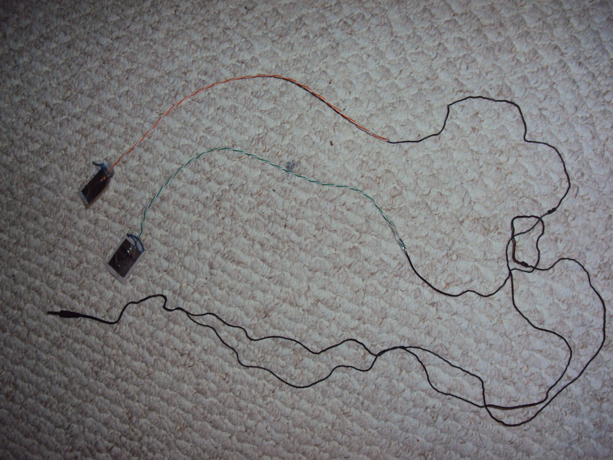

<title>fabrication</title>

Inventory
---

<table border=1>

<tr>
<td><b>Type</b></td>
<td><b>Quantity</b></td>
</tr>

<tr>
<td>Business card sized toekeyboard sample kits</td>
<td>100</td>
</tr>

<tr>
<td>Full toekeyboard</td>
<td>0</td>
</tr>

<tr>
<td></td>
<td></td>
</tr>

</table>

 
 

<table border=1>

<tr>
<td><b>Material</b></td>
<td><b>Stock</b></td>
<td><b>Place of acquisition</b></td>
</tr>

<tr>
<td>3.5mm audio jack</td>
<td>0</td>
<td>Sayal.com</td>
</tr>

<tr>
<td>Ethernet</td>
<td>15 units x ~16ft = 240ft </td>
<td>Sayal.com</td>
</tr>

<tr>
<td>Solder (60/40 activated rosin core solder)</td>
<td>110 inches</td>
<td>Sayal.com</td>
</tr>

<tr> 
<td>Aluminum Foil (for contact pads)</td>
<td>4 rolls </td>
<td>Dollar store</td>
</tr>

<tr>
<td>Plastic (for insulators)</td>
<td>4 bags</td>
<td>Dollar store</td>
</tr>

<tr>
<td>Clear plastic tape 2" wide</td>
<td>3 rolls</td>
<td>Dollar store</td>
</tr>

<tr>
<td>String</td>
<td>2 rolls</td>
<td>Dollar store</td>
</tr>

<tr>
<td>Blank paper</td>
<td>500 sheets</td>
<td>Office supplies</td>
</tr>

<tr>
<td></td>
<td></td>
<td></td>
</tr>

</table>

Materials
---
<pre>
	Wire:
	&nbsp;&nbsp;&nbsp;&nbsp;3.5mm audio phone connector / audio jack (connection to cellphone)
	&nbsp;&nbsp;&nbsp;&nbsp;<a href="https://en.wikipedia.org/wiki/Phone_connector_(audio)">(Tip-Ring-Sleeve, TRS connector)</a>
	&nbsp;&nbsp;&nbsp;&nbsp;(source:  +8 ft cable, double ended audio jack.  26-30 <a href="https://en.wikipedia.org/wiki/American_wire_gauge">AWG</a>. Left & Right channel encased in different sleeves)

	Aluminum foil (for contact pads):
	&nbsp;&nbsp;&nbsp;&nbsp;(7/8)" x 1"   (x4)
	&nbsp;&nbsp;&nbsp;&nbsp;(source:  aluminum foil from kitchen, normally used for baking/bbq)

	Plastic (for insulator between contact pads):
	&nbsp;&nbsp;&nbsp;&nbsp;1" x 1"(1/2)"	(x2)
	&nbsp;&nbsp;&nbsp;&nbsp;(if aluminum contacts are sticking together, increase thickness with multiple plastic layers)
	&nbsp;&nbsp;&nbsp;&nbsp;(source: think plastic bag from any food packaging)

	Tape (to bind contact pads and insulator together):
	&nbsp;&nbsp;&nbsp;&nbsp;(source: 2" wide duck tape)

	String (to secure pads to big toes)	(x2)
	&nbsp;&nbsp;&nbsp;&nbsp;(source: wide packing string, more comfortable)
</pre>

Sample kits (business card size)
---
<pre>
	Plastic:	1 1/2" x 1"
	Aluminum: 	1 x 7/8"
	Paper: 		1 1/2" x 1"
	String (wide packing string): 	3" (not useable, but conveys idea of having string)
	Wire (braded, 26 AWG-american wire guage): 		3" (1" stripped)
	Clear tape (2" wide): 	~2" (almost square)		(for contacts pads)
	Masking tape (7/8" wide): 	1/2" (thumb width)	(for attaching string to pad)
					1/4" (1/2 thumb width)	(for binding two individual pads together)

	Plastic:
		From plastic rice bag
	Aluminum:
		Heavy-duty Barbecue strength 25' Aluminum Foil
	Paper: 	
		EarthChoice50 office paper.  
		White 92.  Letter size 8.5x11in/216x279mm.  Sheets 500. Item 1846.
	String (wide packing string):
		distributed by: P.I.C
		Toronto, Ontario
		item no. 31004
	Wire (braded, 26 AWG-american wire guage):	
		Ethernet cable cat 5
	Clear tape (2" wide): 
		cantech
		Canadian Technical Tape Ltd. Montreal, Qc. Canada
		Cantech Industries Inc. Johnson City, TN U.S.A
		www.cantechtape.com
	Masking tape (7/8" wide): 
		Tartan 
		General Purpose Masking Tape
		Masking Tape Cat. 2050

</pre>

Statistics & Measurements
---
<pre>
	Heavy-duty Barbecue strength 25' Aluminum Foil
		45.6 cm x 7.6 m = 3.5m^2
		18 in x 25 ft = 37.5 sq ft
		18 in x 25 ft x (12 in / 1 ft) = 5400 sq in

	Square contact pads (x4)
		1 in x (7/8) in = (7/8) sq in
		(7/8) sq in x 4 = 3.5 sq in

	Number of toekeyboard that can be produced from a single roll of aluminum foil
		5400 sq in / 3.5 sq in = 1542.857...
		Therefore, can produce 1542 toekeyboards
</pre>

Accessories
---
<pre>
	Cellphone

	<a href="https://en.wikipedia.org/wiki/Headset_%28audio%29#Bluetooth">Bluetooth headset</a>

	<a href="https://en.wikipedia.org/wiki/Headphones">Old wired headphones / earbuds</a>
	&nbsp;&nbsp;&nbsp;&nbsp;for 3.5mm audio phone connector / audio jack (connection to cellphone)
	&nbsp;&nbsp;&nbsp;&nbsp;<a href="https://en.wikipedia.org/wiki/Phone_connector_(audio)"> (Tip-Ring-Sleeve, TRS connector)</a>
	&nbsp;&nbsp;&nbsp;&nbsp;must split in the middle, so wires can go down legs.
</pre>

Steps
---

<pre>
	1. Cut 8 ft+ double ended audio cable in half.  Strip ends, expose 1" wire.   (akes two toe keyboards, each 4 ft long)  
	2. Cut four aluminum foil pads ((7/8)" x 1")
	3. Punch hole through all four aluminum foil pads (with pin / sewing needle / thumbtack) ( (1/2)" from side; (1/4)" from bottom )
	4. Put exposed copper wires through holes.  Bend wires, loop at bottom.  Solder in place.
	5. Cut two plastics pads (1" x 1"(1/2)")
	6. Cut holes through them with scissors.  (Center: (1/2)" from side; (5/8)" from top. Diameter: approximately (3/8)")
	7. Make toe keyboard pads
		i. Lie one aluminum pad and wire on tape
		ii. Lie plastic pad on top
		iii. Lie alumium pad on plastic pad
		iv. Wrap tape around pads
		v. Wrap tape around paper, for additional protection / advertising / instructions.
		v. Tape string to one side.  (String 8" long)
		vi. Repeat for second pad
</pre>

Tools
---
<pre>
	Ruler
	Pen / marker
	Scissor / Exacto knife  
	Guillotine
	Duck tape
	<a href="https://en.wikipedia.org/wiki/Drawing_pin">Pin / sewing needle / thumbtack</a> 
	Wire Strippers
	Soldering iron
	Laser printer
	Computer
</pre>

Internal tools fabrication
---
<pre>
	Metal soup can lips, to make hole cutters in plastic insulator.
	Use two different scissors, when cutting masking tape & string.  So doesnt stick to scissors.

</pre>

Fabrication (DIY - Do it yourself)
---

<pre>

<b>----Accessories needed</b>
	Cellphone

	<a href="https://en.wikipedia.org/wiki/Headset_%28audio%29#Bluetooth">Bluetooth headset</a>

	<a href="https://en.wikipedia.org/wiki/Headphones">Old wired headphones / earbuds</a>
	&nbsp;&nbsp;&nbsp;&nbsp;for 3.5mm audio phone connector / audio jack (connection to cellphone)
	&nbsp;&nbsp;&nbsp;&nbsp;<a href="https://en.wikipedia.org/wiki/Phone_connector_(audio)"> (Tip-Ring-Sleeve, TRS connector)</a>

<b>----Materials needed</b>
	Wire (for leg connections):
	&nbsp;&nbsp;&nbsp;&nbsp;20" (4 wires)
	&nbsp;&nbsp;&nbsp;&nbsp;(source:  ethernet cable.  contains 8 wires.  Only need 4 of them)

	Aluminum foil (for contact pads):
	&nbsp;&nbsp;&nbsp;&nbsp;(7/8)" x 1"(1/4)"   (x4)
	&nbsp;&nbsp;&nbsp;&nbsp;(source:  aluminum foil from kitchen, normally used for baking/bbq)

	Plastic (for insulator between contact pads):
	&nbsp;&nbsp;&nbsp;&nbsp;1" x 1"(3/4)"	(x2)
	&nbsp;&nbsp;&nbsp;&nbsp;(if aluminum contacts are sticking together, increase thickness with multiple plastic layers)
	&nbsp;&nbsp;&nbsp;&nbsp;(source: think plastic bag from any food packaging)

	Tape (to bind contact pads and insulator together):
	&nbsp;&nbsp;&nbsp;&nbsp;(source: 2" wide duck tape)

	Elastic bands (to secure pads to big toes)	(x2)
	&nbsp;&nbsp;&nbsp;&nbsp;(source: thin elastic bands usually wrapping scallion / green onions together)

<b>----Tools needed</b>
	Ruler
	Pen / marker
	Scissor / Exacto knife  
	Duck tape
	<a href="https://en.wikipedia.org/wiki/Drawing_pin">Pin / sewing needle / thumbtack</a> 
	Lighter / matches (to burn off protective coating off headphones/earbud wires)
	&nbsp;&nbsp;&nbsp;&nbsp; (optional: Soldering iron & solder (to solder wires together) )

<b>----Steps</b>
	1. Strip ethernet cable(cut off ethernet protective casing around wires).  Strip wire ends
	2. Cut four aluminum foil pads ((7/8)" x 1"(1/4)")
	3. Punch hole through all four aluminum foil pads (with pin / sewing needle / thumbtack) ( (1/2)" from side; (1/4)" from bottom )
	4. Put exposed copper wires through holes.  Bend wires
	5. Cut two plastics pads (1" x 1"(3/4)")
	6. Cut holes through them with scissors.  (Center: (1/2)" from side; (5/8)" from top. Diameter: approximately (3/8)")
	7. Make toe keyboard pads
		i.Lie one aluminum pad and wire on tape
		ii. Lie plastic pad on top
		iii. Lie alumium pad on plastic pad
		iv. Finish wrapping tape around all pads
		v. Cut out small triangles on sides of pad.  Fit elastic band around them
		vi. Repeat for second pad
	8. Cut old headphones / earbuds off (leaving maximum length of wire, and audio jack). Strip wire ends
	9. Burn off protective coatings off headphone / earbud wires with lighter
	&nbsp;&nbsp;&nbsp;&nbsp;<a href="http://www.tonvid.com/info.php?video_id=xc8itw4ns78">(Awesome idea to fix Broken Mobile Headset)</a>
	10. Twist ethernet wires and headphone / earbud wires together (Ground -> Ground; Right -> Right; Left -> Left).  To secure: Tape or solder

</pre>

Pictures
---

 

 

 <a href="https://toekeyboard.github.io/toekeyboard-fabrication/pics_fabrication/v5/index.html" target="_blank">Version 5</a>
 <a href="https://toekeyboard.github.io/toekeyboard-fabrication/pics_fabrication/v4/index.html" target="_blank">Version 4</a>
 <a href="https://toekeyboard.github.io/toekeyboard-fabrication/pics_fabrication/v3/index.html" target="_blank">Version 3</a>
 <a href="https://toekeyboard.github.io/toekeyboard-fabrication/pics_fabrication/v2/index.html" target="_blank">Version 2</a>
 <a href="https://toekeyboard.github.io/toekeyboard-fabrication/pics_fabrication/v1/index.html" target="_blank">Version 1</a>

 

 
 
